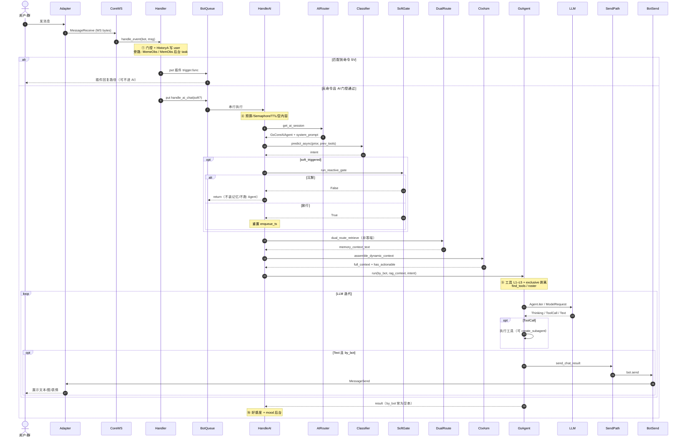
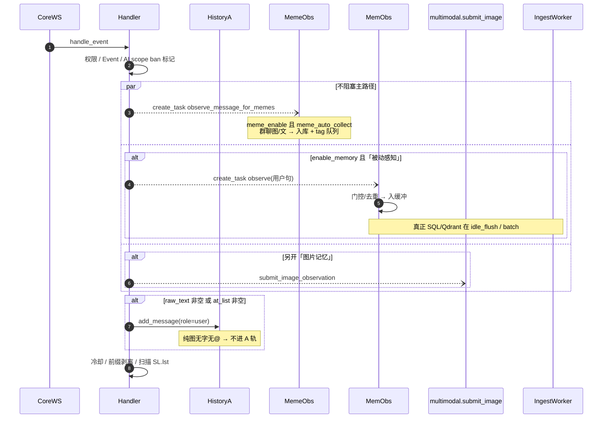
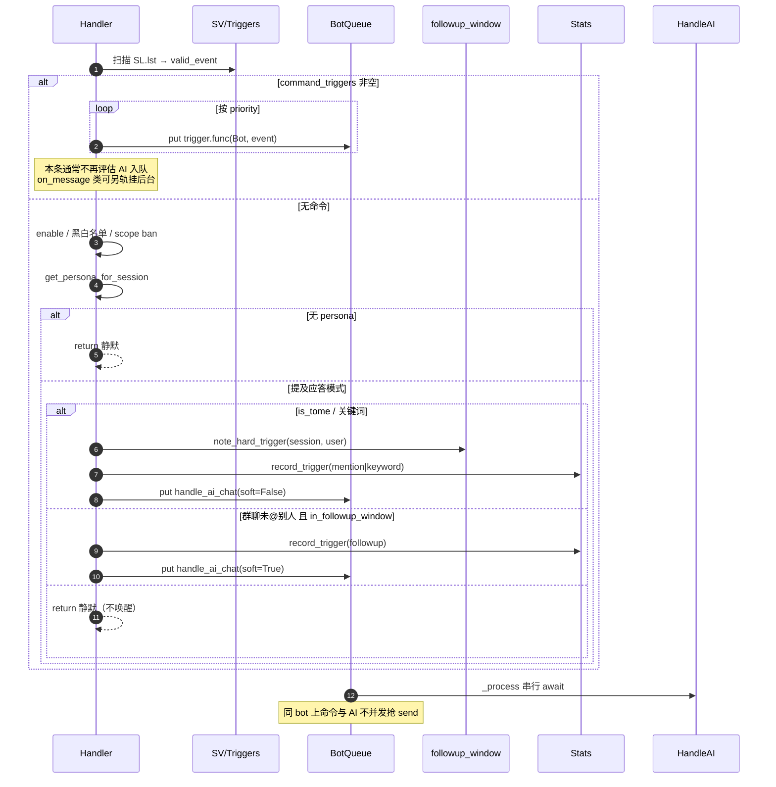
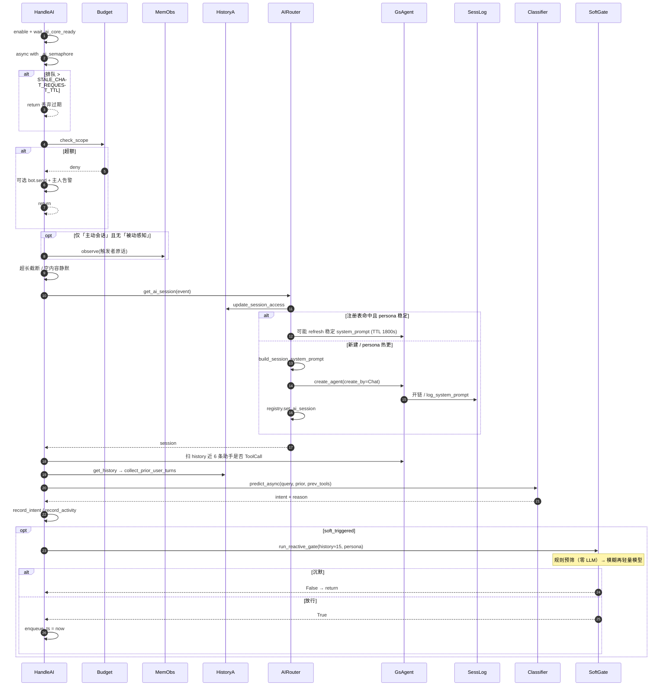
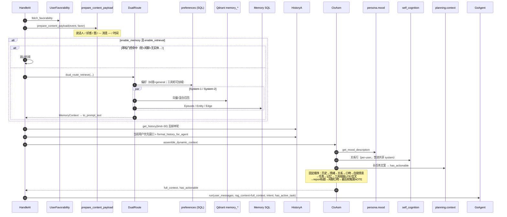
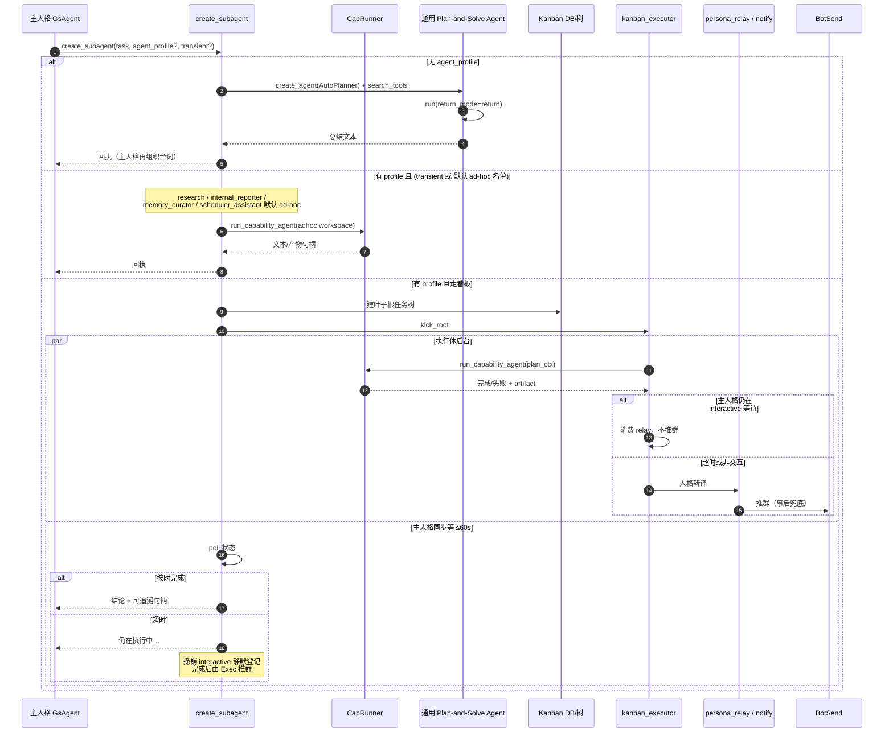
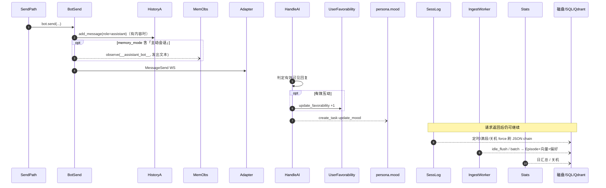
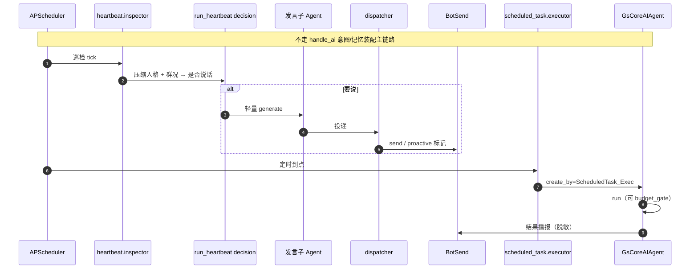
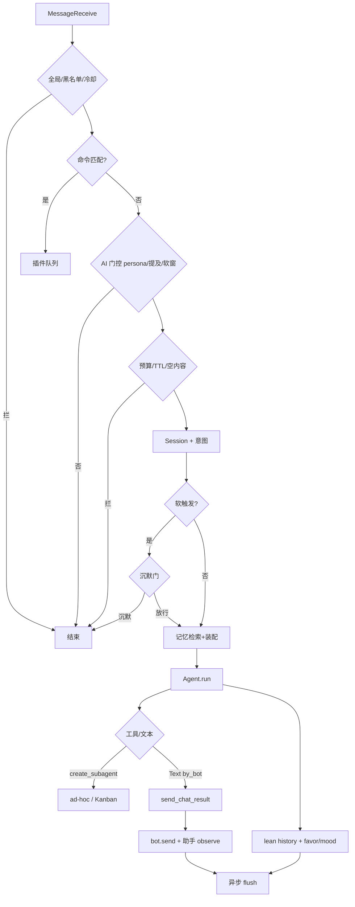

# GsCore AI：一条消息的完整生命周期

> 日期：2026-07-24（完整重写 + 时序图补全）
> 主线：**适配器推来一条群聊消息 → 是否进 AI → 读哪些数据 → 激活哪些模块 → 怎么回复 → 什么被沉淀 → 首尾日志**
> 源码是唯一事实源。改 `handler` / `handle_ai` / `gs_agent` / 装配 / 记忆 / subagent 后请同步本文。
> 关联：
> - 开发技能：`docs/skills/gscore-development/references/02-startup-lifecycle.md`、`04-event-trigger-flow.md`、`06-ai-session-and-persona.md`、`07-tool-registry-and-agent.md`、`09-memory-system.md`
> - 会话日志：`AI_SESSION_LOG_CHAIN_AND_WATERFALL_20260708.md`
> - 本批行为交接：`AI_CORE_OOC_DELEGATION_UPDATE_20260724.md`

---

## 怎么读本文

| 章节 | 内容 |
|------|------|
| **§0** | 前置假设：core 已启动、AI 子系统就绪 |
| **§1** | 一图总览：单条消息 12 个阶段（文字） |
| **§S** | **时序图集（Mermaid）**：端到端 + 分阶段 + 记忆/表情 + Subagent/Kanban + 异步沉淀 |
| **§2–§13** | **按时间顺序逐步走**（读 / 写 / 模块 / 日志） |
| **§14** | 三套历史 / 三类落盘对照 |
| **§15** | 进程启动与 `init_ai_core`（消息到来之前） |
| **§16** | 后台链路：Heartbeat / 定时 / Kanban（非本条用户消息） |
| **§17** | 成本与意图相关修法备忘 |

**读图约定**：

- 实线箭头 = 同步 `await` / 队列串行消费
- `par` / 注释「后台 task」= `asyncio.create_task` / `_add_bg_task`，**不阻塞**主路径
- 参与者缩写见 **§S.0**

**测生产插件行为不要用 `--dev`**：

```bash
# 加载全部插件（含业务插件）
GSUID_LOCAL_TEST_MODE=1 GSUID_LOCAL_TEST_TOKEN=... PYTHONUTF8=1 uv run core --port 8765

# --dev 只加载目录名 endswith("-dev") 的插件；普通插件全部跳过
```

---

## 0. 前置：消息到达前世界已就绪

假定：

1. `uv run core` 已 `init_database` + `load_plugins`（`@sv` / `@ai_tools` 进表）
2. lifespan 里 `init_ai_core` **已完成**（RAG/Persona/Planning/Memory/MCP/统计…）
3. 适配器已 WS 连上，`bot._process` 在消费 `ws.queue`
4. 当前群已配 persona（`scope=global` 或 `specific` 含本群）

若 `init_ai_core` 未完成：`handler` 会打 `ai_initializing` / `ai_init_incomplete` 并 **不入队** AI。

---

## 1. 一图总览：单条消息 12 阶段

```text
适配器 MessageReceive
    │
    ▼
① WS receive + handle_event 入站门控          [handler]
    │  读: 黑名单/冷却/AI开关  写: HistoryManager(用户句)  旁路: meme/记忆observe
    ▼
② 命令触发器匹配                               [SL.lst / SV]
    │  有命令 → 插件路径结束（可不进主 Agent）
    │  无命令 ↓
    ▼
③ AI 触发门控（persona / 提及 / 软触发）       [handler 尾部]
    │  入队 handle_ai_chat → bot.queue
    ▼
④ handle_ai_chat 早退闸门                     [handle_ai]
    │  预算 / 空内容 / Semaphore / 过期 TTL
    ▼
⑤ Session 路由                                [ai_router]
    │  读/建 GsCoreAIAgent + system_prompt 固化
    ▼
⑥ 意图分类（同用户上下文拼接）                 [mode_classifier]
    ▼
⑦ 软触发沉默门（仅 soft）                      [reactive_gate]
    ▼
⑧ 装配 user 侧上下文                          [payload / memory / history / assembly]
    ▼
⑨ Agent.run：工具五层 + LLM 迭代               [gs_agent]
    │  工具执行 / report 发送 / session_log
    ▼
⑩ 回合收尾：history lean / 好感度 / mood       [gs_agent + handle_ai]
    ▼
⑪ 发送路径旁路：Bot 出站 + 助手侧记忆 observe  [bot.send]
    ▼
⑫ 异步沉淀：session_log 刷盘 / 记忆 flush / 统计
```

---

## S. 时序图集（覆盖全阶段）

> 以下图用 **Mermaid `sequenceDiagram`**。GitHub / VS Code Markdown 预览可直接渲染。
> 图中模块名对齐源码；细节表仍见 §2–§13。

### S.0 参与者一览

| 缩写 | 源码位置 | 职责 |
|------|----------|------|
| Adapter | 适配器 WS 客户端 | 推 `MessageReceive`、收 `MessageSend` |
| CoreWS | `core.websocket_endpoint` | 解码、回执短路、`handle_event` |
| Handler | `handler.handle_event` | 入站门控、历史、旁路观察、命令/AI 分流 |
| HistoryA | `message_history.HistoryManager` | 群/私 **A 轨** 滑动窗口（内存） |
| MemeObs | `meme.observer` | 表情入库观察（后台） |
| MemObs | `memory.observe` / `observer` | 对话记忆入缓冲（后台） |
| BotQueue | `bot._Bot.queue` / `_process` | **串行**消费命令与 AI 协程 |
| HandleAI | `handle_ai.handle_ai_chat` | 早退闸、意图、软门、装配、调 Agent |
| Budget | `budget.budget_manager` | Session Token 额度 |
| AIRouter | `ai_router.get_ai_session` | 读/建 `GsCoreAIAgent` + 稳定 system_prompt |
| Classifier | `mode_classifier` / `classifier_service` | 闲聊/工具/问答 |
| SoftGate | `heartbeat.decision.run_reactive_gate` | 软触发沉默门 |
| DualRoute | `memory.retrieval.dual_route` | 双路记忆检索（读） |
| CtxAsm | `context_assembly` | user 侧动态上下文顺序 |
| GsAgent | `gs_agent.GsCoreAIAgent` | 工具五层 + LLM 迭代 |
| Toolset | `register` / `dynamic_toolset` / `rag.tools` | 保底/状态/向量/find_tools |
| LLM | pydantic-ai `Agent.iter` | 模型请求与 tool 循环 |
| SubAgent | `buildin_tools.subagent.create_subagent` | 通用子代理 / 能力代理入口 |
| CapRunner | `capability_agents.runner` | 无人格能力节点执行 |
| Kanban | `planning.kanban` / `kanban_executor` | 任务树、kick、转译推群 |
| SendPath | `utils.send_chat_result` | 两通道 report / meme 标签 / 出站 |
| BotSend | `bot._Bot.send` | WS 出站 + 助手历史 + 主动会话 observe |
| SessLog | `session_logger.AISessionLogger` | C 轨事件流（可落盘） |
| Ingest | `memory.ingestion.worker` | Episode/边/偏好异步 flush |
| Stats | `statistics_manager` | 触发/意图/token（内存→日汇总） |

---

### S.1 端到端总览（硬触发成功一轮，同步主路径）

> 旁路任务（meme / 被动记忆 / mood）见 **S.2 / S.8**，本图只标「旁路启动」。



---

### S.2 阶段 ①：入站旁路 — History / Meme / 记忆 observe



**记忆双写口径**：

| 模式配置 | 用户句写入点 | 助手句写入点 |
|----------|--------------|--------------|
| 含「被动感知」 | `handler` 入站 | 通常仍靠「主动会话」+ `bot.send` 观察助手 |
| 仅「主动会话」（无被动） | `handle_ai_chat` 早段 observe（能进 AI 才写） | `bot.send` 时 `speaker_id=__assistant_{bot_id}__` |
| 两者都开 | 入站只写一次（handle_ai **跳过**用户 observe 防双写） | 同上 |

---

### S.3 阶段 ②–③：命令分流 vs AI 入队



---

### S.4 阶段 ④–⑦：早退闸 → Session → 意图 → 软门



---

### S.5 阶段 ⑧：记忆检索 + 上下文装配（读多写少）



---

### S.6 阶段 ⑨：Agent 工具五层 + LLM 环 + 发送

```mermaid
sequenceDiagram
    autonumber
    participant HandleAI
    participant GsAgent
    participant Toolset
    participant LLM
    participant Plugin as 插件/MCP/buildin 工具
    participant SubAgent as create_subagent
    participant SendPath
    participant BotSend
    participant SessLog as SessLog

    HandleAI->>GsAgent: run(...)
    GsAgent->>GsAgent: async with _run_lock + 二次 TTL
    GsAgent->>SessLog: log_run_start / log_user_input

    Note over GsAgent: 交互脚手架 C-1 省略跟进 / C-2 漂移 / C-3 @别人→零工具

    GsAgent->>Toolset: 装配
    Note over Toolset: L1 保底 self+buildin<br/>L2 状态 Kanban/定时/record<br/>L3 驻留族<br/>语境 tags<br/>L4/L5 向量（非闲聊）<br/>剥离 exclusive + roster<br/>find_tools + RetrievableToolset

    GsAgent->>SessLog: log_tools_list

    loop pydantic-ai Agent.iter
        GsAgent->>LLM: ModelRequest（含 message_history）
        LLM-->>GsAgent: parts

        alt ThinkingPart
            GsAgent->>SessLog: log_thinking
        else ToolCallPart
            GsAgent->>Plugin: 执行 tool
            alt tool == create_subagent
                GsAgent->>SubAgent: 见 S.7
                SubAgent-->>GsAgent: 回执字符串
            else 普通工具
                Plugin-->>GsAgent: ToolReturn
            end
            GsAgent->>SessLog: log_tool_call / log_tool_return
            Note over GsAgent: 高密度结构返回可当轮折叠<br/>可注入 POST_TOOL 输出契约
        else TextPart
            alt SILENCE / 假完成暂扣 / OOC 预检
                GsAgent->>GsAgent: 跳过发送或重写
            else return_mode=by_bot
                GsAgent->>SendPath: send_chat_result(text)
                Note over SendPath: 两通道拆分 → report 出图<br/>&lt;meme:情绪&gt; → 选表情发送<br/>md 净化 / 拆条
                SendPath->>BotSend: bot.send(segments|image)
            end
            GsAgent->>SessLog: log_text_output
        end
    end

    Note over GsAgent: 收尾：_relean_user_turn / tool 截断 / compact report<br/>history.extend / extract_history / L3 驻留 / token / budget
    GsAgent->>SessLog: log_result / token / log_run_end
    GsAgent-->>HandleAI: result
```

---

### S.7 Subagent / 能力代理 / Kanban 调度（嵌在工具调用中）



**委派闭环（主人格池）**：交互 `create_by` 剥离能力代理 exclusive 工具 → 模型只能 `create_subagent(agent_profile=真实 node_id)`；`find_tools` / `RetrievableToolset` 同步 `blocked_tool_names` 禁止回灌。

---

### S.8 阶段 ⑩–⑫：出站、助手记忆、异步沉淀



| 数据 | 同步在请求内？ | 真正落盘时机 |
|------|----------------|--------------|
| HistoryA / Agent.history | 是（内存） | **默认不落盘**，空闲 GC |
| session_log entries | 写缓冲 | 增量刷盘 / 滚动 / 关机 |
| 记忆 Episode/边 | 仅入队 | IngestionWorker flush |
| 好感度 / 预算 | 调用时 | SQL |
| Kanban / artifact | 工具/执行体时 | DB + workspace 文件 |

---

### S.9 后台：Heartbeat / 定时任务（非本条用户消息）



---

### S.10 短路面板（对照时序出口）



---

## 2. 阶段 ①：WS 入站 → `handle_event`

> 时序图：**§S.2**（History / Meme / 记忆旁路）

### 2.1 调用链

```text
core.websocket_endpoint
  └─ data = websocket.receive_bytes()
  └─ msg = MessageReceive 解码
  └─ bot.resolve_recall(msg)? → 回执短路
  └─ await handle_event(bot, msg)          # gsuid_core/handler.py
```

### 2.2 顺序（有语义：别乱插全局拦截）

| # | 动作 | 模块 | 读 | 写 / 副作用 |
|---|------|------|----|-------------|
| 1 | `IS_HANDDLE` | handler | 全局开关 | 关则 return |
| 2 | Meta 事件 | `handle_meta_event` | — | 独立路径 |
| 3 | 权限 `user_pm` | `get_user_pml` | masters/superusers | 改写 msg.user_pm |
| 4 | `msg_process` → `Event` | handler | MessageReceive | Event（含 `session_id`） |
| 5 | ShowReceive 日志 | logger | — | 可选 info |
| 6 | AI scope ban | `core_ai_control` | 禁言表 | 标记 `ai_scope_banned` |
| 7 | Meme 观察 | `meme.observer` | 图/文 | 异步 task，不挡主路径 |
| 8 | **用户历史** | `HistoryManager` | — | **内存 deque** 追加 user |
| 9 | **记忆 observe（被动）** | `memory.observe` | memory_mode | **缓冲入队**（非立刻 SQL） |
| 10 | 主人自动订阅 | Subscribe DB | — | 可能 INSERT/UPDATE |
| 11 | CoreUser/Group 入库 | database | — | 用户/群行 |
| 12 | 重复消息 / 冷却 | cooldown | 进程态 | 命中则 return |
| 13 | 命令前缀剥离 | command_start | 配置 | 改 raw 前缀 |
| 14 | 触发器扫描 | `SL.lst` | 全部 SV | 填 `valid_event` |

**入历史门控**：`raw_text` 非空 **或** `at_list` 非空才 `add_message`。纯图（无字无 @）不进 HistoryManager；图片记忆走另一路 `submit_image_observation`。

**群聊 session_id**（不含 user_id，整群共享 Agent）：

```text
{WS_BOT_ID}:{bot_id}:{bot_self_id}:group:{group_id}
```

私聊：`...:private:{user_id}`。

### 2.3 日志（①）

| 级别 | 典型内容 |
|------|----------|
| info | `log.handler.event_received`（ShowReceive 开时） |
| warning | 黑名单 / at 屏蔽号 |
| debug | 记忆 observe 失败等 |

---

## 3. 阶段 ②：命令 vs AI 分流

### 3.1 有命令匹配

```text
command_triggers 非空
  → 按 priority 入队 trigger.func(Bot, event)
  → logger.info cmd_triggered
  → block 触发器可打断后续
  → 本条通常**不再**进 handle_ai_chat
```

（`on_message` 类触发器另轨：每条消息可挂后台，不挡 AI 判定。）

### 3.2 无命令 → 进入 AI 门控（阶段 ③）

仅当 `command_triggers` 为空才评估 AI。

---

## 4. 阶段 ③：AI 触发门控（仍在 `handler`）

严格顺序，任一步失败 **静默 return**（多数无用户提示）：

| # | 检查 | 失败行为 |
|---|------|----------|
| 1 | `ai_config.enable` | return |
| 2 | `ai_scope_banned` | return |
| 3 | AI 黑名单（用户/群） | return |
| 4 | AI 白名单（若配置了则必须命中） | return |
| 5 | `get_persona_for_session(session_id)` | None → return（本群未绑定人格） |
| 6 | `ai_mode` 含「提及应答」 | 见下 |

**提及应答**（生产默认）：

```text
should_respond = event.is_tome          # @机器人 或 私聊
             or 关键词命中 keywords
             or 软触发：
                  硬触发刚登记过 followup 窗口
                  and 群聊 and 未 at 别人
                  and in_followup_window(session_id, user_id)
```

| 触发类型 | `trigger_type` 统计 | 后续 |
|----------|---------------------|------|
| @/私聊 | `mention` | 硬触发，`note_hard_trigger` 开窗口 |
| 关键词 | `keyword` | 同上 |
| 续聊窗口内普通发言 | `followup` | `soft_triggered=True`，稍后沉默门 |

**AI Core 未就绪**：

```text
logger.info  ai_initializing
  或 logger.warning ai_init_incomplete
→ return（不入队）
```

**入队**：

```python
ws.queue.put_nowait(TaskContext(
    coro=handle_ai_chat(Bot(ws, event), event, enqueue_ts=now, soft_triggered=...),
    name="handle_ai_chat",
    priority=event.user_pm,
))
```

`bot._process` **串行**消费队列（同 bot 上命令与 AI 互不并发抢同一 send 路径）。

### 4.1 日志（③）

| 时机 | 日志 |
|------|------|
| 统计 | `statistics_manager.record_trigger(mention|keyword|followup)`（内存，非 console 必打） |
| 入队成功 | 通常无单独 info（看后续 handle_ai） |

---

## 5. 阶段 ④：`handle_ai_chat` 早退闸门

> 时序图：**§S.4**（闸门 + Session + 意图 + 软门）

文件：`gsuid_core/ai_core/handle_ai.py`

| # | 闸门 | 读 | 写 / 日志 |
|---|------|----|-----------|
| 1 | 再次 `enable` | ai_config | debug 跳过 |
| 2 | `is_ai_core_ready` / wait 300s | startup 状态 | info 等待 / warning 超时跳过 |
| 3 | `async with _ai_semaphore`（默认 10） | — | 全局 AI 并发 |
| 4 | 队列等待 > `STALE_CHAT_REQUEST_TTL` | enqueue_ts | **info 丢弃过期请求** |
| 5 | **预算** `budget_manager.check_scope` | SQLite 账本 | 超额 info + 可选 bot.send + 主人告警 → return |
| 6 | 主动会话记忆：仅「主动会话」且无「被动感知」时 observe 用户句 | — | 防双写 |
| 7 | 长度：>60000 硬截断；稍后 >15000 可子 Agent 摘要 | — | warning 截断 |
| 8 | 空内容：无字且无模型可见内容且未 @ 我 | — | **info 前置静默跳过** |

### 5.1 日志（④）样例

```text
💰 [GsCore][AI] 预算超额拦截 (...)
🧠 [GsCore][AI] 队列等待 45.2s 超 TTL，丢弃过期请求
🧠 [GsCore][AI] 空内容消息（无模型可见内容且未@我），前置静默跳过
```

---

## 6. 阶段 ⑤：Session 路由 — 读 / 建 `GsCoreAIAgent`

```text
session = await get_ai_session(event)   # ai_router.py
```

### 6.1 流程

```text
session_id = event.session_id
history_manager.update_session_access(event)     # 刷新 A 轨活跃时间

registry.get_ai_session(session_id)
  ├─ 命中且 persona 未变
  │    └─ 可能 _maybe_refresh_stable_prompt（TTL 1800s）
  │         原地换 system_prompt 字符串，不丢 history
  └─ 未命中 / persona 文件 mtime 变 / 人名变
       ├─ get_persona_for_session → persona_name
       ├─ build_session_system_prompt(event, persona_name)
       │    = persona.md + SYSTEM_CONSTRAINTS
       │    + 群简介
       │    + 稳定前缀（self_model 自述 + 群画像，无 per-user 关系/mood）
       ├─ create_agent(..., create_by="Chat", persona_name=...)
       │    └─ AISessionLogger 开文件 / 续写 chain
       │    └─ log_system_prompt
       └─ registry.set_ai_session
```

### 6.2 数据

| 数据 | 介质 | 时机 |
|------|------|------|
| persona.md / config.json | 磁盘 `data/ai_core/persona/...` | 建 session / 热重载 |
| self_model / 群画像 | SQL + 缓存 | 稳定前缀 |
| `session.history` | **进程内存** ModelMessage 列表 | 跨轮累积，空闲 30min 回收丢 |
| session_log 文件 | `data/ai_core/session_logs/*.json` | 创建时打开，增量刷 |

### 6.3 日志（⑤）

```text
# 新建时常见
🧠 [GsCoreAIAgent] ... create / session ...
# session_log 内 entry: system_prompt（不总是 console）
```

---

## 7. 阶段 ⑥：意图分类（闲聊 / 工具 / 问答）

**不能只喂当前句**（省略跟进依赖上文）。

### 7.1 读入

| 输入 | 来源 |
|------|------|
| `query` | 本轮 raw_text |
| `prior_user_turns` | HistoryManager 同 user_id 近几句（去掉本轮已入库的末条） |
| `prev_turn_used_tools` | `session.history` **最近最多 6 条** ModelResponse 是否含 ToolCallPart |

### 7.2 判别路径（`mode_classifier.predict_async`）

1. 短句/省略跟进 + 有 prior → **ContextPrimary**：拼接 `prior[-3:] + 当前` 再跑分类器
2. 长句先闲聊 → ContextJoin 再判
3. 省略 +（上轮工具 **或** 上文用户句工具向）→ Structural 升级为「工具」
4. 向量问答兜底（低置信闲聊 + 疑问词）

### 7.3 写

| 写 | 位置 |
|----|------|
| `statistics_manager.record_intent` | 内存统计 |
| `record_activity` | 活跃用户计数 |

### 7.4 日志（⑥）

```text
🧠 [GsCore][AI] 意图识别结果: {intent, conf, reason}
🧠 [GsCore][AI] 闲聊模式 | 工具模式 | 问答模式
```

`reason` 例：`ContextPrimary:Rule: Check Data`、`Structural: ellipsis follow-up after tools`。

---

## 8. 阶段 ⑦：软触发沉默门（仅 `soft_triggered`）

```text
run_reactive_gate(event, history_manager 近 15 条, persona_name)
  ├─ 规则预筛：空/纯语气/@别人 → 直接沉默（不打 LLM）
  ├─ 规则预筛：短接续 → 直接放行
  └─ 否则轻量 LLM 门
```

| 结果 | 行为 | 日志 |
|------|------|------|
| 沉默 | return，不装记忆、不跑主 Agent | `软触发沉默门判定与AI无关，保持沉默` |
| 放行 | 重置 enqueue_ts（门耗时不计入过期） | `软触发沉默门放行，按续聊处理` |
| 异常 | fail-open 放行主 Agent | debug |

后续还有 user 侧 `SOFT_TRIGGER_NOTE` + 人设「沉默规则」两道偏沉默约束。

---

## 9. 阶段 ⑧：装配本轮送给模型的内容

> 时序图：**§S.5**（记忆检索 + 装配顺序）

### 9.1 用户 payload

```text
favorability = fetch_favorability(user_id, bot_id)     # SQL，失败 None
user_messages = prepare_content_payload(event, favorability)
  # 含：说话人标注 / 好感 / 多模态图 / --- 消息 --- 正文
可选：长文 create_subagent 摘要
追加：【当前时间】
```

### 9.2 记忆检索（读，不写）

```text
若 enable_memory 且 enable_retrieval：
  寒暄门控（短+闲聊+无实体）→ 跳过
  否则 dual_route_retrieve(query, group_id|None, user_id, ...)
       → memory_context_text（预算截断 + 第三方隐私过滤）
```

日志：`命中寒暄门控` / `检索到记忆上下文 (N 字符)` / warning 失败。

### 9.3 群消息历史渲染（读 A 轨）

```text
raw = history_manager.get_history(limit=30)
history = raw[:-1]                          # 去掉本轮（已在 payload）
# 当前用户优先窗口：自 5 + 他人 15，按时间排
rag_context = "【历史对话】\n" + format_history_for_agent(...)
```

### 9.4 动态上下文唯一顺序（`assemble_dynamic_context`）

拼进 **user 侧**（进模型；结束后 `_relean` **不进**持久 Agent history）：

1. 历史对话块
2. 情绪 mood
3. 关系行（per-user，不能进共享 system）
4. 口吻锚点
5. 自我情景（回指「你说过」）
6. 长任务 Kanban 进度文案 → `has_actionable`
7. 长期记忆块
8. **工具规程分级**
   - 闲聊且无上轮工具且无活跃任务 → `TOOL_ORCHESTRATION_LITE`
   - 否则全文 `TOOL_ORCHESTRATION_CONSTRAINTS`
9. 上一轮 report 标题提示
10. 闲聊口吻注
11. **最后**软触发 `SOFT_TRIGGER_NOTE`（近因）

### 9.5 交给 Agent

```python
chat_result = await session.run(
    user_message=user_messages,
    bot=bot, ev=event,
    rag_context=full_context,
    return_mode="by_bot",
    enqueue_ts=enqueue_ts,
    intent=intent,
    has_active_task=has_actionable,
)
```

---

## 10. 阶段 ⑨：`GsCoreAIAgent.run` — 工具与 LLM

> 时序图：**§S.6**（工具五层 + LLM 环）；Subagent 展开见 **§S.7**

### 10.1 锁与过期

```text
async with self._run_lock:          # 同 Session 串行
  若 Chat 且排队过久 → 丢弃，return ""
  refresh_model_if_changed()        # 控制台换模型热切换
```

日志：`获取到执行锁，开始执行...` / `队列等待 … 超 TTL，丢弃过期请求`。

### 10.2 运行头

```text
logger.info ====== Agent 运行开始 ======
拼接 rag_context → final_user_message
可选 DS 角色 Marker / 无工具强制提醒
交互脚手架 C-1/C-2/C-3（省略跟进 / 漂移 / @别人砍工具）
session_logger.log_run_start()
session_logger.log_user_input(final_user_message)
```

### 10.3 工具五层装配（`dynamic` pack，交互主人格）

| 层 | 条件 | 内容 |
|----|------|------|
| L1 保底 | 每轮 | `self` + `buildin` 分类；persona `tool_names` |
| L2 状态 | 每轮 | 活跃 Kanban / 定时任务 / record 集合 → 能力族；闲聊裁剪为轻量白名单 |
| L3 驻留 | 有历史调用 | 近几轮用过的 capability_domain 继续常驻数轮 |
| 语境 | 有 group | 群画像 tags → 最多 8 个 context 工具 |
| L4/L5 向量 | **非闲聊** intent | 近文 user 句 + query 检索 + 族展开 |
| 委派 | 交互主人格 | **剥离**能力代理专属工具；必要时注入 `create_subagent`；user 侧注入可用画像清单 |
| 渐进 | 非闲聊 | `find_tools` + RetrievableToolset |

日志例：

```text
🧠 [GsCoreAIAgent] 工具数量: N (保底 a + 附加 b)
🧠 [GsCoreAIAgent] 主人格剥离能力代理专属工具 k 个: [...]
🧠 [GsCoreAIAgent] 已注入 find_tools，本轮启用渐进式工具暴露
🧭 [Scaffold] C-3 寻址门：… 本轮砍掉工具集
session_logger.log_tools_list([...])
```

### 10.4 pydantic-ai 迭代环

```text
agent.iter(message_history=self.history + 本轮 user)
  loop:
    ModelRequestNode → 调 LLM（流式）
      parts:
        Thinking  → log_thinking
        ToolCall  → 执行工具 → ToolReturn
                    log_tool_call / log_tool_return
                    高密度结构返回当轮折叠（防 OOC）
                    交互主人格可注入 POST_TOOL 输出契约
        TextPart  → return_mode=by_bot 时 send_chat_result 即时发
                    log_text_output
```

**工具执行**可读：插件函数 / MCP / buildin；可写：插件业务 DB、state_store、Kanban、artifact 文件等（视工具）。

**`send_chat_result` 发送链**：错误脱敏 → 剥工具伪影 → **report 两通道**（XML + 内容密度结构块 → 图）→ md 净化 → OOC 门 → 拆条延迟 → `bot.send`。

### 10.5 日志（⑨）核心串

```text
🧠 [GsCoreAIAgent] ====== Agent 运行开始 ======
🧠[GsCoreAIAgent] 已添加 RAG 上下文
🧠 [GsCoreAIAgent] 工具数量: ...
🧠  ▶ [Sending request]: Waiting for the model to think...
🧠 [GsCoreAIAgent] ⚡ Trigger node: CallToolsNode
[🔧 LLM requests tool]: tool_name='...'
[✅ Tool execution complete]: tool_name='...'
⏱️ [GsCoreAIAgent] TTFT: ... ms
# 用户侧已发出文本/图（平台）
```

session_log entries（磁盘，可稍后刷）：

`run_start` → `user_input` → `tools_list` → `thinking`* → (`tool_call`/`tool_return`)* → `text_output`* → `result` → `token_usage` → `run_end`

---

## 11. 阶段 ⑩：回合收尾（内存 lean + 业务沉淀）

### 11.1 Agent 内部（run 末尾）

| 动作 | 目的 |
|------|------|
| `_relean_user_turn` | 剥 user 侧规程/动态块，**不进**持久 history |
| tool return 截断/摘要 | 控 token |
| report 结构块 compact | 历史里去表，metadata 留 `sent_reports` 标题 |
| `history.extend(new_messages)` | 更新 B 轨 |
| `extract_history` 安全截断 | ToolCall/Return 配对；可能 `history_reset auto_compact` |
| L3 驻留：记录本轮调用过的能力族 | 下几轮工具池 |
| `log_result` / `log_run_end` / token | 观测 |
| 预算记账 | SQLite ledger |
| 释放 `_run_lock` | `执行完成，释放锁` |

### 11.2 `handle_ai_chat` 尾

| 动作 | 条件 |
|------|------|
| `SILENCE` | info「角色选择沉默」——不发（by_bot 可能已发过则依赖 Agent 内） |
| 错误串 | 脱敏 send + 通知主人 |
| 成功且仍有字符串 | 再 `send_chat_result`（by_bot 多为空）→ info「回复已发送」 |
| 好感度 +1 | 有效可见回复 |
| mood 异步更新 | persona 情绪状态机 |
| （可选）助手侧 observe | 部分路径；出站主路径在 bot.send |

---

## 12. 阶段 ⑪：出站 `bot.send` 与助手记忆

> 时序图：**§S.8**

`send_chat_result` → `Bot`/`_Bot` 组 `MessageSend` → WS 推适配器。

若记忆模式含「主动会话」：

```text
observe(content=发出文本, speaker_id=__assistant_{bot_id}__, ...)
  → 入 Ingestion 缓冲（与用户 observe 相同介质）
```

平台侧消息已出；本地 **HistoryManager 是否写 bot 侧** 取决于发送路径是否 `add_message(role=assistant)`（命令/AI 发送封装处）。

---

## 13. 阶段 ⑫：异步沉淀（本条消息返回后仍可继续）

| 数据 | 何时真正落盘 | 路径 |
|------|----------------|------|
| Session 日志 entries | 定时增量 / 满 2000 条滚动分段 / 关机 force | `data/ai_core/session_logs/`，`chain_id` 归并 |
| 记忆 Episode | 静默 ≥ idle_flush / 攒满 batch / 关机 | SQL + Qdrant `memory_*` |
| 统计 intent/token | 日汇总 / 关机 | 统计库 |
| 预算 | check/记账时 | 预算库 |
| 好感度 | update 时 | SQL `UserFavorability` |
| Kanban / artifact / state | 工具调用时 | 各自表/文件 |
| HistoryManager / Agent.history | **默认不落盘** | 进程内存，重启丢 |

---

## 14. 三套「历史」与读写下沉（对照）

| 轨道 | 模块 | 写入时机 | 读取时机 | 落盘 |
|------|------|----------|----------|------|
| **A** 群消息 | `HistoryManager` | ① 用户；发送路径助手 | ⑥ prior；⑦ 软门；⑧ 历史块；心跳 | 否 |
| **B** Agent | `GsCoreAIAgent.history` | ⑩ extend（已 lean） | ⑤ 上轮工具；⑨ LLM message_history | 否（随 Session） |
| **C** 观测 | `AISessionLogger` | ⑨ 全程 log_* | WebConsole / 排障 | 是 JSON chain |

**不建议合成一套**：schema（IM / LLM 协议 / 事件流）、生命周期（AI 关也要 A）、胖瘦目标（B 瘦 / C 胖）均不同。减债靠「统一读投影 API」，不是物理合并。

---

## 15. 附录 A：进程启动与 `init_ai_core`（消息前）

### 15.1 T0 启动

```text
uv run core
  → init_database
  → load_gss → load_plugins（import → @sv / @ai_tools / 可选 register_agent_node）
  → import ai_core.startup（只注册钩子）
  → uvicorn lifespan
```

`--dev`：只加载 `*-dev` 目录插件。

### 15.2 T1 `init_ai_core`（后台串行，单步失败不阻断）

1. 导入 handle_ai / buildin_tools
2. RAG：嵌入 + tools/knowledge Qdrant 同步
3. Persona 默认/迁移
4. 审批中心
5. 定时任务 `reload_pending`
6. Planning：Kanban + **内置**能力代理节点
7. Memory：IngestionWorker + memory collections
8. MCP / Meme / 统计（含 Heartbeat job）

**WS 可连 ≠ AI 就绪**。

### 15.3 关闭

`flush` session_log → memory final flush → 统计 → 停 scheduler/MCP。

---

## 16. 附录 B：非本条用户消息的激活

| 入口 | 触发 | 与主链路关系 | 时序图 |
|------|------|----------------|--------|
| Heartbeat 巡检 | APScheduler | 轻量 agent / 主动发言；proactive session_log | **§S.9** |
| 定时任务 | 到点 executor | 新子 Agent，`create_by=ScheduledTask_Exec` | **§S.9** |
| Kanban kick / cron | planning | 能力代理或子树；artifact 落盘 | **§S.7** 执行体侧 |
| `create_subagent` | 主人格工具调用 | 嵌在 **§S.6** 的 ToolCall 内；三路径见 **§S.7** | **§S.7** |

### 16.1 `create_subagent` 三路径速查

| 条件 | 路径 | 是否建看板卡 | 是否阻塞主人格 |
|------|------|--------------|----------------|
| 无 `agent_profile` | 通用 Plan-and-Solve 子 Agent | 否 | 是（等 `run` 返回） |
| profile ∈ 默认 ad-hoc 集合，或显式 `transient=True` | `run_capability_agent` 临时工作区 | 否 | 是 |
| 其余 profile | 建叶子根 → `kick_root` → poll ≤60s | **是** | 最多 60s；超时后执行体可自行推群 |

默认 ad-hoc：`research_agent` / `internal_reporter` / `memory_curator` / `scheduler_assistant`。
code / plugin_dev 等需要产物与审批的仍走看板。

---

## 17. 附录 C：成本与意图修法备忘（2026-07-24）

1. **闲聊规程**：user 侧 `TOOL_ORCHESTRATION_LITE`（轻工具 + 省略跟进），非零工具；重规程仅工具/问答/上轮工具/活跃任务。
2. **意图**：同用户 prior 拼接为主路径；近 6 条助手消息扫 ToolCall；省略结构升级。
3. **软门**：规则预筛再 LLM。
4. **Kanban 等待**：文本类 profile 默认 transient；同步上限 60s。
5. **框架无业务插件域词特判**：意图词表/内置 prompt 不写死具体业务工具名；专域能力由插件 `register_agent_node` + 工具描述召回。

---

## 18. 模块激活速查（单条进 AI 的消息）

| 模块 | 本条是否激活 | 说明 |
|------|--------------|------|
| handler / HistoryManager | 是 | 入站必经（有文本或 @） |
| 命令 SV | 可能 | 有匹配则可能不进 AI |
| followup_window | 条件 | 硬触发写；软触发读 |
| statistics | 是 | trigger/intent/activity |
| budget | 是 | 前置闸 |
| memory.observe | 条件 | 被动/主动模式 |
| dual_route_retrieve | 条件 | 非寒暄跳过 |
| mode_classifier | 是 | 进 AI 必跑 |
| reactive_gate | 仅 soft | |
| ai_router / Session | 是 | |
| context_assembly | 是 | |
| gs_agent 工具装配 | 是 | 层随 intent 变 |
| LLM provider | 是 | 除非软门沉默/早退 |
| 插件工具 / MCP | 条件 | 模型点名才执行 |
| send_chat_result | 条件 | 有可见文本/report |
| session_logger | 是 | 进 run 即 log |
| mood / favorability | 条件 | 有效互动 |
| Ingestion flush | 异步 | 非同步在本请求内 |

---

## 19. 端到端日志时间线（硬触发成功一轮，示意）

```text
# ── ① 入站 ──
[info ] log.handler.event_received ...          # 若 ShowReceive

# ── ③ 无命令，AI 入队（常无单独行）──

# ── ④–⑥ handle_ai ──
[debug] 🧠 [GsCore][AI] 意图识别结果: {...}
[info ] 🧠 [GsCore][AI] 工具模式                  # 或 闲聊/问答

# ── ⑨ Agent ──
[info ] 🧠 [GsCoreAIAgent] 获取到执行锁，开始执行...
[info ] 🧠 [GsCoreAIAgent] ====== Agent 运行开始 ======
[info ] 🧠[GsCoreAIAgent] 已添加 RAG 上下文
[debug] 🧠 [GsCoreAIAgent] 工具数量: ...
[debug] 🧠  ▶ [Sending request]: Waiting for the model to think...
[debug] 🧠 [GsCoreAIAgent] ⚡ Trigger node: CallToolsNode   # 若调工具
[debug] [🔧 LLM requests tool]: ...
[debug] [✅ Tool execution complete]: ...
[debug] ⏱️ [GsCoreAIAgent] TTFT: ...
# （send 路径可能无「回复已发送」若 by_bot 已在环内发完）

# ── ⑩ 收尾 ──
[info ] 🧠 [GsCoreAIAgent] 执行完成，释放锁
[info ] 🧠 [GsCore][AI] 回复已发送 (模式: 工具)   # 视路径

# ── ⑫ 稍后 ──
# session_log 增量写盘（通常无每 entry 的 console）
# memory idle_flush 后 embedding + SQL（独立日志前缀）
```

**软触发沉默早退**：

```text
[info ] 🧠 [GsCore][AI] 软触发沉默门判定与AI无关，保持沉默
# 无 Agent 运行开始
```

**角色选择沉默**：

```text
[info ] 🧠 [GsCore][AI] 角色选择沉默，不发送回复
```

---

*完。排查生产问题：先按 §1 阶段号定位 → 打开 **§S** 对应时序图 → 再对 §19 日志关键字与 §14 三轨数据。*
*改 handler / handle_ai / gs_agent / 记忆 observe / subagent / Kanban 时请同步更新 **§S** 图中的参与者与分支。*
)
