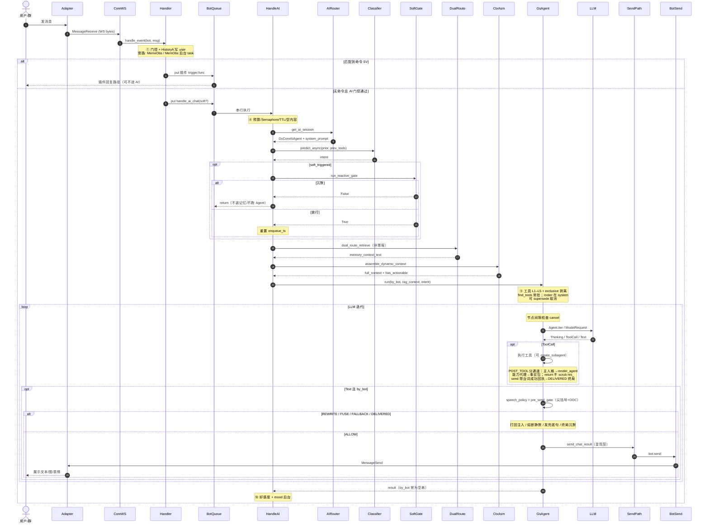
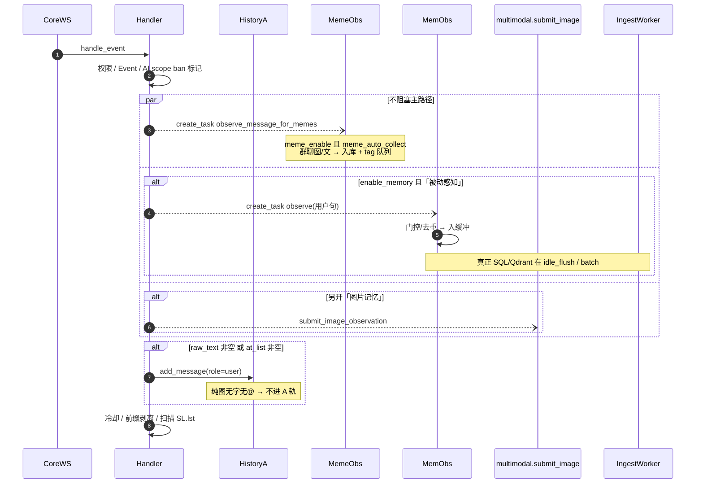
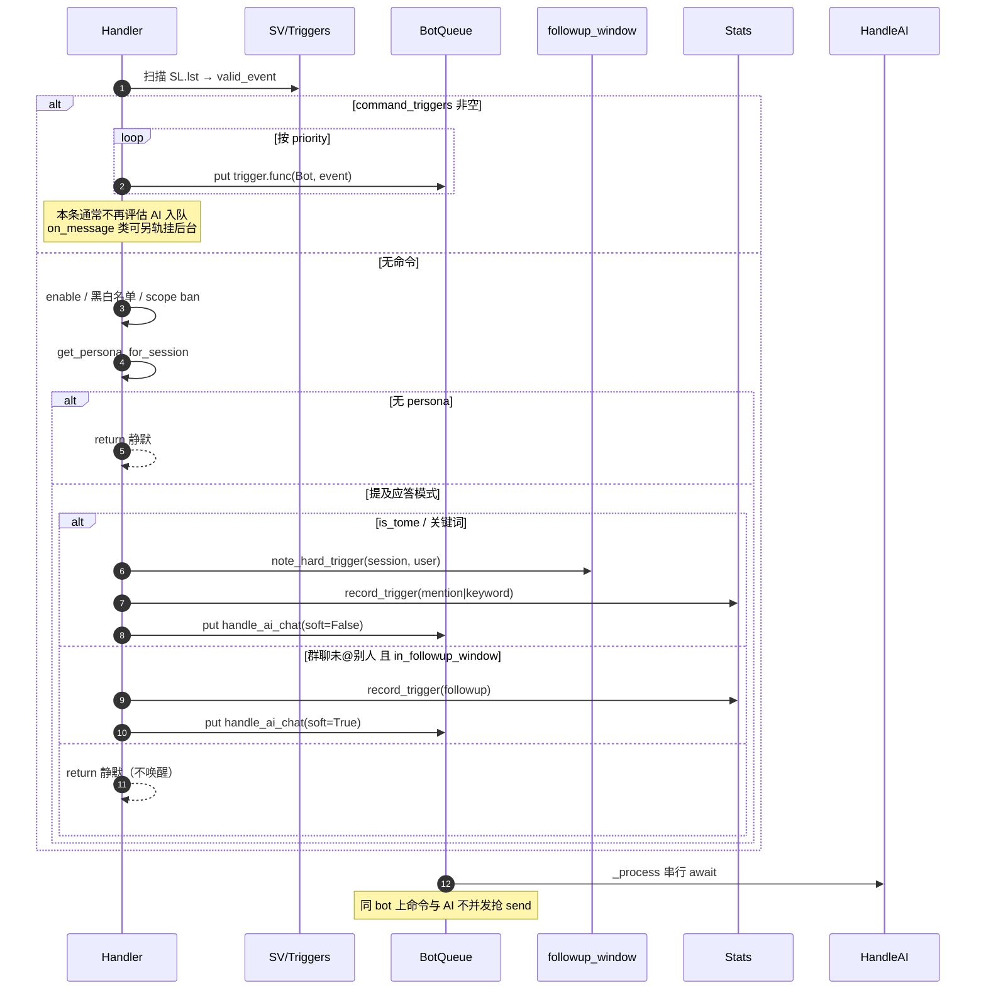
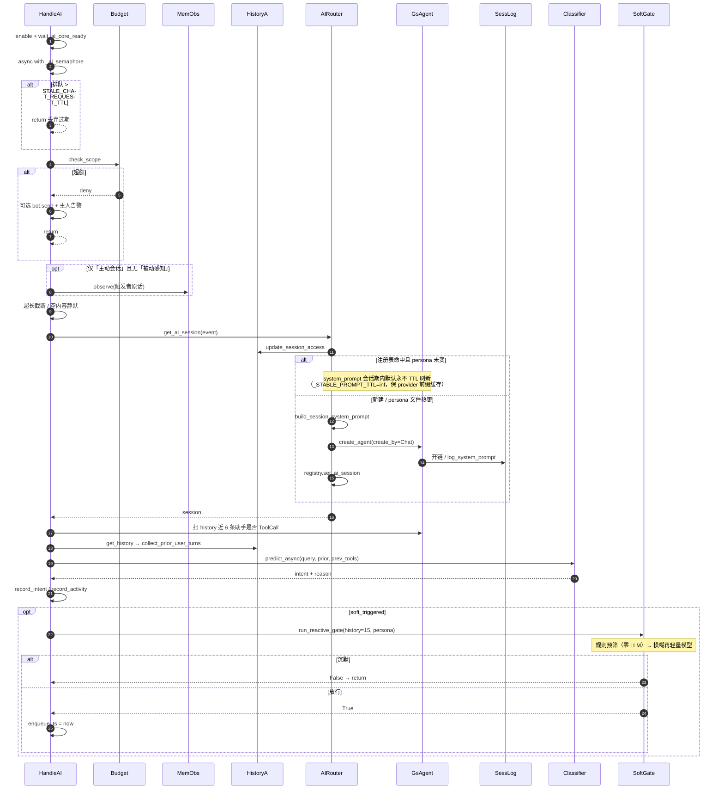
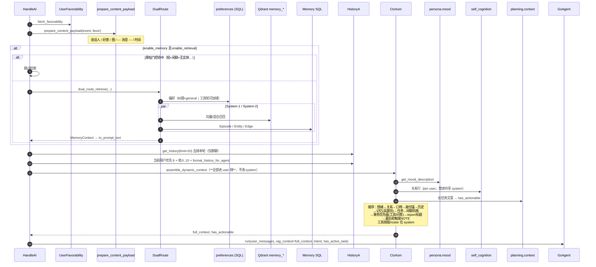
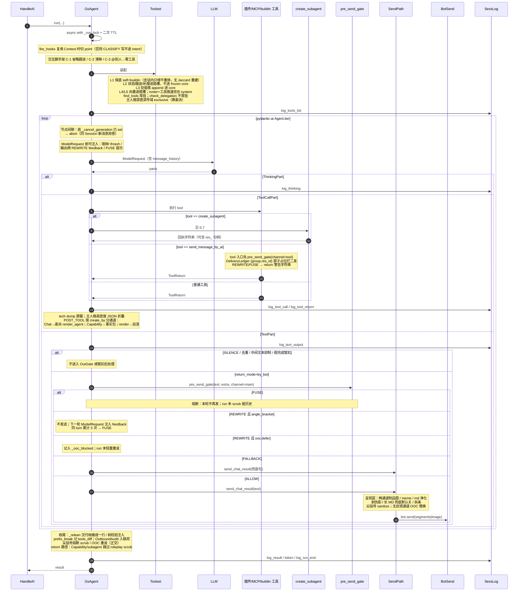
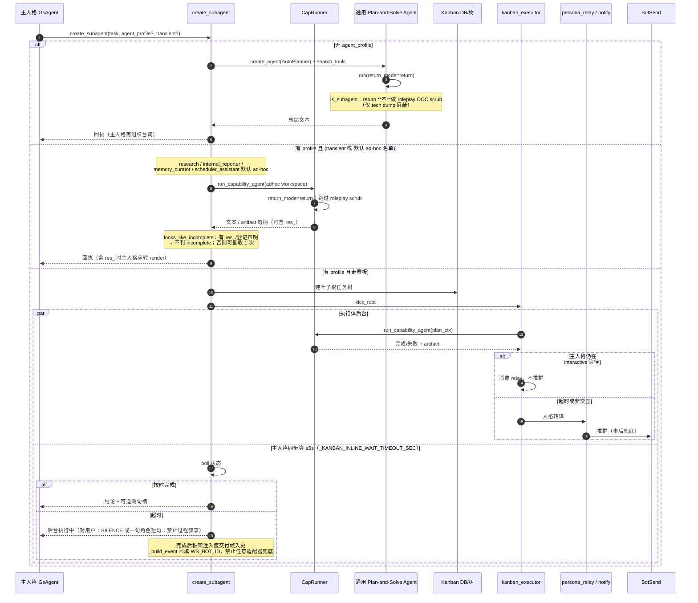
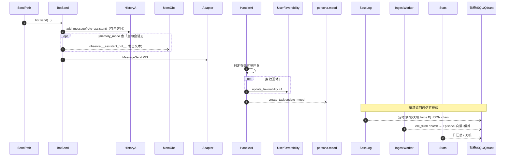
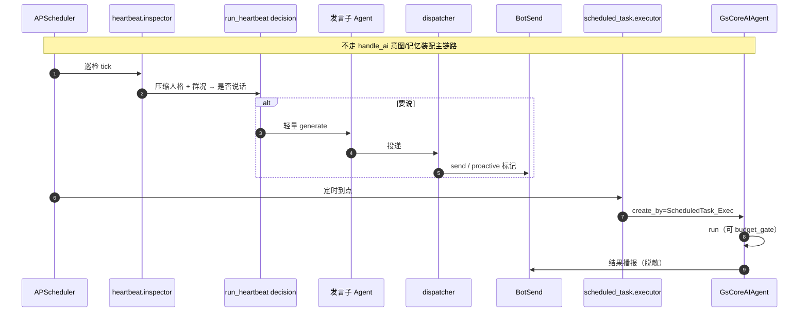
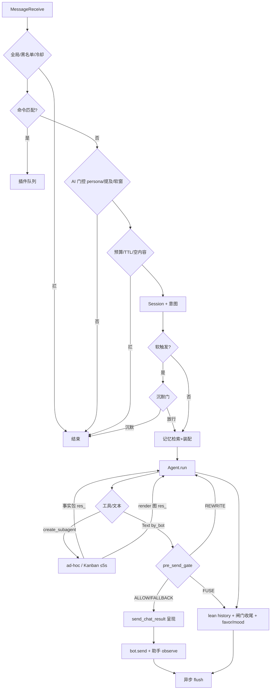

# GsCore AI：一条消息的完整生命周期

> 日期：**2026-08-21**（对齐源码：SVG 文字 HTML 覆盖层 / OutboundAudit+DeliveryLedger /
> 引用等值消解 / 工具池删 Jaccard / 族速览折叠 / 计划一行 /
> FileOS 折叠多点仍武装出图 / 念数纠正走 render / chart_spec 解开 provider 数组包裹 /
> fire_hooks 复用 Context 切 point / 人格表面不进他人映射 / 句首呼名算点名 /
> 在途模板句 / 委派人人设资源按需拉取（§16.3）/
> 2026-08-20：入史即发送 / 工具池会话钉死 / 群词汇映射出 system /
> 心想闸 / 逐人新鲜度 / 梗词典 / self_ontology / capability_map / 前缀失配探针 /
> 2026-08-16 既有：system 前缀缓存 / exclusive 委派 / `pre_send_gate` /
> 能力代理 **return 不做 roleplay OOC scrub** / incomplete 认 `res_` /
> POST_TOOL 分通道 / **出图主路径 `render_agent`** / 长 MD 兜底默认关 /
> DELEGATION_FIRST + web_search 降权 / 身份锚定 /
> **Agent 单次 run 已拆 `ai_core/agent_run/` 阶段包** /
> **DELIVERED 交付终局态 + `delivery_narration` 防火墙** /
> 出图候选时效+多点判据 / 能力缺口登记 / 召回阈值可配 / heartbeat 话头门 /
> **出图委派 ToolCall 即在途静默 / 多点读数结构闸 / `in_flight_short` 瘦工具池 /
> `render_chart_spec` series+图例+零轴**）
> 主线：**适配器推来一条群聊消息 → 是否进 AI → 读哪些数据 → 激活哪些模块 → 怎么回复 → 什么被沉淀 → 首尾日志**
> 源码是唯一事实源。改 `handler` / `handle_ai` / `gs_agent` / **`agent_run/*`** / `output_gate` /
> `output_firewall` / `subagent` / `delegation_contracts` / 装配 / 记忆后请同步本文。
> 关联：
> - 开发技能：`.agents/skills/gscore-development/references/02-startup-lifecycle.md`、`04-event-trigger-flow.md`、`06-ai-session-and-persona.md`、`07-tool-registry-and-agent.md`、`09-memory-system.md`
> - 会话日志：`AI_SESSION_LOG_CHAIN_AND_WATERFALL_20260708.md`
> - 委派/OOC 历史交接：`AI_CORE_OOC_DELEGATION_UPDATE_20260724.md`
> - **Agent run 拆分**：[`AI_AGENT_RUN_REFACTOR_20260808.md`](AI_AGENT_RUN_REFACTOR_20260808.md)
> - **2026-08-10 OOC 根治归因**：[`AI_SESSION_OOC_ROOTCAUSE_20260810.md`](AI_SESSION_OOC_ROOTCAUSE_20260810.md)
> - 生产问题归因（历史）：`plans/AI_CORE_SESSION_PROBLEM_ANALYSIS_20260808.md`
> - 渲染：`docs/TAKUMI_HTML_GUIDE.md`、`ai_core/buildin_tools/html_render_tools.py`

---

## 怎么读本文

| 章节 | 内容 |
|------|------|
| **§0** | 前置假设：core 已启动、AI 子系统就绪 |
| **§1** | 一图总览：单条消息 12 个阶段（文字） |
| **§S** | **时序图集（Mermaid）**：端到端 + 分阶段 + 记忆/表情 + Subagent/Kanban + 异步沉淀 |
| **§2–§13** | **按时间顺序逐步走**（读 / 写 / 模块 / 日志） |
| **§10.0–§10.8** | Agent 环：`agent_run` 阶段包地图 / 闸门 / 假完成 / 呈现层 / return OOC |
| **§14** | 三套历史 / 三类落盘对照 |
| **§15** | 进程启动与 `init_ai_core`（消息到来之前） |
| **§16** | 后台链路 + **create_subagent 三路径 + 理想长信息流水线** |
| **§17** | 成本 / 委派 / 出图 / web 降权备忘（2026-08-08） |

**读图约定**：

- 实线箭头 = 同步 `await` / 队列串行消费
- `par` / 注释「后台 task」= `asyncio.create_task` / `_add_bg_task`，**不阻塞**主路径
- 参与者缩写见 **§S.0**

**测生产插件行为不要用 `--dev`**：

```bash
# 加载全部插件（含业务插件）。Windows 必须带 NO_PROXY，否则系统代理会把
# 本机 Qdrant / chat_with_history 打成 502（curl 通、httpx 失败）。
GSUID_LOCAL_TEST_MODE=1 GSUID_LOCAL_TEST_TOKEN=... PYTHONUTF8=1 \
  NO_PROXY=localhost,127.0.0.1 uv run core --port 8765

# --dev 只加载目录名 endswith("-dev") 的插件；普通插件全部跳过
```

---

## 0. 前置：消息到达前世界已就绪

假定：

1. `uv run core` 已 `init_database` + `load_plugins`（`@sv` / `@ai_tools` 进表）
2. lifespan 里 `init_ai_core` **已完成**（RAG/Persona/Planning/Memory/MCP/统计…）
3. 适配器已 WS 连上，`bot._process` 在消费 `ws.queue`
4. 当前会话已配 persona（`global` / 群聊 `global_group` / 私聊 `global_private` / `specific` 含本群或本用户）

若 `init_ai_core` 未完成：`handler` 会打 `ai_initializing` / `ai_init_incomplete` 并 **不入队** AI。

---

## 1. 一图总览：单条消息 12 阶段

```text
适配器 MessageReceive
    │
    ▼
① WS receive + handle_event 入站门控          [handler]
    │  读: 黑名单/冷却/AI开关  写: HistoryManager(用户句)  旁路: meme/记忆observe
    ▼
② 命令触发器匹配                               [SL.lst / SV]
    │  有命令 → 插件路径结束（可不进主 Agent）
    │  无命令 ↓
    ▼
③ AI 触发门控（persona / 提及 / 软触发）       [handler 尾部]
    │  入队 handle_ai_chat → bot.queue
    ▼
④ handle_ai_chat 早退闸门                     [handle_ai]
    │  预算 / 空内容 / Semaphore / 过期 TTL
    ▼
⑤ Session 路由                                [ai_router]
    │  读/建 GsCoreAIAgent + system_prompt 固化
    ▼
⑥ 意图分类（同用户上下文拼接）                 [mode_classifier]
    ▼
⑦ 软触发沉默门（仅 soft）                      [reactive_gate]
    ▼
⑧ 装配 user 侧上下文                          [payload / memory / history / assembly]
    ▼
⑨ Agent.run：工具五层 + LLM 迭代               [gs_agent + agent_run]
    │  prepare → tools → loop → settle（§10.0）
    │  exclusive 剥离 / create_subagent 委派
    │  POST_TOOL 分通道 / **pre_send_gate** / send_chat_result
    │  （重任务理想：research→render→短句+图）
    ▼
⑩ 回合收尾：history lean / 闸门收尾重写 / 关系温度结算 / mood
    ▼
⑪ 发送路径旁路：Bot 出站 + 助手侧记忆 observe  [bot.send]
    ▼
⑫ 异步沉淀：session_log 刷盘 / 记忆 flush / 统计 / 认知节点回流
```

### 1.1 内核 vs 套件（2026-08-15 起）

上面 12 阶段是**内核编排**。产品能力（记忆 / 关系温度 / 情绪 / 意图分类 / 软门 /
脚手架注入 / 工具装配 / FileOS 折叠 / 质量纠正）**不再写在阶段函数体里**，而是 18 个
可替换**套件**，挂在同一张 **31 点位 hook 总线**上：

```text
handler   ①  ──→ H00 ON_INBOUND                    记忆观察 / 表情观察 / 图片记忆
handle_ai ④  ──→ H01 BEFORE_AI_CHAT                会话静默窗（abort）
          ⑤  ──→ H02 AFTER_SESSION                 关系温度 View / 主动会话 observe
          ⑥  ──→ H03 CLASSIFY                      意图（**由槽位占用者写入**）
          ⑦  ──→ H04 REACTIVE_GATE                 软触发沉默门（silence）
          ⑧  ──→ H05 RETRIEVE_CONTEXT              贵检索窗（唯一 15s 长超时）
              ──→ H06 COMPOSE_CONTEXT              各套件填命名块
              ──→ H07 AFTER_CONTEXT                第三方追加 hint
          ⑩  ──→ H08 AFTER_RUN                     mood / 统计上报
              ──→ H09 ON_AI_ERROR
agent_run    ──→ H10–H13   prepare（预算后 / ToolContext / user 外壳）
             ──→ H14/H15/H15b  工具装配 / 钉工具 / 建 Agent 后
             ──→ H16–H22   iter（模型请求前 / ToolReturn / ToolCall / 出站前后）
             ──→ H23–H28   settle / 纠正 / usage limit / 取消 / 失败 / cleanup
建 session   ──→ H29 ON_STABLE_CONTEXT              **唯一**允许写 system 的点位
```

- 关某个能力 = `kit_slots.<slot> = off` → 套件**不注册** → 自然跳过。
  内核里没有 `if enable_x`（闸门应该过滤，不该整轮跳过）。
- 总闸 `agent_hooks_enable=false` → 回落纯内核编排（应急回滚）。
- 单个 hook 异常 / 超时一律 **fail-open + warning**，**不得**升级成 ABORT_RUN、
  不得变成人格台词。
- 详见 [`AI_CORE_THREE_LINE_REFACTOR_20260815.md`](AI_CORE_THREE_LINE_REFACTOR_20260815.md)
  §6 与 [`skills/gscore-development/references/13-agent-loop-hooks.md`](skills/gscore-development/references/13-agent-loop-hooks.md)。

**留在内核、不许做成可关套件的**：`system_prompt` 稳定、预算闸与记账、exclusive 剥离、
`pre_send_gate` 唯一入口、保头裁中段、`_relean`、`_run_lock` / 抢答、AI 总开关、
`content_guard` 输入侧防护、TurnGraph 构建、C-3 寻址门的零工具硬约束。

---

## S. 时序图集（覆盖全阶段）

> 以下图用 **Mermaid `sequenceDiagram`**。GitHub / VS Code Markdown 预览可直接渲染。
> 图中模块名对齐源码；细节表仍见 §2–§13。

### S.0 参与者一览

| 缩写 | 源码位置 | 职责 |
|------|----------|------|
| Adapter | 适配器 WS 客户端 | 推 `MessageReceive`、收 `MessageSend` |
| CoreWS | `core.websocket_endpoint` | 解码、回执短路、`handle_event` |
| Handler | `handler.handle_event` | 入站门控、历史、旁路观察、命令/AI 分流 |
| HistoryA | `message_history.HistoryManager` | 群/私 **A 轨** 滑动窗口（内存） |
| MemeObs | `meme.observer` | 表情入库观察（后台） |
| MemObs | `memory.observe` / `observer` | 对话记忆入缓冲（后台） |
| BotQueue | `bot._Bot.queue` / `_process` | **串行**消费命令与 AI 协程 |
| HandleAI | `handle_ai.handle_ai_chat` | 早退闸、意图、软门、装配、调 Agent |
| Budget | `budget.budget_manager` | Session Token 额度 |
| AIRouter | `ai_router.get_ai_session` | 读/建 `GsCoreAIAgent` + 稳定 system_prompt |
| Classifier | `mode_classifier` / `classifier_service` | 闲聊/工具/问答 |
| SoftGate | `heartbeat.decision.run_reactive_gate` | 软触发沉默门 |
| DualRoute | `memory.retrieval.dual_route` | 双路记忆检索（读） |
| CtxAsm | `context_assembly` | user 侧动态上下文顺序 |
| GsAgent | `gs_agent.GsCoreAIAgent` + `agent_run/*` | 单次 run 编排；工具五层 + LLM 迭代 + 出站闸 |
| Toolset | `register` / `dynamic_toolset` / `rag.tools` | 保底/状态/向量/find_tools |
| LLM | pydantic-ai `Agent.iter` | 模型请求与 tool 循环 |
| OutGate | `output_gate.pre_send_gate` | **统一发送前闸门**（尖括号 → OOC → 心想；本轮工具名集合防泄漏） |
| SubAgent | `buildin_tools.subagent.create_subagent` | 通用子代理 / 能力代理入口 |
| CapRunner | `capability_agents.runner` | 无人格能力节点执行 |
| Kanban | `planning.kanban` / `kanban_executor` | 任务树、kick、转译推群 |
| SendPath | `utils.send_chat_result` | 呈现层：report / meme / 出图 / 拆条 / sanitize |
| BotSend | `bot._Bot.send` | WS 出站 + 助手历史 + 主动会话 observe |
| SessLog | `session_logger.AISessionLogger` | C 轨事件流（可落盘） |
| Ingest | `memory.ingestion.worker` | Episode/边/偏好异步 flush |
| Stats | `statistics_manager` | 触发/意图/token（内存→日汇总） |

---

### S.1 端到端总览（硬触发成功一轮，同步主路径）

> 旁路任务（meme / 被动记忆 / mood）见 **S.2 / S.8**，本图只标「旁路启动」。


```mermaid
sequenceDiagram
    autonumber
    actor User as 用户/群
    participant Adapter
    participant CoreWS as CoreWS
    participant Handler
    participant BotQueue
    participant HandleAI
    participant AIRouter
    participant Classifier
    participant SoftGate
    participant DualRoute
    participant CtxAsm as CtxAsm
    participant GsAgent
    participant LLM
    participant SendPath
    participant BotSend

    User->>Adapter: 发消息
    Adapter->>CoreWS: MessageReceive (WS bytes)
    CoreWS->>Handler: handle_event(bot, msg)

    Note over Handler: ① 门控 + HistoryA 写 user<br/>旁路: MemeObs / MemObs 后台 task

    alt 匹配到命令 SV
        Handler->>BotQueue: put 插件 trigger.func
        BotQueue-->>User: 插件回复路径（可不进 AI）
    else 无命令且 AI 门控通过
        Handler->>BotQueue: put handle_ai_chat(soft?)
        BotQueue->>HandleAI: 串行执行

        Note over HandleAI: ④ 预算/Semaphore/TTL/空内容

        HandleAI->>AIRouter: get_ai_session
        AIRouter-->>HandleAI: GsCoreAIAgent + system_prompt

        HandleAI->>Classifier: predict_async(prior, prev_tools)
        Classifier-->>HandleAI: intent

        opt soft_triggered
            HandleAI->>SoftGate: run_reactive_gate
            alt 沉默
                SoftGate-->>HandleAI: False
                HandleAI-->>BotQueue: return（不装记忆/不跑 Agent）
            else 放行
                SoftGate-->>HandleAI: True
                Note over HandleAI: 重置 enqueue_ts
            end
        end

        HandleAI->>DualRoute: dual_route_retrieve（非寒暄）
        DualRoute-->>HandleAI: memory_context_text
        HandleAI->>CtxAsm: assemble_dynamic_context
        CtxAsm-->>HandleAI: full_context + has_actionable

        HandleAI->>GsAgent: run(by_bot, rag_context, intent)

        Note over GsAgent: ⑨ 工具 L1–L5 + exclusive 剥离<br/>find_tools 常挂；roster 在 system<br/>可 supersede 取消

        loop LLM 迭代
            Note over GsAgent: 节点间隙检查 cancel
            GsAgent->>LLM: Agent.iter / ModelRequest
            LLM-->>GsAgent: Thinking / ToolCall / Text
            opt ToolCall
                GsAgent->>GsAgent: 执行工具（可 create_subagent）
                Note over GsAgent: POST_TOOL 分通道：主人格→render_agent<br/>能力代理→事实包；return 不 scrub res_<br/>send 带台词成功回执→DELIVERED 终局
            end
            opt Text 且 by_bot
                GsAgent->>GsAgent: speech_policy + pre_send_gate（尖括号+OOC）
                alt REWRITE / FUSE / FALLBACK / DELIVERED
                    Note over GsAgent: 打回注入 / 熔断静默 / 发兜底句 / 终局沉默
                else ALLOW
                    GsAgent->>SendPath: send_chat_result（呈现层）
                    SendPath->>BotSend: bot.send
                    BotSend->>Adapter: MessageSend
                    Adapter-->>User: 展示文本/图/表情
                end
            end
        end

        GsAgent-->>HandleAI: result（by_bot 常为空串）
        Note over HandleAI: ⑩ 好感度 + mood 后台
    end
```

---

### S.2 阶段 ①：入站旁路 — History / Meme / 记忆 observe


```mermaid
sequenceDiagram
    autonumber
    participant CoreWS
    participant Handler
    participant HistoryA as HistoryA
    participant MemeObs as MemeObs
    participant MemObs as MemObs
    participant ImgMem as multimodal.submit_image
    participant Ingest as IngestWorker

    CoreWS->>Handler: handle_event

    Handler->>Handler: 权限 / Event / AI scope ban 标记

    par 不阻塞主路径
        Handler--)MemeObs: create_task observe_message_for_memes
        Note over MemeObs: meme_enable 且 meme_auto_collect<br/>群聊图/文 → 入库 + tag 队列
    and
        alt enable_memory 且「被动感知」
            Handler--)MemObs: create_task observe(用户句)
            MemObs->>MemObs: 门控/去重 → 入缓冲
            Note over MemObs,Ingest: 真正 SQL/Qdrant 在 idle_flush / batch
        end
    and
        alt 另开「图片记忆」
            Handler--)ImgMem: submit_image_observation
        end
    end

    alt raw_text 非空 或 at_list 非空
        Handler->>HistoryA: add_message(role=user)
        Note over HistoryA: 纯图无字无@ → 不进 A 轨
    end

    Handler->>Handler: 冷却 / 前缀剥离 / 扫描 SL.lst
```

**记忆双写口径**：

| 模式配置 | 用户句写入点 | 助手句写入点 |
|----------|--------------|--------------|
| 含「被动感知」 | `handler` 入站 | 通常仍靠「主动会话」+ `bot.send` 观察助手 |
| 仅「主动会话」（无被动） | `handle_ai_chat` 早段 observe（能进 AI 才写） | `bot.send` 时 `speaker_id=__assistant_{bot_id}__` |
| 两者都开 | 入站只写一次（handle_ai **跳过**用户 observe 防双写） | 同上 |

---

### S.3 阶段 ②–③：命令分流 vs AI 入队


```mermaid
sequenceDiagram
    autonumber
    participant Handler
    participant SV as SV/Triggers
    participant BotQueue
    participant Follow as followup_window
    participant Stats
    participant HandleAI

    Handler->>SV: 扫描 SL.lst → valid_event

    alt command_triggers 非空
        loop 按 priority
            Handler->>BotQueue: put trigger.func(Bot, event)
        end
        Note over Handler: 本条通常不再评估 AI 入队<br/>on_message 类可另轨挂后台
    else 无命令
        Handler->>Handler: enable / 黑白名单 / scope ban
        Handler->>Handler: get_persona_for_session
        alt 无 persona
            Handler-->>Handler: return 静默
        else 提及应答模式
            alt is_tome / 关键词
                Handler->>Follow: note_hard_trigger(session, user)
                Handler->>Stats: record_trigger(mention|keyword)
                Handler->>BotQueue: put handle_ai_chat(soft=False)
            else 群聊未@别人 且 in_followup_window
                Handler->>Stats: record_trigger(followup)
                Handler->>BotQueue: put handle_ai_chat(soft=True)
            else
                Handler-->>Handler: return 静默（不唤醒）
            end
        end
    end

    BotQueue->>HandleAI: _process 串行 await
    Note over BotQueue: 同 bot 上命令与 AI 不并发抢 send
```

---

### S.4 阶段 ④–⑦：早退闸 → Session → 意图 → 软门


```mermaid
sequenceDiagram
    autonumber
    participant HandleAI
    participant Budget
    participant MemObs as MemObs
    participant HistoryA as HistoryA
    participant AIRouter
    participant GsAgent
    participant SessLog as SessLog
    participant Classifier
    participant SoftGate

    HandleAI->>HandleAI: enable + wait_ai_core_ready
    HandleAI->>HandleAI: async with _ai_semaphore
    alt 排队 > STALE_CHAT_REQUEST_TTL
        HandleAI-->>HandleAI: return 丢弃过期
    end

    HandleAI->>Budget: check_scope
    alt 超额
        Budget-->>HandleAI: deny
        HandleAI->>HandleAI: 可选 bot.send + 主人告警
        HandleAI-->>HandleAI: return
    end

    opt 仅「主动会话」且无「被动感知」
        HandleAI->>MemObs: observe(触发者原话)
    end

    HandleAI->>HandleAI: 超长截断 / 空内容静默

    HandleAI->>AIRouter: get_ai_session(event)
    AIRouter->>HistoryA: update_session_access
    alt 注册表命中且 persona 未变
        Note over AIRouter,GsAgent: system_prompt 会话期内默认永不 TTL 刷新<br/>（_STABLE_PROMPT_TTL=inf，保 provider 前缀缓存）
    else 新建 / persona 文件热更
        AIRouter->>AIRouter: build_session_system_prompt
        AIRouter->>GsAgent: create_agent(create_by=Chat)
        GsAgent->>SessLog: 开链 / log_system_prompt
        AIRouter->>AIRouter: registry.set_ai_session
    end
    AIRouter-->>HandleAI: session

    HandleAI->>GsAgent: 扫 history 近 6 条助手是否 ToolCall
    HandleAI->>HistoryA: get_history → collect_prior_user_turns
    HandleAI->>Classifier: predict_async(query, prior, prev_tools)
    Classifier-->>HandleAI: intent + reason
    HandleAI->>HandleAI: record_intent / record_activity

    opt soft_triggered
        HandleAI->>SoftGate: run_reactive_gate(history≈15, persona)
        Note over SoftGate: 规则预筛（零 LLM）→ 模糊再轻量模型
        alt 沉默
            SoftGate-->>HandleAI: False → return
        else 放行
            SoftGate-->>HandleAI: True
            HandleAI->>HandleAI: enqueue_ts = now
        end
    end
```

---

### S.5 阶段 ⑧：记忆检索 + 上下文装配（读多写少）


```mermaid
sequenceDiagram
    autonumber
    participant HandleAI
    participant Favor as UserFavorability
    participant Payload as prepare_content_payload
    participant DualRoute
    participant Pref as preferences (SQL)
    participant Qdrant as Qdrant memory_*
    participant SQL as Memory SQL
    participant HistoryA as HistoryA
    participant CtxAsm as CtxAsm
    participant Mood as persona.mood
    participant Rel as self_cognition
    participant PlanCtx as planning.context
    participant GsAgent

    HandleAI->>Favor: fetch_favorability
    HandleAI->>Payload: prepare_content_payload(event, favor)
    Note over Payload: 说话人 / 好感 / 图 / --- 消息 --- / 时间

    alt enable_memory 且 enable_retrieval
        alt 寒暄门控命中（短+闲聊+无实体…）
            HandleAI->>HandleAI: 跳过检索
        else
            HandleAI->>DualRoute: dual_route_retrieve(...)
            DualRoute->>Pref: 偏好（纠错+general；工具轮可加域）
            par System-1 / System-2
                DualRoute->>Qdrant: 向量/混合召回
                DualRoute->>SQL: Episode / Entity / Edge
            end
            DualRoute-->>HandleAI: MemoryContext → to_prompt_text
        end
    end

    HandleAI->>HistoryA: get_history(limit=20) 去掉本轮（仅群聊）
    HandleAI->>HistoryA: 当前用户优先 6 + 他人 10 + format_history_for_agent

    HandleAI->>CtxAsm: assemble_dynamic_context（**全部进 user 侧**，不改 system）
    CtxAsm->>Mood: get_mood_description
    CtxAsm->>Rel: 关系行（per-user，禁进共享 system）
    CtxAsm->>PlanCtx: 长任务文案 → has_actionable
    Note over CtxAsm: 顺序：情绪→关系→口吻→身份锚→历史<br/>→记忆(高置信)→任务→闲聊风格<br/>→事务优先级(工具/问答)→report标题<br/>→最后软触发NOTE<br/>工具规程/roster 在 system
    CtxAsm-->>HandleAI: full_context, has_actionable

    HandleAI->>GsAgent: run(user_messages, rag_context=full_context, intent, has_active_task)
```

> **2026-08-17 Everything is Memory**：统一写契约 `remember(MemoryWrite)`；
> web 搜索/抓取 ≥40 字同步落 FileOS（当轮可回想）；`search_cognition` 补 History A /
> record / 图片 / 表情，产物走 SQL+向量。⑧ 每轮自动注入仍只打记忆+偏好。
> 公共概念的**路径卡 + 选定全文**只出现在工具 `search_cognition` 的回执里，不灌闲聊。
> 门面 `cognition.facade.search_cognition` 签名不变；展开在 `cognition.hub.expand_hub`
> （失败 fail-open，独立 i18n `cognition_expand_fail`，不挡联邦命中列表）。
> 只问正式名不附全文（枢纽名本身不是点名）；同 slot 两篇也不附。
> 选定全文只 inline `kb_plugin:` / `kb_kbdoc:`；`to_` 留在路径卡，走 `read_handle` ACL。
> 启动挂载见 **§15.2**（READY 之后后台 `create_task`，不进 `_INIT_STEPS`）。

---

### S.6 阶段 ⑨：Agent 工具五层 + LLM 环 + 输出闸门 + 发送


```mermaid
sequenceDiagram
    autonumber
    participant HandleAI
    participant GsAgent
    participant Toolset
    participant LLM
    participant Plugin as 插件/MCP/buildin 工具
    participant SubAgent as create_subagent
    participant OutGate as pre_send_gate
    participant SendPath
    participant BotSend
    participant SessLog as SessLog

    HandleAI->>GsAgent: run(...)
    GsAgent->>GsAgent: async with _run_lock + 二次 TTL
    Note over GsAgent: fire_hooks 复用 Context 时切 point（否则 CLASSIFY 写不进 intent）

    Note over GsAgent: 交互脚手架 C-1 省略跟进 / C-2 漂移 / C-3 @别人→零工具

    GsAgent->>Toolset: 装配
    Note over Toolset: L1 保底 self+buildin（会话内只增不重排，无 Jaccard 重建）<br/>L2 状态/跟进/补搜进尾槽，不进 frozen core<br/>L3 驻留族 append 进 core<br/>L4/L5 向量进尾槽；roster+工具族速览在 system<br/>find_tools 常挂；check_delegation 不常挂<br/>主人格禁直调专域 exclusive（靠委派）

    GsAgent->>SessLog: log_tools_list

    loop pydantic-ai Agent.iter
        Note over GsAgent: 节点间隙：若 _cancel_generation 已 set<br/>→ abort（同 Session 新消息抢答）
        Note over GsAgent: ModelRequest 前可注入：墙钟/ thrash /<br/>输出闸 REWRITE feedback / FUSE 提示
        GsAgent->>LLM: ModelRequest（含 message_history）
        LLM-->>GsAgent: parts

        alt ThinkingPart
            GsAgent->>SessLog: log_thinking
        else ToolCallPart
            GsAgent->>Plugin: 执行 tool
            alt tool == create_subagent
                GsAgent->>SubAgent: 见 S.7
                SubAgent-->>GsAgent: 回执字符串（可含 res_ 句柄）
            else tool == send_message_by_ai
                Note over Plugin: tool 入口先 pre_send_gate(channel=tool)<br/>DeliveryLedger (group,res_id) 原子占位拦二发<br/>REWRITE/FUSE → return 警告字符串
                Plugin-->>GsAgent: ToolReturn
            else 普通工具
                Plugin-->>GsAgent: ToolReturn
            end
            GsAgent->>SessLog: log_tool_call / log_tool_return
            Note over GsAgent: tech dump 屏蔽；主人格高密度 JSON 折叠<br/>POST_TOOL 按 create_by 分通道：<br/>Chat→委派 render_agent；Capability→事实包；render→自渲
        else TextPart
            GsAgent->>SessLog: log_text_output
            alt SILENCE / 去重 / 中间文本抑制 / 假完成暂扣
                Note over GsAgent: 不进入 OutGate 或暂扣后处理
            else return_mode=by_bot
                GsAgent->>OutGate: pre_send_gate(text, extra, channel=main)
                alt FUSE
                    Note over OutGate,GsAgent: 熔断：本轮不再发；run 末 scrub 脏历史
                else REWRITE 且 angle_bracket
                    Note over GsAgent: 不发送；下一轮 ModelRequest 注入 feedback<br/>同 turn 累计 3 次 → FUSE
                else REWRITE 且 ooc.defer
                    Note over GsAgent: 记入 _ooc_blocked；run 末轻量重说
                else FALLBACK
                    GsAgent->>SendPath: send_chat_result(兜底句)
                else ALLOW
                    GsAgent->>SendPath: send_chat_result(text)
                    Note over SendPath: 呈现层：两通道制品图 / meme / md 净化<br/>剥伪影 / 长 MD 兜底默认关 / 拆条<br/>尖括号 sanitize；无反馈通道 OOC 替换
                    SendPath->>BotSend: bot.send(segments|image)
                end
            end
        end
    end

    Note over GsAgent: 收尾：_relean 交付帧瘦成一行 / 剥校验注入<br/>prefix_break 记 tools_diff；OutboundAudit 入联邦<br/>尖括号熔断 scrub / OOC 重说（正交）<br/>return 路径：Capability/subagent 跳过 roleplay scrub
    GsAgent->>SessLog: log_result / token / log_run_end
    GsAgent-->>HandleAI: result
```

---

### S.7 Subagent / 能力代理 / Kanban 调度（嵌在工具调用中）


```mermaid
sequenceDiagram
    autonumber
    participant GsAgent as 主人格 GsAgent
    participant SubTool as create_subagent
    participant Cap as CapRunner
    participant Plan as 通用 Plan-and-Solve Agent
    participant Kanban as Kanban DB/树
    participant Exec as kanban_executor
    participant Relay as persona_relay / notify
    participant BotSend

    GsAgent->>SubTool: create_subagent(task, agent_profile?, transient?)

    alt 无 agent_profile
        SubTool->>Plan: create_agent(AutoPlanner) + search_tools
        Plan->>Plan: run(return_mode=return)
        Note over Plan: is_subagent：return **不**做 roleplay OOC scrub<br/>（仅 tech dump 屏蔽）
        Plan-->>SubTool: 总结文本
        SubTool-->>GsAgent: 回执（主人格再组织台词）
    else 有 profile 且 (transient 或 默认 ad-hoc 名单)
        Note over SubTool: research / internal_reporter /<br/>memory_curator / scheduler_assistant 默认 ad-hoc
        SubTool->>Cap: run_capability_agent(adhoc workspace)
        Cap->>Cap: return_mode=return；跳过 roleplay scrub
        Cap-->>SubTool: 文本 / artifact 句柄（可含 res_）
        Note over SubTool: looks_like_incomplete：有 res_/登记声明<br/>→ 不判 incomplete；否则可催收 1 次
        SubTool-->>GsAgent: 回执（含 res_ 时主人格应转 render）
    else 有 profile 且走看板
        SubTool->>Kanban: 建叶子根任务树
        SubTool->>Exec: kick_root
        par 执行体后台
            Exec->>Cap: run_capability_agent(plan_ctx)
            Cap-->>Exec: 完成/失败 + artifact
            alt 主人格仍在 interactive 等待
                Exec->>Exec: 消费 relay，不推群
            else 超时或非交互
                Exec->>Relay: 人格转译
                Relay->>BotSend: 推群（事后兜底）
            end
        and 主人格同步等 ≤5s（_KANBAN_INLINE_WAIT_TIMEOUT_SEC）
            SubTool->>SubTool: poll 状态
            alt 按时完成
                SubTool-->>GsAgent: 结论 + 可追溯句柄
            else 超时
                SubTool-->>GsAgent: 后台执行中（对用户：SILENCE 或一句角色短句；禁止过程叙事）
                Note over SubTool: 完成后框架注入瘦交付帧入史<br/>_build_event 回填 WS_BOT_ID，禁止任意适配器兜底
            end
        end
    end
```

**委派闭环（主人格池）**：交互 `create_by` 剥离能力代理 exclusive 工具 → 模型只能
`create_subagent(agent_profile=真实 node_id)`；`find_tools` / `RetrievableToolset`
同步 `blocked_tool_names` 禁止回灌。roster + **工具族速览**固化在 **system**。
`check_delegation` 不进群聊瘦保底，追问进度时经 `find_tools` 召回。
`_build_event` 必须回填 `WS_BOT_ID`；`_get_bot` / `_resolve_active_bot` **禁止任意适配器兜底**。
同 `(group_id, res_id)` 由 `DeliveryLedger` 原子占位，拦跨 session 二发。

**两通道交付（2026-08-08）**：

| 方向 | 允许 | 禁止 |
|------|------|------|
| 能力代理 → 主人格（return） | Markdown/JSON 事实包、`res_` 句柄、工具名/字段 | roleplay OOC scrub 整段替换 |
| 主人格 → 用户（by_bot） | 角色短句、`send_message_by_ai(image_id=)` | 念句柄/工具拓扑；长表当台词 |

---

### S.8 阶段 ⑩–⑫：出站、助手记忆、异步沉淀


```mermaid
sequenceDiagram
    autonumber
    participant SendPath
    participant BotSend
    participant HistoryA as HistoryA
    participant MemObs as MemObs
    participant Adapter
    participant HandleAI
    participant Favor as UserFavorability
    participant Mood as persona.mood
    participant SessLog as SessLog
    participant Ingest as IngestWorker
    participant Stats
    participant Disk as 磁盘/SQL/Qdrant

    SendPath->>BotSend: bot.send(...)
    BotSend->>HistoryA: add_message(role=assistant)（有内容时）
    opt memory_mode 含「主动会话」
        BotSend--)MemObs: observe(__assistant_bot__, 发出文本)
    end
    BotSend->>Adapter: MessageSend WS

    HandleAI->>HandleAI: 判定有效可见回复
    opt 有效互动
        HandleAI->>Favor: update_favorability +1
    end
    HandleAI--)Mood: create_task update_mood

    Note over SessLog,Disk: 请求返回后仍可继续
    SessLog--)Disk: 定时/满段/关机 force 刷 JSON chain
    Ingest--)Disk: idle_flush / batch → Episode+向量+偏好
    Stats--)Disk: 日汇总 / 关机
```

| 数据 | 同步在请求内？ | 真正落盘时机 |
|------|----------------|--------------|
| HistoryA / Agent.history | 是（内存） | **默认不落盘**，空闲 GC |
| session_log entries | 写缓冲 | 增量刷盘 / 滚动 / 关机 |
| 记忆 Episode/边 | 仅入队 | IngestionWorker flush |
| 好感度 / 预算 | 调用时 | SQL |
| Kanban / artifact | 工具/执行体时 | DB + workspace 文件 |

---

### S.9 后台：Heartbeat / 定时任务（非本条用户消息）


```mermaid
sequenceDiagram
    autonumber
    participant Sched as APScheduler
    participant Heart as heartbeat.inspector
    participant Decide as run_heartbeat decision
    participant Gen as 发言子 Agent
    participant Disp as dispatcher
    participant BotSend
    participant TaskEx as scheduled_task.executor
    participant Agent as GsCoreAIAgent

    Note over Sched,Agent: 不走 handle_ai 意图/记忆装配主链路

    Sched->>Heart: 巡检 tick
    Heart->>Decide: 压缩人格 + 群况 → 是否说话
    alt 要说
        Decide->>Gen: 轻量 generate
        Gen->>Disp: 投递
        Disp->>BotSend: send / proactive 标记
    end

    Sched->>TaskEx: 定时到点
    TaskEx->>Agent: create_by=ScheduledTask_Exec
    Agent->>Agent: run（可 budget_gate）
    Agent->>BotSend: 结果播报（脱敏）
```

---

### S.10 短路面板（对照时序出口）


```mermaid
flowchart TD
    A[MessageReceive] --> B{全局/黑名单/冷却}
    B -->|拦| Z[结束]
    B --> C{命令匹配?}
    C -->|是| P[插件队列]
    C -->|否| D{AI 门控 persona/提及/软窗}
    D -->|否| Z
    D --> E{预算/TTL/空内容}
    E -->|拦| Z
    E --> F[Session + 意图]
    F --> G{软触发?}
    G -->|是| H{沉默门}
    H -->|沉默| Z
    H -->|放行| I[记忆检索+装配]
    G -->|否| I
    I --> J[Agent.run]
    J --> K{工具/文本}
    K -->|create_subagent| L[ad-hoc / Kanban ≤5s]
    L -->|事实包 res_| J
    L -->|render 图 res_| J
    K -->|Text by_bot| G0{pre_send_gate}
    G0 -->|ALLOW/FALLBACK| M[send_chat_result 呈现]
    G0 -->|REWRITE| J
    G0 -->|FUSE| O
    M --> N[bot.send + 助手 observe]
    J --> O[lean history + 闸门收尾 + favor/mood]
    N --> Q[异步 flush]
    O --> Q
```

---

## 2. 阶段 ①：WS 入站 → `handle_event`

> 时序图：**§S.2**（History / Meme / 记忆旁路）

### 2.1 调用链

```text
core.websocket_endpoint
  └─ data = websocket.receive_bytes()
  └─ msg = MessageReceive 解码
  └─ bot.resolve_recall(msg)? → 回执短路
  └─ await handle_event(bot, msg)          # gsuid_core/handler.py
```

### 2.2 顺序（有语义：别乱插全局拦截）

| # | 动作 | 模块 | 读 | 写 / 副作用 |
|---|------|------|----|-------------|
| 1 | `IS_HANDDLE` | handler | 全局开关 | 关则 return |
| 2 | Meta 事件 | `handle_meta_event` | — | 独立路径 |
| 3 | 权限 `user_pm` | `get_user_pml` | masters/superusers | 改写 msg.user_pm |
| 4 | `msg_process` → `Event` | handler | MessageReceive | Event（含 `session_id`） |
| 5 | ShowReceive 日志 | logger | — | 可选 info |
| 6 | AI scope ban | `core_ai_control` | 禁言表 | 标记 `ai_scope_banned` |
| 7 | Meme 观察 | `meme.observer` | 图/文 | 异步 task，不挡主路径 |
| 8 | **用户历史** | `HistoryManager` | — | **内存 deque** 追加 user |
| 9 | **记忆 observe（被动）** | `memory.observe` | memory_mode | **缓冲入队**（非立刻 SQL） |
| 10 | 主人自动订阅 | Subscribe DB | — | 可能 INSERT/UPDATE |
| 11 | CoreUser/Group 入库 | database | — | 用户/群行 |
| 12 | 重复消息 / 冷却 | cooldown | 进程态 | 命中则 return |
| 13 | 命令前缀剥离 | command_start | 配置 | 改 raw 前缀 |
| 14 | 触发器扫描 | `SL.lst` | 全部 SV | 填 `valid_event` |

**入历史门控**：`raw_text` 非空 **或** `at_list` 非空才 `add_message`。纯图（无字无 @）不进 HistoryManager；图片记忆走另一路 `submit_image_observation`。

**群聊 session_id**（不含 user_id，整群共享 Agent）：

```text
{WS_BOT_ID}:{bot_id}:{bot_self_id}:group:{group_id}
```

私聊：`...:private:{user_id}`。

### 2.3 日志（①）

| 级别 | 典型内容 |
|------|----------|
| info | `log.handler.event_received`（ShowReceive 开时） |
| warning | 黑名单 / at 屏蔽号 |
| debug | 记忆 observe 失败等 |

---

## 3. 阶段 ②：命令 vs AI 分流

### 3.1 有命令匹配

```text
command_triggers 非空
  → 按 priority 入队 trigger.func(Bot, event)
  → logger.info cmd_triggered
  → block 触发器可打断后续
  → 本条通常**不再**进 handle_ai_chat
```

（`on_message` 类触发器另轨：每条消息可挂后台，不挡 AI 判定。）

### 3.2 无命令 → 进入 AI 门控（阶段 ③）

仅当 `command_triggers` 为空才评估 AI。

---

## 4. 阶段 ③：AI 触发门控（仍在 `handler`）

严格顺序，任一步失败 **静默 return**（多数无用户提示）：

| # | 检查 | 失败行为 |
|---|------|----------|
| 1 | `ai_config.enable` | return |
| 2 | `ai_scope_banned` | return |
| 3 | AI 黑名单（用户/群） | return |
| 4 | AI 白名单（若配置了则必须命中） | return |
| 5 | `get_persona_for_session(session_id)` | None → return（本群未绑定人格） |
| 6 | `ai_mode` 含「提及应答」 | 见下 |

**提及应答**（生产默认）：

```text
should_respond = event.is_tome          # @机器人 或 私聊
             or 关键词命中 keywords
             or 软触发：
                  硬触发刚登记过 followup 窗口
                  and 群聊 and 未 at 别人
                  and in_followup_window(session_id, user_id)
```

| 触发类型 | `trigger_type` 统计 | 后续 |
|----------|---------------------|------|
| @/私聊 | `mention` | 硬触发，`note_hard_trigger` 开窗口 |
| 关键词 | `keyword` | 同上 |
| 续聊窗口内普通发言 | `followup` | `soft_triggered=True`，稍后沉默门 |

**AI Core 未就绪**：

```text
logger.info  ai_initializing
  或 logger.warning ai_init_incomplete
→ return（不入队）
```

**入队**：

```python
ws.queue.put_nowait(
    TaskContext(
        coro=handle_ai_chat(Bot(ws, event), event, enqueue_ts=now, soft_triggered=...),
        name="handle_ai_chat",
        priority=event.user_pm,
    )
)
```

`bot._process` **串行**消费队列（同 bot 上命令与 AI 互不并发抢同一 send 路径）。

### 4.1 日志（③）

| 时机 | 日志 |
|------|------|
| 统计 | `statistics_manager.record_trigger(mention|keyword|followup)`（内存，非 console 必打） |
| 入队成功 | 通常无单独 info（看后续 handle_ai） |

---

## 5. 阶段 ④：`handle_ai_chat` 早退闸门

> 时序图：**§S.4**（闸门 + Session + 意图 + 软门）

文件：`gsuid_core/ai_core/handle_ai.py`

| # | 闸门 | 读 | 写 / 日志 |
|---|------|----|-----------|
| 1 | 再次 `enable` | ai_config | debug 跳过 |
| 2 | `is_ai_core_ready` / wait 300s | startup 状态 | info 等待 / warning 超时跳过 |
| 3 | `async with _ai_semaphore`（默认 10） | — | 全局 AI 并发 |
| 4 | 队列等待 > `STALE_CHAT_REQUEST_TTL` | enqueue_ts | **info 丢弃过期请求** |
| 5 | **预算** `budget_manager.check_scope` | SQLite 账本 | 超额 info + 可选 bot.send + 主人告警 → return |
| 6 | 主动会话记忆：仅「主动会话」且无「被动感知」时 observe 用户句 | — | 防双写 |
| 7 | 长度：>60000 硬截断；稍后 >15000 可子 Agent 摘要 | — | warning 截断 |
| 8 | 空内容：无字且无模型可见内容且未 @ 我 | — | **info 前置静默跳过** |

### 5.1 日志（④）样例

```text
💰 [GsCore][AI] 预算超额拦截 (...)
🧠 [GsCore][AI] 队列等待 45.2s 超 TTL，丢弃过期请求
🧠 [GsCore][AI] 空内容消息（无模型可见内容且未@我），前置静默跳过
```

---

## 6. 阶段 ⑤：Session 路由 — 读 / 建 `GsCoreAIAgent`

```text
session = await get_ai_session(event)   # ai_router.py
```

### 6.1 流程

```text
session_id = event.session_id
history_manager.update_session_access(event)     # 刷新 A 轨活跃时间

registry.get_ai_session(session_id)
  ├─ 命中且 persona 未变
  │    └─ system_prompt **会话期内默认永不改串**
  │         _STABLE_PROMPT_TTL = float("inf")
  │         （最大化 provider 前缀缓存；空闲回收重建时自然刷新）
  └─ 未命中 / persona 文件 mtime 变 / 人名变
       ├─ get_persona_for_session → persona_name
       ├─ build_session_system_prompt(event, persona_name)
       │    = 人设 + SYSTEM_CONSTRAINTS + TOOL_ORCHESTRATION_CONSTRAINTS
       │    + 当前日期（日级，无时分秒）
       │    + 能力代理花名册 format_capability_roster
       │    + 群简介 + 慢变 self_model/群画像
       │    ※ 不含 per-user 关系 / mood / 记忆 / 精确时间
       ├─ create_agent(..., create_by="Chat", persona_name=...)
       │    └─ AISessionLogger 开文件 / 续写 chain
       │    └─ log_system_prompt
       └─ registry.set_ai_session
```

### 6.1.1 前缀缓存边界（必读）

| 放哪 | 内容 | 为何 |
|------|------|------|
| **system（会话内字节稳定）** | 人设、合规、工具规程、日级日期、roster、群简介、self_model/群画像 | 改串 = 整段 KV 前缀失效 |
| **user 每轮** | 精确时间、payload、情绪、关系、历史、记忆、任务、软触发 NOTE | 高频变；`_relean` 后不进持久 B 轨 |

**错误示范**：把 mood/关系/记忆写进 system 或每轮改 system → 每轮重算全量前缀缓存。
**正确**：system 只在建 session / persona 热更时构建；动态一律 `assemble_dynamic_context` → `rag_context` 拼进本轮 user。

### 6.2 数据

| 数据 | 介质 | 时机 |
|------|------|------|
| persona.md / config.json | 磁盘 `data/ai_core/persona/...` | 建 session / 热重载 |
| self_model / 群画像 | SQL + 缓存 | 稳定前缀（建 session 时） |
| `session.history` | **进程内存** ModelMessage 列表 | 跨轮累积，空闲 30min 回收丢 |
| session_log 文件 | `data/ai_core/session_logs/*.json` | 创建时打开，增量刷 |

### 6.3 日志（⑤）

```text
# 新建时常见
🧠 [GsCoreAIAgent] ... create / session ...
# session_log 内 entry: system_prompt（不总是 console）
```

---

## 7. 阶段 ⑥：意图分类（闲聊 / 工具 / 问答）

**不能只喂当前句**（省略跟进依赖上文）。

### 7.1 读入

| 输入 | 来源 |
|------|------|
| `query` | 本轮 raw_text |
| `prior_user_turns` | HistoryManager 同 user_id 近几句（去掉本轮已入库的末条） |
| `prev_turn_used_tools` | `session.history` **最近最多 6 条** ModelResponse 是否含 ToolCallPart |

### 7.2 判别路径（`mode_classifier.predict_async`）

1. 短句/省略跟进 + 有 prior → **ContextPrimary**：拼接 `prior[-3:] + 当前` 再跑分类器
2. 长句先闲聊 → ContextJoin 再判
3. 省略 + 上轮真用过工具 → Structural 升级为「工具」
4. 上轮用过工具 + 本轮短句/低置信闲聊 → 升为「工具」（防误判砍风格/计数豁免）
5. 向量问答兜底（低置信闲聊 + 疑问词）

### 7.2.1 intent 对下游的真实影响（2026-07-29）

| 用途 | 是否用 intent |
|------|----------------|
| 向量工具预装 / 状态驱动整族 | **否**（分类器会误判闲聊，不得砍工具） |
| find_tools 渐进暴露 | **否**（常挂） |
| 连续无工具强制提醒豁免 | **是**（闲聊豁免计数/注入） |
| user 侧极短风格提示 | **是**（且上轮工具/有任务时不压短） |
| 记忆寒暄门 | **部分**（短+闲聊+无实体可跳过检索） |

### 7.3 写

| 写 | 位置 |
|----|------|
| `statistics_manager.record_intent` | 内存统计 |
| `record_activity` | 活跃用户计数 |

### 7.4 日志（⑥）

```text
🧠 [GsCore][AI] 意图识别结果: {intent, conf, reason}
🧠 [GsCore][AI] 闲聊模式 | 工具模式 | 问答模式
```

`reason` 例：`ContextPrimary:Rule: Check Data`、`Structural: ellipsis follow-up after tools`。

---

## 8. 阶段 ⑦：软触发沉默门（仅 `soft_triggered`）

```text
run_reactive_gate(event, history_manager 近 15 条, persona_name)
  ├─ 规则预筛：空/纯语气/@别人 → 直接沉默（不打 LLM）
  ├─ 规则预筛：短接续 → 直接放行
  └─ 否则轻量 LLM 门
```

| 结果 | 行为 | 日志 |
|------|------|------|
| 沉默 | return，不装记忆、不跑主 Agent | `软触发沉默门判定与AI无关，保持沉默` |
| 放行 | 重置 enqueue_ts（门耗时不计入过期） | `软触发沉默门放行，按续聊处理` |
| 异常 | fail-open 放行主 Agent | debug |

后续还有 user 侧 `SOFT_TRIGGER_NOTE` + 人设「沉默规则」两道偏沉默约束。

---

## 9. 阶段 ⑧：装配本轮送给模型的内容

> 时序图：**§S.5**（记忆检索 + 装配顺序）

### 9.1 用户 payload

```text
favorability = fetch_favorability(user_id, bot_id)     # SQL，失败 None
user_messages = prepare_content_payload(event, favorability)
  # 含：说话人标注 / 好感 / 多模态图 / --- 消息 --- 正文
可选：长文 create_subagent 摘要
追加：【当前时间】
```

### 9.2 记忆检索：H05 `RETRIEVE_CONTEXT`（读，不写）

内核**只开窗、不判断**——「要不要检索、检索多深、预算怎么切」全在 `gscore.memory` 套件里：

```text
fire_hooks(RETRIEVE_CONTEXT, ctx)        # 内核唯一动作
└─ gscore.memory.retrieve（H05，唯一允许的 15s 长超时）
   ├─ enable_memory / enable_retrieval 检查
   ├─ 寒暄门控 should_retrieve()（短+闲聊+无实体/情绪/回指 → 跳过；主人恒检索）
   ├─ 偏好能力域过滤（闲聊轮传**空 list**，不是 None）
   ├─ cognition.inject_memory_slice(kinds={memory,preference})
   │     → dual_route_retrieve(..., enable_system2=<配置>)   # 必填，不吃函数默认值
   │     → to_prompt_text(预算五配额位 + priority_speakers + 第三方隐私门)
   └─ 可选：探针预取全联邦（`cognition_prefetch_enable`，**默认关**）
```

关 `memory` 槽 = 套件不注册 = 这一步自然跳过；内核里**没有** `if enable_memory`
（闸门应该过滤，不该整轮跳过）。

`priority_speakers` = masters ∪ 本 scope 内 `close` 用户（由
`relationship.collect_priority_speakers` 算出，高好感只是回忆时少被裁掉，不等于主人）。

日志：`命中寒暄门控` / `检索到记忆上下文 (N 字符)` / `[Cognition] 命中 N 条` / warning 失败。

### 9.3 群消息历史渲染（读 A 轨）

```text
# 私聊：不注入 IM 历史（pydantic_ai session.history 已覆盖，避免破坏缓存前缀）
raw = history_manager.get_history(limit=20) if group else []
history = raw[:-1]                          # 去掉本轮（已在 payload）
# 当前用户优先窗口：自 4 + 他人 6，按时间排
rag_context = "【历史对话】\n" + format_history_for_agent(...)
```

### 9.4 动态上下文唯一顺序（`CONTEXT_BLOCK_ORDER` + 合成器）

**全部拼进 user 侧**（`rag_context` → 本轮 `final_user_message`）。
结束后 `_relean_user_turn` **只剥框架注入**，动态块入史与最后一次请求所见一致（前缀缓存）。
膨胀由 `BLOCK_CHAR_BUDGET` + compact 摊还摘要控制。

自 2026-08-15 起，顺序的唯一定义在 **`kits/base.py::CONTEXT_BLOCK_ORDER`**（跨计划冻结
接口）。`assemble_dynamic_context` 只做三件事：建 `AgentHookContext` → 开火
**H06 `COMPOSE_CONTEXT`** / **H07 `AFTER_CONTEXT`** → 按块名表拼装。
各来源只 `set_context_block(name, text)` **填命名块**，未知块名直接拒绝
（`HookCapabilityError`），防止有人把块插到身份锚前面。

| # | 块名 | 谁填 |
|---|------|------|
| 1 | `mood` | `gscore.mood`（括号包裹，暗示内心状态） |
| 2 | `relationship` | `gscore.favorability`（per-user，**绝不能进共享 system**） |
| 3 | `voice_anchor` | `gscore.self_cognition`（口吻锚点 + 当前 zone 的一句口气） |
| 4 | `identity` | `gscore.identity`（**密封槽**，关不掉）——防群聊历史把人设拖成别的称呼 |
| 5 | `history` | **内核**（`turn_pipeline.build_group_history_block`；HistoryManager 是消息基础设施） |
| 6 | `group_context` | `gscore.group_profile`（群词汇映射；成员称呼仍在 system 稳定块） |
| 7 | `memory` | `gscore.memory`（H05 检索 → H06 注入；预算 `memory_inject_max_chars`=800 + 梗预注入） |
| 8 | `task` | `gscore.planning_context`（顺带写 `has_actionable`） |
| 9 | `plan_hint` | `gscore.planning_context`（袖珍规划前置，条件触发） |
| 10 | `chitchat_style` | `gscore.scaffold`（仅 intent=闲聊且无上轮工具且无活跃任务） |
| 11 | `transaction_priority` | `gscore.scaffold`（intent∈{工具,问答}：优先调工具，困/懒不是跳过理由） |
| 12 | `report_titles` | `gscore.scaffold`（上一轮资料图标题） |
| 13 | `soft_trigger` | `gscore.reactive_gate`（`SOFT_TRIGGER_NOTE`，近因） |
| 14 | `plugin_hints` | 第三方 H07 `append_user_hint` 汇入，**恒在最后** |

> 历史注意：本节旧版写的顺序是「历史对话 → 情绪 → …」，与代码不符（代码里情绪在最前），
> 已按实际 append 顺序更正。记忆块曾在配置预算之外再被一个 **1200 字面量**硬截一刀，
> 使 `memory_inject_max_chars` 形同虚设——该字面量已删除。

**已移出本块、固化在 system 的：**

- `SYSTEM_CONSTRAINTS` + 人设卡 + **`TOOL_ORCHESTRATION_CONSTRAINTS`**
  （含 **DELEGATION_FIRST**、web_search 降权、禁念工具名）
- 能力代理 roster（`format_capability_roster`）
- 日级「当前日期」
- self_model 自述 / 群画像 —— 只在**建 session** 时经 **H29 `ON_STABLE_CONTEXT`** 贡献，
  写入后冻结。dispatcher 硬拒非建 session 阶段的 H29 调用（运行中改 system 会打光前缀缓存）。

**精确时间**在 `turn_pipeline.stamp_current_time` / user 正文侧（`[当前时间：…]`），不进 system。

### 9.5 交给 Agent

```python
chat_result = await session.run(
    user_message=user_messages,
    bot=bot,
    ev=event,
    rag_context=full_context,
    return_mode="by_bot",
    enqueue_ts=enqueue_ts,
    intent=intent,
    has_active_task=has_actionable,
)
```

---

## 10. 阶段 ⑨：`GsCoreAIAgent.run` — 工具与 LLM

> 时序图：**§S.6**（工具五层 + LLM 环）；Subagent 展开见 **§S.7**
> 拆分说明：[`AI_AGENT_RUN_REFACTOR_20260808.md`](AI_AGENT_RUN_REFACTOR_20260808.md)

### 10.0 源码地图（`agent_run` 阶段包）

单次尝试入口 **`_execute_run_once`** 在 `agent_run/orchestrator.py`；`GsCoreAIAgent` 经
`RunOnceMixin` 组合各 Phase。环内可变状态统一为 **`RunOnceState`**（`agent_run/state.py`）。

```text
gs_agent.GsCoreAIAgent.run
  └─ _run_lock / supersede / TTL          [gs_agent]
  └─ _execute_run（瞬时失败重试）          [gs_agent]
       └─ _execute_run_once               [agent_run/orchestrator]
            ├─ A prepare                  [agent_run/prepare]
            │    budget_gate → init_state → prepare_user_message
            ├─ B tools                    [agent_run/tools]
            │    assemble_tools → build_agent_meta
            ├─ C loop                     [agent_run/loop]
            │    Agent.iter：ModelRequest / CallTools / End
            │    → settle_result
            ├─ except UsageLimitExceeded  [agent_run/settle]
            └─ finally cleanup            [agent_run/settle]
```

| 包内模块 | 职责 | 主方法（挂在 Agent 上） |
|----------|------|-------------------------|
| `orchestrator` | 编排 + `RunOnceState` 构造 | `_execute_run_once` |
| `prepare` | 预算闸、墙钟/ToolContext、user 消息与脚手架 | `_run_once_budget_gate` / `_run_once_init_state` / `_run_once_prepare_user_message` |
| `tools` | 工具五层 + exclusive + Agent 构建 | `_run_once_assemble_tools` / `_run_once_build_agent_meta` |
| `loop` | `Agent.iter` 节点处理 | `_run_once_on_model_request` / `_run_once_on_call_tools` / `_run_once_iter_and_settle` |
| `settle` | history/闸门收尾/假完成/UsageLimit/finally | `_run_once_settle_result` / `_run_once_usage_limit_fallback` / `_run_once_cleanup` |
| `support` | 假完成/thrash/委派纯函数 | `_claims_fake_done`、`_capability_exclusive_tool_names`… |
| `budget_ctx` | 预算 scope contextvar | `set/reset_budget_scope_context` |
| `host` / `mixin` | 类型槽 + Phase 组合 | `RunOnceHost` / `RunOnceMixin` |

**仍在 `gs_agent.py`**：锁与抢答、`_execute_run` 重试、`_resolve_output_gate_after_run` /
`_ooc_rewrite_and_send`、history 裁剪、工厂 `create_agent`。测试可继续
`from gsuid_core.ai_core.gs_agent import …` 取 re-export 的 support 符号。

### 10.1 锁与过期 + 消息交错抢答（A）

> 源码：`gs_agent.GsCoreAIAgent.run` / `_run_under_lock`。

```text
# bot.queue 可并发 create_task（受 semaphore）；同 Session 靠 _run_lock 串行

若 create_by ∈ 交互 且 _run_lock 已被占用:
    _cancel_generation.set()     # 请求取消当前 generation（抢答）
    log: 同 Session 新消息到达，请求取消当前生成

async with self._run_lock:
  self._cancel_generation = Event()   # 本 generation 新事件，互不污染
  若 Chat 且排队过久 > STALE_CHAT_REQUEST_TTL → 丢弃，return ""
  refresh_model_if_changed()
  _execute_run(...)   # 内调 _execute_run_once（agent_run/orchestrator）
```

**合并语义**：A 在节点间隙看到 cancel → 中止、**不写 history**；B 拿到锁后用 HistoryManager 中已有的 A+B 用户句装配完整上下文再生成。
（若 A 已 by_bot 发出部分文本，用户可能看到半截 + B 完整回复——取消点在模型节点间隙，无法收回已发送段。）

日志：`获取到执行锁` / `generation_cancelled_supersede` / `generation_aborted_no_history` / `队列等待 … 超 TTL`。

### 10.2 运行头（prepare）

> 源码：`agent_run/prepare.py`（预算 + init 后）→ `_run_once_prepare_user_message`。

```text
logger.info ====== Agent 运行开始 ======
拼接 rag_context → final_user_message
可选 DS 角色 Marker / 无工具强制提醒（闲聊意图豁免计数）
交互脚手架 C-1/C-2/C-3（省略跟进 / 漂移 / @别人砍工具）
session_logger.log_run_start()
session_logger.log_user_input(final_user_message)
```

预算闸（`budget_gate=True` 自主入口）在 **prepare 最前**：超额早退且**不** install 墙钟；
放行后 `init_state` 绑定 `budget_ctx` scope、装 `ToolContext`、开墙钟时钟。

### 10.3 工具五层装配（`dynamic` pack，交互主人格）

> 源码：`agent_run/tools.py` → `_run_once_assemble_tools` / `_run_once_build_agent_meta`。

| 层 | 条件 | 内容 |
|----|------|------|
| L1 保底 | 每轮 | `self` + `buildin`；persona `tool_names` |
| L2 状态 | 有实体 | 活跃 Kanban / 定时 / record → **整族**（不因 intent=闲聊裁剪） |
| L3 驻留 | 有历史调用 | capability_domain 常驻 **2** 轮 |
| 语境 | 有 group | 群画像 tags → 最多 8 个（如 papertrade 只读工具） |
| L4/L5 向量 | **有 query 即搜** | 近文 + 本轮检索；族展开受 `tool_extra_pool_max`（默认 6）；**闲聊不跳过** |
| 委派 | 交互主人格 | 剥离 **exclusive**；注入 `create_subagent`；roster 在 **system** |
| 渐进 | 每轮可挂 | `find_tools` + RetrievableToolset（`blocked_tool_names` 防 exclusive 回灌） |
| 出图 | **主路径** | **`create_subagent(agent_profile="render_agent")`** 自由 HTML → 图句柄；主人格 `send_message_by_ai(image_id=)` |
| media 直调 | 能力/特例 | `render_html_to_image` 挂在 render_agent 白名单；主人格契约 **禁止自渲** |

日志例：

```text
🧠 [GsCoreAIAgent] 工具数量: N (保底 a + 附加 b)
🧠 [GsCoreAIAgent] 主人格剥离能力代理专属工具 k 个: [...]
🧠 [GsCoreAIAgent] 已注入 find_tools，本轮启用渐进式工具暴露
🧭 [Scaffold] C-3 寻址门：… 本轮砍掉工具集
session_logger.log_tools_list([...])
```

### 10.4 pydantic-ai 迭代环 + 统一输出闸门（B）

> 源码：`agent_run/loop.py`（`_run_once_on_model_request` / `_run_once_on_call_tools` /
> `_run_once_iter_and_settle`）；闸门 `output_gate.pre_send_gate`；
> POST_TOOL 文案 `capability_agents/delegation_contracts.py`；
> **环后收尾** `agent_run/settle.py` + `gs_agent._resolve_output_gate_after_run`。

```text
agent.iter(message_history=self.history + 本轮 user)   # loop.py
  loop:
    若 _cancel_generation.is_set() → break（A 抢答中止；有在途委派则留交接语 4.7）
    ModelRequestNode → _run_once_on_model_request
      请求前可注入 UserPromptPart：
        · 墙钟软预算（等待中：角色短句或 SILENCE）/ 同工具 thrash fuse
        · 输出闸 REWRITE feedback（上一轮 Text 被打回）
        · 输出闸 FUSE 提示（熔断后最多注入一次）
        · **交付终局 SILENCE 指令**（DELIVERED 后只注入一次，取代 POST_TOOL）
        · 计划一行 / 引用对象 / 口癖配额（user 侧，_relean 剥除或瘦身）
      请求侧 ToolReturn 处理：
        · is_tech_dump → TECH_DUMP_TOOL_SHIELD（主人格）
        · FileOS：主人格长文落盘折叠 → 句柄卡；群聊无 inline_head；只读工具/句柄卡永不二次折
        · 高密度 JSON → 摘要折叠（CapabilityAgent 不折叠）
        · 无时点聚合 → saw_timeless_aggregate（只记账，不往请求里塞禁令）
        · post_tool_contracts_for(create_by, capability_node_id=…):
            Chat/Agent → POST_TOOL_OUTPUT：软提示（长对照可出图，短答/换路均可）
            Capability 非 render → 事实包；禁嵌套 create_subagent/render
            render_agent → 单次 render_html_to_image；只登记 artifact
            失败 → 对应 FAIL 契约
            **DELIVERED 终局** → 改注入 POST_DELIVERY_SILENCE（禁再注入 POST_TOOL）
    CallToolsNode → _run_once_on_call_tools
      清洗：embedded thinking / tool_call 伪影 / 参数规范化 / thrash 剥重复 call
      **先扫**本响应是否有 create_subagent(render_agent)：有则立刻
        delegated_render + pending_async + silence_only
        （TextPart 可能排在 ToolCall 前，不能等遍历到 call 才静默）
      parts:
        ToolCall  → log_tool_call / on_trace
                    create_subagent 仅当 agent_profile 解析到 render_agent
                    才抢先静默（看 profile 字段，不扫 task 正文）
                    send_message_by_ai → image_sent，解除异步静默
                    （工具本体由 pydantic-ai 执行；send_message_by_ai 入口
                     tool_gate_feedback = pre_send_gate(channel=tool)；
                     带台词成功交付 → extra["delivered_with_speech"]）
        ToolReturn create_subagent → inflight_after_create_subagent_return：
                    异步 ack / 完成回执确认在途；失败且未 ack 则回滚抢先静默
        TextPart  → log_text_output；return_mode=by_bot 时按序：
                    1) SILENCE / 本轮去重 / 中间文本抑制
                    2) **speech_policy.should_block**（delivered/silence_only/…
                       话术态；DELIVERED 终局只许 SILENCE；发图后拦交付状态汇报；
                       pending_async 或 render_inflight → 默认 SILENCE，极短等待可一次；
                       多点读数密度 → numeric_recitation 丢弃（不进 INV-4），
                       记原因后 settle 走 render 纠正；FileOS 折叠的多点检索仍武装出图）
                    3) **pre_send_gate(channel=main)**  ← 统一合规闸（见 §10.5）
                    4) 假完成预检（零工具却声称办完）→ 暂扣（进 RunOnceState.fab_blocked）
                    5) 主通道单轮出站配额（超 MAIN_CHANNEL_VISIBLE_LIMIT 静默）
                    6) ALLOW → send_chat_result（呈现层，见 §10.6）
        Thinking  → log_thinking
    End → log_node_transition
  未被 supersede → _run_once_settle_result（settle.py）:
    history.extend(new_messages)；_relean_user_turn（剥墙钟/闸门 nudge；交付帧瘦成一行）
    prefix_break 记 tools_diff（added/removed）
    _resolve_output_gate_after_run（gs_agent）：
      尖括号：熔断 scrub / replace_map / 补轻量重写
      OOC：_ooc_rewrite_and_send（**尖括号熔断仍执行**；与 angle scrub 正交）
    假完成 / 结构零工具 / render 未委派 → 可选纠正重跑 _execute_run_once
      （结构零工具纠正带 **SILENCE 自洽出口**：概念题已答全则不刷屏、不削原答）
    出口消毒后再 log_result（避免 raw 念数被当成已出站）
    return 路径：见 §10.8（Capability/subagent 跳过 roleplay scrub）
```

**控制面收口（2026-08-14）**：settle 的四条纠正（假完成 / 结构零工具 / 进度零工具 /
出图未委派）不再塞裸文本进 `user_message`，统一走
`control.corrections.*` → `render_control_envelope()` → **`<control>` 信封**，并传
`is_framework_injection=True`。三条硬规矩（详见
[`AI_CONTROL_PLANE_UNIFICATION_20260814.md`](AI_CONTROL_PLANE_UNIFICATION_20260814.md)）：

1. **INV-1 出处 ≠ 排版**：`saw_structured_return` 只能由真实 `ToolReturnPart` 置位；
   台词呈长结构只记 `presentation_mismatch`，**不得**据此强制工具或销毁内容。
   出图义务只在「真出处 +（台词呈报告体 / empty_handoff 暂扣）」时武装。
   观测源栅栏（`image_ocr` 等）不得武装出图。报告体拦截仍要 `fact_pack_pending`。
2. **INV-3 纠正非破坏性**：`_corrected_or_original()` —— 纠正沉默或脏输出则**原答案生效**。
   旧版「纠正判据误报 → 模型选 `<SILENCE>` → 原答被 scrub」是整轮零输出的活锁根因。
   假完成一条**有意分岔**：原答是编造的完成声明，不能当 fallback，无干净纠正则静默。
3. **义务轮无空操作出口**：`<control>` 有 `Obligation` 时不提供 `<SILENCE>`；模型认为观察
   不成立就调 `dispute_directive(reason=…)`，原答照原样交付。义务由
   `settle._obligations_met()` 按 `RunOnceState` 结构事实校验，不看模型文本。

**INV-4 兜底**：排版闸暂扣过原文、而纠正被申辩或未履行义务时，`settle._deliver_withheld()`
在 by_bot 的 `return ""` **之前**真把原文发出去——否则整轮零输出。
`dispute_directive` / `check_delegation` 已进 `SLIM_GROUP_CORE_TOOLS`：群聊是主战场，
这两个缺席则模型只能用用户可见文本争辩，正是要消的 OOC。

**在途委派（2026-08-14）**：`create_subagent` 回执改印 `dlg_<root_task_id>` 句柄（原印
`root.id[:8]`，而 `list_persisted_outputs` 是 SQL 等值 → 模型怎么查都是空）。`dlg_` 已接进
`handle_resolver`，`read_handle` 与 `check_delegation(id, wait_sec=)` 均可消费；内联等待
与轮询共用 `control.delegation.await_delegation`，5s 只是默认参数。产物按 **root** 取
（`list_for_root`：多节点树的产物挂在 child 上）。执行体完成先 `mailbox.post_to_session`，
再由短窗 flush 用 `drain_one(session, "delivery", root)` 精确消费——会话级 drain 会抽走
兄弟 root 的投递。

**出图在途静默（2026-08-16）**：群聊里「先念完整事实包、再 `create_subagent(render_agent)`」
会把图上的信息误解成气泡正文。修复是**结构通道**，不是业务词表：

1. `create_subagent` 的 `agent_profile` 解析到 `render_agent` 时（只看 profile 字段，
   **不**扫 `task` 正文里的节点名），在 **ToolCall 当下**置 `delegated_render` +
   `pending_async_delivery` + `speech_policy=silence_only`。同响应先扫 call 再处理 TextPart。
2. ToolReturn：异步 ack / 完成回执确认在途（`render_ack_seen`）；失败且未 ack 则回滚静默，
   避免整轮哑火。`pending_async` 期间不注入 POST_TOOL（那会提醒模型「再说一句」）。
3. `should_block_user_visible_text(..., render_inflight=, has_active_task=)`：
   在途默认 `<SILENCE>`；极短第一人称等待（≤12 字）可一句；清单/多点读数/第二执行者不占额度。
   活跃任务下「多点读数密度」拦为 `numeric_recitation`，**不进** `presentation_withheld`。
   `status_ok` 且已查状态工具时放行进度句。发图后另有一句短收尾额度（与在途额度分开）。
   同响应若已有函数工具，`suppress_intermediate_text` 仍压规划/OS；主人格一句 inflight quota
   接任务应除外（只一次），避免长时间任务开场完全静默。
4. 主人格折叠卡：群聊 **不内嵌 inline_head**（summary + 句柄）；长 `create_subagent` 回执同样折成卡。
   反问时按需 `read_handle`，默认不当事实总线。交付回灌卡 `speech_expand=False`。
5. `in_flight_short`：`has_active_task` 且剥壳后真人句 ≤48 字 → 跳过语境标签池与向量检索，
   `max_extra_tools≤2`，保住 L2 kanban/`check_delegation`。唤醒词只剥「装配壳内 ASCII 直接
   贴非 ASCII」，不切英文句首词。

**图表编码（2026-08-16）**：`render_chart_spec` 支持 `series=[{name,data}]` 分组柱/多折线 +
图例；`signed` 只表达正负，系列身份不用升/降色；有负值走零轴；缺测点断线不补 0；类目标签
保留 18 字。事实包禁止把多源分歧合成「a~b」假区间。详见
[`TAKUMI_HTML_GUIDE.md`](TAKUMI_HTML_GUIDE.md) §8.5、`chart_svg.py`。

**DELIVERED 终局态（2026-08-10，P0 OOC 根治）**：`send_message_by_ai` **带台词**成功交付时
（工具侧写结构信号 `extra["delivered_with_speech"]`，非文本关键词），loop 把本 run 置为
`speech_policy="delivered"`：此后对用户只许 `<SILENCE>`，杜绝「任务已完成，图已发送给…」
这类系统日志腔 OOC。media-only 交付不置位，保留一句角色收尾额度（post_image_ok）。

**机器腔判据（形态，非业务词）**：`Traceback`、`File "…", line`、`"status": 5xx`、`status_code`、常见 `*Error:`、内存地址、框架栈特征等（`output_firewall._TECH_DUMP_RE` / `is_tech_dump`）。

**工具执行**可读：插件函数 / MCP / buildin；可写：插件业务 DB、state_store、Kanban、artifact 文件等（视工具）。

### 10.5 统一输出闸门 `pre_send_gate`（内容能不能发）

> 源码：`gsuid_core/ai_core/output_gate.py`。策略检测逻辑仍分模块，**编排只走这一入口**。

| 策略顺序 | 模块 | 命中决策 | 同 turn 行为 |
|----------|------|----------|--------------|
| 1 `angle_bracket` | `angle_bracket_guard` | 非法 `<>`（如 `<bubble/>` / **`<br>`**）→ **REWRITE**；同 ModelResponse 多段只计 1 次 attempt；累计 3 次 → **FUSE** | 主路径：下一轮 ModelRequest 注入 feedback（`merge_rewrite_feedbacks`）；工具：return 警告；熔断后本轮静默并 scrub 历史 |
| 2 `ooc` | `output_firewall.check_ooc` | **machine_dump** 主路径 → **FALLBACK**「额…出错了，稍后再试」；**delivery_narration** 主路径 → **FUSE**（交付已完成，重说无意义，直接静默）；其它主路径 → **REWRITE+defer**（记入 `_ooc_blocked`，run 末轻量重说）；工具路径：提醒一次再命中非 never-release 可放行；资金/机器腔 never-release 持续打回 | 状态仅 `extra["output_gate"]` → **`GateBag`**（`angle_bracket` / `ooc` 的 `PolicyState` + `ooc_warned_turn_ids`） |

**决策枚举** `GateDecision`：`ALLOW` | `REWRITE` | `FALLBACK` | `FUSE`。

**OOC 类目**（`check_ooc` 返回 `FirewallHit.category`）：`model_identity` / `ai_selfref` /
`system_term`（框架泄漏 / 系统文案）/ `fund_claim` / `machine_dump` / **`delivery_narration`**。
`delivery_narration`（2026-08-10）= 交付状态汇报的系统日志腔（「任务已完成 / 图已发送给X /
无需追加发言」），由 `speech_policy.looks_like_delivery_status_narration` 双信号共现检测
（交付/完成播报 × 行政化自我静默），不认业务关键词；与 DELIVERED 终局态互补（终局态是主闸，
此类目是未置终局时的兜底）。

**协议标签不触发尖括号闸**（检测前剥掉）：`<SILENCE>`、`<meme:…>`。
**`<br>` / `<report>` 不是协议**——与其它自造标签一样打回。
多项资料出图主路径：`create_subagent(render_agent)` → `render_html_to_image`（只登记 artifact）；
呈现层仍兼容剥离遗留 `<report>` / 结构化 fence body 并出资料图。

**假阳性抑制（检测启发式）**：形如 `</?Name…>`；`List<str>` 等 PascalCase 泛型、`a < b > c` 比较、含 `@` 的伪标签跳过。

**环内 API**：`begin_response_batch(extra)`（每个 `CallToolsNode` 处理 TextPart 前）；`count_attempt=` 控制同 response 只计一次；收尾 `plan_angle_after_run` + `gs_agent._resolve_output_gate_after_run`（由 `settle` 调用；post-end 失败亦 `set_fused`，与环内 FUSE 一样跳过 OOC 重说）。轻量重写共用 `_lightweight_text_rewrite`。

**不在 `pre_send_gate` 内**（故意分层，见 §10.6 / 主循环其它闸）：

| 类别 | 位置 | 说明 |
|------|------|------|
| 话术态 / DELIVERED 终局 / 交付状态汇报 | `agent_run/speech_policy.should_block_user_visible_text`（gate **之前**） | 交付后只许 SILENCE；发图后拦状态汇报；沉默/进度/回灌分流；出图在途 / 多点读数密度 |
| **报告体（长结构台词）** | 同上，但**必须** `fact_pack_pending=True` | 出处凭据；无事实包的长正文是用户要的，不拦（INV-1）；被拦的原文进 `presentation_withheld` 供 INV-4 兜底；**numeric_recitation 不进暂扣** |
| **框架纠正指令** | `control/corrections.py` → `<control>` 信封（settle 发起） | 观察 + 凭据 + 可申辩义务；不进 user 槽/B 轨/工具 query（INV-2） |
| 假完成 | `agent_run/loop` TextPart（gate **之后**）+ `settle` 结算 | 与「是否调过工具」结构绑定，不是纯文本合规 |
| SILENCE / 去重 / 中间抑制 / 出站配额 | `agent_run/loop` | 通道与节奏 |
| 剥 tool_call 伪影 / 私有 token / 资源句柄 | `send_chat_result` | 静默 sanitize，不打回 |
| report / meme / 长 markdown 出图 / 空行拆条 | `send_chat_result` | **呈现层** |
| 无反馈通道 OOC 末端替换 | `send_chat_result(ooc_check=True)` | proactive 等：直接换兜底句 |
| 尖括号 sanitize 兜底 | `send_chat_result` | gate 漏网时删标签；`<br>`→换行 |

后续新增「打回/熔断」类策略：在 `output_gate` 挂 `_eval_*`，**不要**在 `agent_run/loop` 或 `gs_agent` 再手写第二套顺序。开发技能导航：[§7.12](skills/gscore-development/references/07-tool-registry-and-agent.md)、[§12.22](skills/gscore-development/references/12-developer-pitfalls.md)。

### 10.6 `send_chat_result` 呈现链（怎么发到 IM）

> 在 **gate 已 ALLOW（或 FALLBACK 安全句）** 之后调用；不负责策略编排。

```text
SILENCE 整段 → return
API 错误字面量 → 角色短句替换
剥 tool_call 伪影 / 模型私有 token
资源句柄 resolve 或抹除
制品两通道兜底：内容形态结构化块 + 遗留 <report> body → 资料图
（主契约：render_agent → render_html_to_image 登记 artifact，非 <report> 标签协议）
非法 <> sanitize 兜底（漏网；``<br>``→换行；``<report>`` 标签删除）
解析 <meme:情绪>；剥 markdown / *动作*
若 ooc_check：台词 + report 体再 check_ooc → 替换/丢弃（无重说）
长 markdown 整篇出图：配置 render_long_markdown_as_image（**默认 False**，2026-08-08）
  · 开启时仍只作呈现层兜底，避免主人格浅分析被渲成丑图
  · 失败则降级空行拆条
空行拆条 + 打字延迟 → bot.send
尾声：report 图 + meme
```

**`render_html_to_image`（render_agent 持有，2026-08）**：

- **默认自由 HTML**：不自动套暗色设计系统壳；agent 自写完整 HTML/`<style>`。
- 原生 `<table>`：经 `table_rewrite.rewrite_tables_for_takumi` 改成 `.md-table` flex（Takumi 无 CSS table 模型）。
- 可选壳：`_wrap_with_design_shell` 仅测试/显式调用。
- 次选：`render_card`、`render_markdown_to_image`；主人格呈现层长 MD 兜底默认关。

### 10.7 日志（⑨）核心串

```text
🧠 [GsCoreAIAgent] ====== Agent 运行开始 ======
🧠[GsCoreAIAgent] 已添加 RAG 上下文
🧠 [GsCoreAIAgent] 工具数量: ...
🧠  ▶ [Sending request]: Waiting for the model to think...
🧠 [GsCoreAIAgent] ⚡ Trigger node: CallToolsNode
[🔧 LLM requests tool]: tool_name='...'
[✅ Tool execution complete]: tool_name='...'
⏱️ [GsCoreAIAgent] TTFT: ... ms
# 用户侧已发出文本/图（平台）
```

session_log entries（磁盘，可稍后刷）：

`run_start` → `user_input` → `tools_list` → `thinking`* → (`tool_call`/`tool_return`)* → `text_output`* → `result` → `token_usage` → `run_end`

> 注：`text_output` 记录的是模型**原始**台词（可含后被 gate 拦下的 `<bubble/>` 等）；是否真正出站看 gate + `send_chat_result`。熔断/scrub 改的是 **B 轨 `self.history`**，不一定回写 session_log 已落条目。

### 10.8 return 路径 OOC 与 incomplete（子代理交付，2026-08-08）

> 源码：`agent_run/settle.py` `_run_once_settle_result` 末尾 return 分支；
> `subagent.looks_like_incomplete_subagent_delivery`。

能力代理 / 通用子代理使用 `return_mode="return"`，文本**不直接发用户**，而是回到
主人格工具 return。此处与 by_bot **故意分岔**：

| 条件 | 行为 | 原因 |
|------|------|------|
| `is_subagent` 或 `create_by ∈ {CapabilityAgent, AutoPlanner}` | **跳过** `scrub_or_fallback`（roleplay OOC） | 事实包必含 `res_` / `artifact_put` / `render_agent` 等「框架泄漏」形态词；若 scrub 会整段换成中性兜底句 → 主人格误判失败 |
| 同上 | 仅 `is_tech_dump` → 替换为短错误摘要 | 仍防堆栈回灌 |
| 其它 Chat 等 return 消费方 | 仍可 scrub | 对用户可见出口保持防火墙 |

`create_subagent` 对 capability 回执：

1. `looks_like_incomplete_subagent_delivery(raw)`
   - 有 `\bres_[0-9a-f]{6,}\b` 或「已登记 artifact / 事实包已登记」→ **完整**
   - 否则：过程口癖 / 过短无结构 → incomplete
2. incomplete 时 **最多催收 1 次**（`_delivery_followup_task`）
3. 仍 incomplete → 回执标明失败，主人格可 web 换路或重委派

**理想重任务流水线**（长信息 / 多跳事实 / 长对比，域无关）：

```text
主人格短前摇
  → create_subagent(research_agent | 其它能力节点…)  # 结构化数据工具优先，web 降权
  → 事实包 artifact_put → res_
  → create_subagent(render_agent, task=句柄+版式)
  → send_message_by_ai(image_id=) + 一两句角色台词
禁止：主人格自搜后先发长 markdown 台词（再被呈现层兜底出丑图）
```

> **与 DELIVERED 终局态的关系（2026-08-10）**：本节讲的是 **return 路径**（子代理回执
> 不回 scrub）；而 `send_message_by_ai` 把图/台词真正发给用户属于 **by_bot 主通道**——
> 那条路由 DELIVERED 终局态接管（见 §10.4）：带台词交付成功后本 run 只许 `<SILENCE>`。
> 二者互补：return 路径保住事实包形态，by_bot 路径堵住交付后的状态汇报 OOC。

---

## 11. 阶段 ⑩：回合收尾（内存 lean + 业务沉淀）

### 11.1 Agent 内部（run 末尾）

> 源码：`agent_run/settle.py`（`_run_once_settle_result`）；闸门收尾实现仍在 `gs_agent`。

| 动作 | 目的 |
|------|------|
| `_relean_user_turn` | 剥 user 侧规程/动态块/墙钟与闸门 nudge 前缀，**不进**持久 history |
| tool return 截断/摘要 | 控 token |
| report 结构块 compact | 历史里去表，metadata 留 `sent_reports` 标题 |
| `history.extend(new_messages)` | 更新 B 轨 |
| **输出闸收尾** `_resolve_output_gate_after_run` | `plan_angle_after_run`：熔断 scrub / `replace_map` 安全替换 / 补重写失败亦 `set_fused`；**尖括号熔断仍** `_ooc_rewrite_and_send`（独立 defer 段） |
| 假完成 / 结构零工具 / render nudge | 可选纠正重跑 `_execute_run_once`（同 once 状态机） |
| L3 驻留：记录本轮调用过的能力族 | 下几轮工具池 |
| `log_result` / `log_run_end` / token | 观测 |
| 预算记账 | SQLite ledger（`budget_ctx` scope） |
| `finally` cleanup | 还原 budget scope / 墙钟 / 单轮节流 |
| 释放 `_run_lock` | `gs_agent.run` 外层；`执行完成，释放锁` |

日志例：`[output_gate] RUN FUSED after N bounces` / `[output_gate/angle_bracket] REWRITE k/3` / OOC firewall 相关 warning。

### 11.2 `handle_ai_chat` 尾

结果**只分类一次**（`turn_pipeline.classify_run_result`），出站与结算复用同一判定：

| 动作 | 条件 |
|------|------|
| `SILENCE` | info「角色选择沉默」——不发（by_bot 可能已发过则依赖 Agent 内） |
| 错误串 | 脱敏 send + 通知主人（`turn_pipeline.deliver_run_result`） |
| 成功且仍有字符串 | 再 `send_chat_result`（by_bot 多为空）→ info「回复已发送」 |
| **关系温度结算** | `relationship.engine.settle_turn(reached_model=True, …)`，**唯一写主** |
| H08 `AFTER_RUN` | mood 更新 / 统计上报，消费结算返回的**同一份**信号扫描结果 |
| （可选）助手侧 observe | 部分路径；出站主路径在 bot.send |

**每轮无条件 +1 已删除。** 涨分靠规则（当日首次有内容 / 明确照顾），扣分靠规则
（侮辱 / 越狱 / 设好感命令 / 强迫称谓），都受日预算与高分段递减约束。详见
[`AI_CORE_THREE_LINE_REFACTOR_20260815.md`](AI_CORE_THREE_LINE_REFACTOR_20260815.md) §4。

> **两处结算调用点**：正常收尾 `reached_model=True`；**CheapGate 静音早退**
> `reached_model=False`（Engine 内部只放行负信号）。不补第二处就会出现吸收态——
> 用户越界 → zone 掉到 cold → 以后未 @ 的越界发言全部走早退 → 再也扣不到分。
> 结构性静音（@了别人 / 多人互聊 / 催别人）**不结算**：那些内容不是冲着人格来的。

---

## 12. 阶段 ⑪：出站 `bot.send` 与助手记忆

> 时序图：**§S.8**

`send_chat_result` → `Bot`/`_Bot` 组 `MessageSend` → WS 推适配器。

若记忆模式含「主动会话」：

```text
observe(content=发出文本, speaker_id=__assistant_{bot_id}__, ...)
  → 入 Ingestion 缓冲（与用户 observe 相同介质）
```

平台侧消息已出；本地 **HistoryManager 是否写 bot 侧** 取决于发送路径是否 `add_message(role=assistant)`（命令/AI 发送封装处）。

---

## 13. 阶段 ⑫：异步沉淀（本条消息返回后仍可继续）

| 数据 | 何时真正落盘 | 路径 |
|------|----------------|------|
| Session 日志 entries | 定时增量 / 满 2000 条滚动分段 / 关机 force | `data/ai_core/session_logs/`，`chain_id` 归并 |
| 记忆 Episode | 静默 ≥ idle_flush / 攒满 batch / 关机 | SQL + Qdrant `memory_*` |
| 统计 intent/token | 日汇总 / 关机 | 统计库 |
| 预算 | check/记账时 | 预算库 |
| 好感度 | update 时 | SQL `UserFavorability` |
| Kanban / artifact / state | 工具调用时 | 各自表/文件 |
| HistoryManager / Agent.history | **默认不落盘** | 进程内存，重启丢 |

---

## 14. 三套「历史」与读写下沉（对照）

| 轨道 | 模块 | 写入时机 | 读取时机 | 落盘 |
|------|------|----------|----------|------|
| **A** 群消息 | `HistoryManager` | ① 用户；发送路径助手 | ⑥ prior；⑦ 软门；⑧ 历史块；心跳 | 否 |
| **B** Agent | `GsCoreAIAgent.history` | ⑩ extend（已 lean） | ⑤ 上轮工具；⑨ LLM message_history | 否（随 Session） |
| **C** 观测 | `AISessionLogger` | ⑨ 全程 log_* | WebConsole / 排障 | 是 JSON chain |

**不建议合成一套**：schema（IM / LLM 协议 / 事件流）、生命周期（AI 关也要 A）、胖瘦目标（B 瘦 / C 胖）均不同。减债靠「统一读投影 API」，不是物理合并。

---

## 15. 附录 A：进程启动与 `init_ai_core`（消息前）

### 15.1 T0 启动

```text
uv run core
  → init_database
  → load_gss → load_plugins（import → @sv / @ai_tools / 可选 register_agent_node）
  → import ai_core.startup（只注册钩子）
  → uvicorn lifespan
```

`--dev`：只加载 `*-dev` 目录插件。

### 15.2 T1 `init_ai_core`（后台串行，单步失败不阻断）

1. 导入 handle_ai / buildin_tools
2. **Agent 套件**：`load_enabled_kits()` 按 `kit_slots.*` 装 18 个第一方套件
3. RAG：嵌入 + tools/knowledge Qdrant 同步
4. Persona 默认/迁移
5. 审批中心
6. 定时任务 `reload_pending`
7. Planning：Kanban + **内置**能力代理节点
8. Memory：IngestionWorker + memory collections
9. MCP / Meme / 统计（含 Heartbeat job）/ MCP Server / 命令执行

流水线 `finally` 置 `_AI_CORE_READY = True` **之后**（不 await）：
`spawn_cognition_mount()` → `asyncio.create_task` 跑：插件 → 手动知识建公共枢纽 →
**Agent 文回挂已有枢纽**（`tags` 含 `hub:{正式名}`，`writable=true`，启动扫描禁止自己新建 `world:`）→
环境实体完整匹配连边。正式名来自 `entity` / 本插件 alias / 标题段 tag，枢纽按插件隔离；
跨插件同名各建一颗。没声明主语的索引页仍跳过（只计入 `skipped_unresolved`，不逐条刷日志）。失败只 warning，**不得**把 READY 改回 false。
开关 `cognition_mount_enable`（默认 true）。
**禁止**把挂载放进 `_INIT_STEPS` 或套件 `init_step`。
`rebuild_cognition_mount` 清挂件 + `world:`/`ent:` 镜像后再跑同一套；**先拍**
Agent/网页挂件，插件回挂后再 `ensure_public_hub` 回挂，避免控制台重建不可逆丢挂。
深度对账 `deep_reconcile_manual_knowledge` 覆盖 `manual` **和** `agent`。

**WS 可连 ≠ AI 就绪**。AI 就绪 ≠ 认知挂载完成（挂载窗口内回想退回无路径卡的联邦，聊天可用）。

**套件为什么排第 2（RAG 之前）**：`AgentKit.register` 只挂 hook（纯注册，重依赖在 hook
体内懒导入，实测 0.14s），但整条 agent loop 的情绪 / 关系 / 记忆 / **工具装配**都由套件
接线。这个循环**没有硬超时**——单步只每 60s 打一条「仍在执行中」然后继续等，卡死的步骤
会无限期挡住它后面的所有步骤。套件排末尾时，Meme 的一次性向量迁移（实测 337s）会让
hook 总线在整个启动窗口内空转：那段时间里所有请求**零工具、零记忆注入**。

**推论（改这里前必读）**：往 `_INIT_STEPS` 插新步骤时，位置就是可用性决策——便宜且
关键的放前面，慢且可选的放后面。另外，一个子系统的 bring-up **只能有一个主**：
套件的 `init_step` 与 `_INIT_STEPS` 条目不可同时指向同一个初始化（否则每次启动跑两遍，
不报错也不告警）。详见
`.agents/skills/gscore-development/references/02-startup-lifecycle.md` §2.3。

### 15.3 关闭

`flush` session_log → memory final flush → 统计 → 停 scheduler/MCP。

---

## 16. 附录 B：非本条用户消息的激活

| 入口 | 触发 | 与主链路关系 | 时序图 |
|------|------|----------------|--------|
| Heartbeat 巡检 | APScheduler | 轻量 agent / 主动发言；proactive session_log | **§S.9** |
| 定时任务 | 到点 executor | 新子 Agent，`create_by=ScheduledTask_Exec` | **§S.9** |
| Kanban kick / cron | planning | 能力代理或子树；artifact 落盘 | **§S.7** 执行体侧 |
| `create_subagent` | 主人格工具调用 | 嵌在 **§S.6** 的 ToolCall 内；三路径见 **§S.7** | **§S.7** |

### 16.1 `create_subagent` 三路径速查

| 条件 | 路径 | 是否建看板卡 | 是否阻塞主人格 |
|------|------|--------------|----------------|
| 无 `agent_profile` | 通用 Plan-and-Solve 子 Agent | 否 | 是（等 `run` 返回） |
| profile ∈ 默认 ad-hoc 集合，或显式 `transient=True` | `run_capability_agent` 临时工作区 | 否 | 是（同步跑完 + incomplete 可催 1 次） |
| 其余 profile | 建叶子根 → `kick_root` → poll ≤**5s** | **是** | 最多 5s；超时后后台继续，完成后框架注入交付包 |

默认 ad-hoc：`research_agent` / `internal_reporter` / `memory_curator` / `scheduler_assistant`。
`render_agent` / `stock_report_agent` / code / plugin_dev 等需要产物与审批的通常走看板。
常量：`_KANBAN_INLINE_WAIT_TIMEOUT_SEC = 5.0`（须低于会话 STALE，防占锁拖垮群聊）。

### 16.2 能力代理工具回填与 web 降权

`run_capability_agent`（非 `render_agent`）：

1. 节点 `tool_packs` + `tool_names` 保底
2. 再按 **task 文本** 向量检索增补专业工具（`tool_search_recall` / `tool_extra_pool_max`）
3. 剥离嵌套 `create_subagent` / 非 render 的 `render_*`
4. `render_agent`：**禁止** task 向量回填 web_search（只吃渲染白名单）

**取数可信度（提示词 + 工具 docstring）**：

| 优先级 | 来源 | 用途 |
|--------|------|------|
| 1 | 结构化数据工具 | 实时读数、状态、业务字段 |
| 2 | `search_cognition` | 入库资料（非实时） |
| 3 | `web_search` / `web_fetch` | 事件/叙事；**摘要常过时，禁止当未核对的实时值** |

`web_search_tool` 返回框极短通用 disclaimer；折叠时 **句柄卡**（群聊无 inline_head），全文 `read_handle`（保底）。

### 16.3 委派人人设资源按需拉取（2026-08-21）

能力代理无人格，但任务可能涉及委派人人格**本人**的音色/形象（配音、画本人、
角色照片）。通用机制 = **执行侧按需拉取**，不由主人格按任务类型预塞资源：

1. `_dispatch_via_kanban` 建树时解析父会话 persona 落库 `AIAgentTask.persona_name`；
2. `kanban_executor._format_subtask_prompt` 注入【委派人人格】块——仅当分配画像
   持有 `get_self_persona_info` 时（防无该工具的节点出现悬空指令）；
3. 拉不拉、拉哪个 `info_type`（audio/image/avatar）由执行体按任务语义判断
   （配音 → audio、画本人 → image、画风景 → 不拉）。

背景：旧 `generate_speech` 契约要求「先 `get_self_persona_info` 取自身音色」，
但 AIGC 能力代理工具集无该工具，静默降级为 IndexTTS 默认音色——归因见
`plans/AI_TTS_PERSONA_VOICE_BUG_20260821.md`。

---

## 17. 附录 C：成本 / 委派 / 出图 / 闸门备忘（2026-08-10，2026-08-16 增补）

1. **system 前缀缓存**：会话内 system **不改串**（TTL=inf）；mood/关系/记忆/精确时间/身份锚只进 user。
   系统契约只 **append UserPromptPart**，落盘前 `_relean` 剥掉。history **保头裁中段**
   （`compact_session_history`），禁止砍头/锚点插头。
2. **工具规程**：`TOOL_ORCHESTRATION` + **DELEGATION_FIRST** 在 system；重任务禁主人格长业务正文。
3. **意图**：prior 拼接 + 省略/短句升工具；装配不因闲聊砍向量/状态族；intent=工具/问答 → user 侧事务优先级句。
4. **工具池**：保底 self+buildin（含 `read_handle`）；recall 默认 3、extra max 默认 6；驻留 2 轮；exclusive 剥离 + find_tools 不回灌。
   **召回阈值** `tool_recall_threshold`（0.38）；**知识库 dense** `knowledge_recall_threshold`（0.35）。
   检索文本 = **name+docstring+covers+aliases**（`ToolBase.retrieval_text`）。
5. **find_tools 分流**：真无命中 / exclusive 剥离 / visible 隐藏 → 语义节点 + `owning_nodes_of_tools` 指路委派；
   **禁止**「据现有能力作答」。节点语义路由见 `agent_node/semantic_routing.py`；roster 附 covers。
6. **抢答（A）**：同 Session 新 run 在锁被占时 set cancel；旧 generation 节点间隙 abort 且不写 history；**有在途委派则留交接语**。
7. **机器腔（B）**：tool return tech dump 屏蔽；输出 `machine_dump` 经 `pre_send_gate` → FALLBACK。
8. **统一输出闸（C）**：`pre_send_gate` 顺序 **尖括号 → OOC → 心想**；勿在 loop 平行第二套顺序。
9. **呈现 vs 合规**：`send_chat_result` 只做通道变换；打回/熔断只在 gate。
10. **出图主路径**：`create_subagent(render_agent)` → 自由 HTML / **`render_chart_spec` SVG** → `res_` 图 → `send_message_by_ai`。
    多点结构只给软提示（`POST_TOOL_OUTPUT_CONTRACT`），**不再**注入「唯一合法下一步出图」。
    委派 **ToolCall 即静默**；图表必须 `series`+图例，禁止把身份拍扁进 label、禁止升/降色当系列色。
11. **web / 时效**：web 返回 `[source=web|staleness_risk=high]`；结构化带 `[as_of=…]`。
    不再额外叠气候/仅 web 禁令；find_tools 的 🔎/🔒/✅ 装配文案**不算** non_web 数据。
12. **DELIVERED 终局**：带台词成功交付 → `speech_policy="delivered"`，只许 `<SILENCE>`。
13. **能力缺口登记**：`find_tools` 未命中计数（`get_capability_gaps`）。
14. **heartbeat 话头门** / **零工具纠正 SILENCE 出口** / **工具健康度**（❌/timeout 连败冻结执行，schema 保留）。
15. **agent_max_history** 默认 30；trim 低水位 0.6；compact 降频 + 保头；被裁中段换成抽取摘要（摊还一次前缀失配）。
16. **入史即发送**：settle 只剥框架注入，不再 lean/二次截断 tool_return。动态块走 `BLOCK_CHAR_BUDGET`。
17. **工具池会话钉死**：首轮快照 + 尾槽 ≤4；tags Jaccard&lt;0.5 才重建。schema 下发用 `schema_brief`（召回仍全文）。
18. **空闲 GC**：`IDLE_THRESHOLD` 7200s；回收前把 history 摘要写入记忆（B 轨丢、语义由记忆承接）。
19. **袖珍 `plan_hint`**：结构信号（并列连词 / 先…再 / 近期评估）触发；选路看花名册与评估缓存，不按业务词分支。
20. **心想闸**：通道形态（长「心想」段）REWRITE，2 次后剥段落放行；不靠业务关键词。

---

## 18. 模块激活速查（单条进 AI 的消息）

| 模块 | 本条是否激活 | 说明 |
|------|--------------|------|
| handler / HistoryManager | 是 | 入站必经（有文本或 @） |
| 命令 SV | 可能 | 有匹配则可能不进 AI |
| followup_window | 条件 | 硬触发写；软触发读 |
| statistics | 是 | trigger/intent/activity |
| budget | 是 | 前置闸 |
| memory.observe | 条件 | 被动/主动模式 |
| dual_route_retrieve | 条件 | 非寒暄跳过 |
| mode_classifier | 是 | 进 AI 必跑 |
| reactive_gate | 仅 soft | |
| ai_router / Session | 是 | |
| context_assembly | 是 | |
| agent_run 工具装配 | 是 | `tools.py`；层随状态/向量/驻留变；**不**因闲聊硬砍；exclusive 剥离 |
| LLM provider | 是 | 除非软门沉默/早退 |
| 插件工具 / MCP | 条件 | 模型点名才执行 |
| **create_subagent / 能力代理** | 条件 | 重任务 / 出图；return 跳过 roleplay scrub |
| **speech_policy / DELIVERED 终局** | 条件 | by_bot 台词前话术态分流；带台词交付后只许 SILENCE；出图在途静默；多点读数密度闸 |
| **output_gate / pre_send_gate** | 条件 | by_bot 发台词或 `send_message_by_ai` 时 |
| send_chat_result | 条件 | gate ALLOW/FALLBACK 后有可见文本/report |
| session_logger | 是 | 进 run 即 log（子代理独立 subagents/ 目录） |
| mood / favorability | 条件 | 有效互动 |
| Ingestion flush | 异步 | 非同步在本请求内 |

---

## 19. 端到端日志时间线（硬触发成功一轮，示意）

```text
# ── ① 入站 ──
[info ] log.handler.event_received ...          # 若 ShowReceive

# ── ③ 无命令，AI 入队（常无单独行）──

# ── ④–⑥ handle_ai ──
[debug] 🧠 [GsCore][AI] 意图识别结果: {...}
[info ] 🧠 [GsCore][AI] 工具模式                  # 或 闲聊/问答

# ── ⑨ Agent ──
[info ] 🧠 [GsCoreAIAgent] 获取到执行锁，开始执行...
[info ] 🧠 [GsCoreAIAgent] ====== Agent 运行开始 ======
[info ] 🧠[GsCoreAIAgent] 已添加 RAG 上下文
[debug] 🧠 [GsCoreAIAgent] 工具数量: ...
[debug] 🧠  ▶ [Sending request]: Waiting for the model to think...
[debug] 🧠 [GsCoreAIAgent] ⚡ Trigger node: CallToolsNode   # 若调工具
[debug] [🔧 LLM requests tool]: ...
[debug] [✅ Tool execution complete]: ...
[debug] ⏱️ [GsCoreAIAgent] TTFT: ...
# （send 路径可能无「回复已发送」若 by_bot 已在环内发完）

# ── ⑩ 收尾 ──
[info ] 🧠 [GsCoreAIAgent] 执行完成，释放锁
[info ] 🧠 [GsCore][AI] 回复已发送 (模式: 工具)   # 视路径

# ── ⑫ 稍后 ──
# session_log 增量写盘（通常无每 entry 的 console）
# memory idle_flush 后 embedding + SQL（独立日志前缀）
```

**软触发沉默早退**：

```text
[info ] 🧠 [GsCore][AI] 软触发沉默门判定与AI无关，保持沉默
# 无 Agent 运行开始
```

**角色选择沉默**：

```text
[info ] 🧠 [GsCore][AI] 角色选择沉默，不发送回复
```

---

*完。排查生产问题：先按 §1 阶段号定位 → 打开 **§S** 对应时序图 → 再对 §19 日志关键字与 §14 三轨数据。*
*改 handler / handle_ai / `gs_agent` / **`agent_run/*`** / 记忆 observe / subagent / Kanban 时请同步更新 **§S** 图中的参与者与分支，以及 **§10.0** 源码地图。*
)
