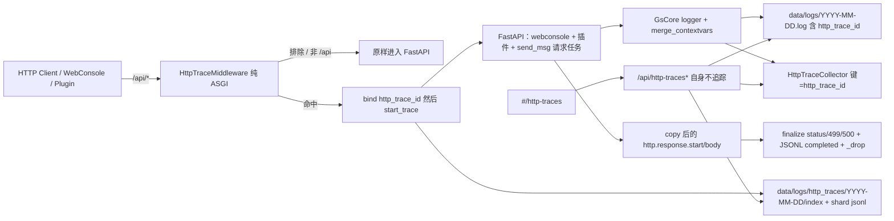

# HTTP `/api` 请求追踪（按请求查看日志）

| 字段 | 值 |
|------|-----|
| 状态 | Draft（2026-08-28 评审修订） |
| 作者 | GsCore / WebConsole |
| 日期 | 2026-08-28 |
| 受众 | 框架维护者（`gsuid_core`）+ 控制台前端（`gsuid_hub`） |
| 相关实现 | 命令追踪：`logger.py` / `trace_archive.py` / `webconsole/trace_api.py` / hub `TracesPage.tsx` |

---

## Overview

GsCore 已有**命令维度**的追踪：每次匹配到的命令在 `_Bot._safe_run` 里拿到 `task_id` 当 `trace_id`，`structlog.contextvars` 绑定后，该命令执行期间所有 `gsuid_core.logger` 行都被打上 `trace_id`，WebConsole `#/traces` 可按日列出并展开内部日志。

本设计把**同一产品形态**做到 FastAPI 的 `/api/*`（含插件挂在共享 `app` 上的 `/api/<plugin>/...`）：一次 HTTP 请求 = 一条独立追踪，运维可按 method / path / status / 耗时检索，并看到**该 ASGI 请求任务**里的官方 logger 行。插件作者只要继续 `from gsuid_core.webconsole.app_app import app` 且 `from gsuid_core.logger import logger`，**零额外代码**自动受益。

硬约束（已与产品对齐，下文不再当开放问题）：

1. 范围只覆盖 HTTP `/api`；不覆盖 `/app` SPA、`/ws/{bot_id}`、非 `/api` 路径。
2. **禁止**把 HTTP 追踪混进命令 `/traces` 列表或 `logs/traces/` JSONL（控制台轮询会淹没命令日历）。
3. v1 **不改** `handler.py` / `bot.py` 的命令追踪；不要求改插件 endpoint。
4. 长连接 `/api` 必须排除或特殊处理，避免一条追踪跨数小时。
5. 纯 ASGI middleware，禁止 Starlette `BaseHTTPMiddleware`（contextvars 泄漏 + 读 body）。
6. 禁止原样记录 Authorization / Cookie / token / 请求体。

v1 **不承诺** `/api/send_msg` 触发的命令函数体内日志进入 HTTP 追踪：生产里命令跑在 `_process` 长任务上，不会继承 HTTP 的 contextvars（见 §D.8）。HTTP 详情覆盖请求任务内日志（如 `handle_event` 入队前的 `cmd_triggered`）；命令内部仍只在 `#/traces`。

---

## Background & Motivation

### 现状（命令追踪）

| 层 | 路径 | 作用 |
|----|------|------|
| 上下文 | `gsuid_core/models.py::TraceContext` | 命令形状：`command` / `user_id` / `group_id` / `bot_id` / `session_id` |
| 绑定 | `logger.bind_trace_context` / `clear_trace_context` | 只 bind/unbind **`trace_id`**（`_TRACE_CONTEXT_KEYS = ("trace_id",)`） |
| 内存 | `logger.TraceCollector`（`max_traces=1000`，stale 1h） | 只保留 **running**；`finalize` 后立刻 `_drop` |
| 收集键 | `TraceCollector.collect` 读 `event_dict["trace_id"]` | 无该键直接 return |
| 元数据 | `data/logs/traces/YYYY-MM-DD/`（`index.jsonl` + `{ab}.jsonl`，与 HTTP 共用写线程；旧整日 jsonl 仍可读） | running + completed 各写一行，同 id 以最后一条为准 |
| 日志正文 | `data/logs/YYYY-MM-DD.log` | 每条 JSON 带 `trace_id`，详情靠扫描重建 |
| API | `GET /api/traces`、`/api/traces/daily_counts`、`/api/traces/{trace_id}` | `require_auth`；固定路径必须声明在 `{trace_id}` **之前** |
| 前端 | `gsuid_hub`：`#/traces`、`src/pages/TracesPage.tsx`、`traceApi` | 日历 `daily_counts`、展开 `ConsolePanel` |

启动点：`handler.py` 构造 `TraceContext` → 入队 `TaskContext` → `bot.py::_process` 从队列取出后 `asyncio.create_task(_safe_run)` → `_safe_run` 里 `start_trace` + `bind` + `finally: clear + finalize`。`create_task` 复制的是 **`_process` 循环**的 context，不是入队方。后台 `clean_trace_collector()`（`app_life.py` lifespan）每 300s `reclaim_stale`。

`CollectLogHandler` 只挂在 `logging.getLogger("GsCore")`。root 上的 file handler 也会 `merge_contextvars`，因此 daily log 里**可能**出现带 `http_trace_id` 的第三方/uvicorn 行，但它们**不会**进内存 collector。

### 痛点

- 插件 / WebConsole / `/api/send_msg` 的故障只能在「历史日志」或实时 SSE 里按时间猜，**不能按一次 HTTP 请求**把请求任务内的 `logger.info` 收拢。
- 控制台自己会打大量 `/api/*`。若写进命令 JSONL，`daily_counts` 会被轮询撑满。
- 仓库里目前 **零 HTTP middleware**（`gsuid_core/` 无 `add_middleware` / `BaseHTTPMiddleware`）。

---

## Goals & Non-Goals

### Goals

- 对进入共享 FastAPI `app` 的 `/api/*` 请求自动生成 uuid，绑定 `http_trace_id`，使**该请求任务**上的官方 logger 行自动带该字段。
- 独立存储、独立 REST、独立前端页；命令 `/traces` 行为与日历数字不变。
- 运维可按请求查看：method、path、HTTP status、duration、user（若能从 WebConsole 会话解析）、请求任务内日志。
- 长连接（SSE / MCP / HTTP Agent stream）不占一条「数小时 running」追踪。
- 插件零改动（官方 logger + 共享 `app`）。
- 不向实时 SSE 控制台 / daily log 刷每请求两条 info Start/End。

### Non-Goals

- 不追踪 `/app/**`、`/ws/**`、`/docs`、OpenAPI、非 `/api` 的 MCP 挂载（配置成 `/mcp` 时本就不在范围内）。
- 不把 HTTP 追踪做成 OpenTelemetry / W3C `traceparent`。
- 不引入 SQL 表；不给 daily log 建索引（v1 用 `to_thread` 扫描）。
- v1 不改 `_safe_run` / `_process` / `handler.py`，因此**不**把命令函数体 / `handle_ai_chat` 的日志并进 HTTP 桶。
- 不记录请求 / 响应 body。
- 不保证 `print()`、非 `GsCore` logger、`to_thread` 线程内日志被捕获。
- 不给命令追踪补 `error_count`。
- v1 不对 WebConsole 的 2xx 轮询做采样丢弃（见 Alt-8，延期）。

---

## Key Decisions

| # | 决策 | 理由 |
|---|------|------|
| K1 | **独立 collector**：类写在 `logger.py`（与 `TraceCollector` 并列），JSONL 在 `http_trace_archive.py` | 命令内存槽位硬上限 1000，HTTP 不能抢。同文件可避免 `logger.py` ↔ 新模块循环 import。 |
| K2 | contextvars 键用 **`http_trace_id`**，**不复用** `trace_id` | 纵深隔离：`clear_trace_context` 只 unbind `trace_id`。**不是**因为 `_safe_run` 会拷贝 HTTP 上下文——生产里它不会（§D.8）。 |
| K3 | 元数据 **`data/logs/http_traces/YYYY-MM-DD/`**（`index.jsonl` + `{ab}.jsonl` 分片 + 非今天 `count` 旁路）；正文仍 **`data/logs/YYYY-MM-DD.log`**（字段名 `http_trace_id`） | 日历隔离。禁止单日一个十几 GB jsonl：列表只读 index，详情只开对应 shard。扫描键禁止抄命令的 `trace_id`。 |
| K4 | **纯 ASGI middleware** 挂在 `app_life.py` 的 `FastAPI()` 之后、首请求之前 | `BaseHTTPMiddleware` / `@app.middleware("http")` 会泄漏 contextvars 并预读 body。 |
| K5 | 前端 **独立 `#/http-traces`**，不做 `/traces` Tab | 列、日历、流量模型都不同。 |
| K6 | REST **`/api/http-traces`**，`daily_counts` 在 `{trace_id}` 之前 | 避开 §7.8.3 坑；与 `git-mirror` 连字符风格一致。 |
| K7 | **始终开启**，无 CoreConfig 开关 | 与命令追踪一致。体积靠：排除健康检查、无 info Start/End、SSE detach；不靠采样（Alt-8 延期）。 |
| K8 | **不读 ASGI `receive` body**；`receive_wrapper` 只窥探 `http.disconnect` 后原样返回 | 读 body 会弄丢插件 POST。disconnect → 499，不是 500。 |
| K9 | 长连接：**路径黑名单 + `text/event-stream` 早 detach** | 产品排除列表 + 插件私自挂 SSE。NDJSON 首版靠 10min stale。 |
| K10 | JSONL 文件，不上 SQL | 与命令运维一致。 |
| K11 | `HttpTraceCollector.collect` **只**读 `http_trace_id` | 抄命令 `collect` 的 `trace_id` 门会把全部 HTTP 行丢掉。 |
| K12 | 列表/详情文件 IO 走 `to_thread`；页面 visible 时每 5s 刷列表（与 running 无关） | HTTP 请求毫秒级，`running>0` 门控会看起来永远空。详情 completed 后停轮询。 |

---

## Proposed Design

### 总览



命令队列（`_process` / `_safe_run`）**不在**上图 HTTP 绑定范围内。

### 模块落点（两仓）

**gsuid_core：**

| 文件 | 职责 |
|------|------|
| `gsuid_core/models.py` | 仅追加 `@dataclass HttpTraceContext`（**不改** `TraceContext`） |
| `gsuid_core/http_trace_archive.py` | HTTP JSONL 读写 / daily_counts / 按 **`http_trace_id`** 扫 daily log |
| `gsuid_core/logger.py` | **`HttpTraceCollector` 与 bind/clear/`_get_http_trace_collector` 写在这里**（紧挨 `TraceCollector`）；`trace_collect_processor` 增补 HTTP 分支；`_HISTORY_SKIP_KEYS` 同时加 `trace_id` 与 `http_trace_id`；`clean_trace_collector` 兼 `reclaim` HTTP collector。processor **只在本文件**，不拆第二份 |
| `gsuid_core/http_trace_middleware.py` | 纯 ASGI：匹配、排除、脱敏、copy send、receive disconnect |
| `gsuid_core/app_life.py` | `FastAPI()` 后立刻 `app.add_middleware(HttpTraceMiddleware)`（先于 `register_http_agent_routes`） |
| `gsuid_core/webconsole/http_trace_api.py` | REST；公开签名只用本文 TypedDict，禁止抄 `trace_api.py` 的 `Dict[str, Any]` |
| `gsuid_core/webconsole/_api_tags.py` | `HTTP_TRACE = [f"{_SYS}/系统/HTTP 请求追踪"]`（与现有 `TRACE = [f"{_SYS}/系统/链路追踪"]` 并列，禁止混成同一 tag） |
| `gsuid_core/webconsole/setup_frontend.py` | `_import_webconsole_apis` 增加 `http_trace_api`（核心 API，与 AI 开关无关） |
| `gsuid_core/webconsole/docs/45-http-traces.md` | 契约 |
| `gsuid_core/locales/{zh-cn,en,ja}/logger.json` | JSONL 失败 / 容量牺牲 / reclaim（**无**每请求 info Start/End 文案） |
| `tests/test_http_trace_collector.py` | PR1 |
| `tests/test_http_trace_middleware.py` | PR2 |
| `tests/test_http_trace_api.py` | PR3 |

不新建 `http_trace.py`（避免与 `logger.py` 循环 import）。archive 在 `start_trace`/`finalize` 内 **函数内 import**，与命令 `trace_archive` 相同。

**gsuid_hub：**

| 文件 | 职责 |
|------|------|
| `src/lib/api.ts` | `HttpTrace*` + `httpTraceApi`（`URLSearchParams`，未设的筛选项不写入） |
| `src/pages/HttpTracesPage.tsx` | 完整页 |
| `src/App.tsx` | `path="http-traces"` |
| `src/components/layout/AppSidebar.tsx` | `logsView` 子项，`id: 'httpTraces'`，`icon: Globe`（不进 `ICON_MAP`） |
| `src/i18n/locales/{zh-CN,en-US,ja-JP}/httpTraces.json` + 三个 `index.ts` + 三个 `sidebar.json` | 四处同步 |
| `src/lib/mockServer.ts` | demo：三条 **带类型** 的 GET（列表 `[]`、详情含 `logs: []`、日历长度 60） |

**不要**为 HTTP 追踪改 `demoMock.ts`（无 ``）。不修改 `TracesPage.tsx` / `traceApi` / `/api/traces*`。

新 Python 遵守 `AGENTS.md`：无 `Any` 公开签名、无 `cast`、无 `# type: ignore`、`#` 注释 ≤2 行且每行 ≤88 字。

---

### D. 后端埋点

#### D.1 注册位置

`gsuid_core/app_life.py` 在 `app = FastAPI(...)` 之后、`register_http_agent_routes(app)` 之前：

```python
from gsuid_core.http_trace_middleware import HttpTraceMiddleware

app.add_middleware(HttpTraceMiddleware)
```

后添加的 middleware 在最外层，能看到 ExceptionMiddleware / ServerErrorMiddleware 转出的 500。禁止 `BaseHTTPMiddleware`、禁止 `@app.middleware("http")`、禁止 lifespan yield 之后再 `add_middleware`。

#### D.2 路径匹配

只处理 `scope["type"] == "http"`。websocket 透传。

```text
# 存储、过滤、排除比较一律用这个值（锁定一种 spec）
def _norm_path(raw: str) -> str:
    path = raw.rstrip("/") or "/"
    return path
```

命中：`path == "/api"` 或 `path.startswith("/api/")`。

不命中：`/app`、`/ws`、`/docs`、`/redoc`、`/openapi.json`、`/`。

MCP：父 middleware 看到完整 path（Mount 在被 user middleware 包裹的 router 内）。排除用运行时 `mcp_server_path`，且必须走 `gsuid_core.ai_core.mcp.server._normalize_mcp_path`（与挂载同一函数），再判断：

```python
mcp = _normalize_mcp_path(...)
excluded = path == mcp or path.startswith(mcp + "/")
```

因此默认 `/api/mcp` **不会**误伤 `/api/ai/mcp`（MCP 配置 API）。配置成 `/mcp` 时本就不在 `/api` 范围内。

#### D.3 排除列表

规范化 `path` 对下列 **OR**（写成纯函数 + 单测表）：

| 规则 | 匹配 | 原因 |
|------|------|------|
| 前缀 | `/api/traces` | 看命令追踪不能再生成追踪 |
| 前缀 | `/api/http-traces` | 自指 |
| 前缀 | `/api/logs` | 日志控制台轮询（含 stream / config / stats） |
| 前缀 | `/api/dashboard` | 仪表盘轮询 |
| 前缀 | `/api/version` | 首页/顶栏版本与 bot 列表轮询 |
| 运行时前缀 | `_normalize_mcp_path(mcp_server_path)` | Streamable HTTP MCP |
| 精确或前缀 | `/api/v1/agent/chat/stream` | Agent SSE。**不**排除 `/sessions/reset`、`/runs/{id}/cancel` |
| 精确 | `/api/system/health` `/api/v1/agent/health` | 探活短 JSON，K8s/负载均衡会连打 |
| 仅 GET 精确 | `/api/auth/me` `/api/auth/pubkey` `/api/auth/admin/exists` `/api/brand` `/api/brand/icon` `/api/theme/config` `/api/theme/presets` `/api/assets/preview` `/api/system/info` `/api/plugins/list` `/api/plugin-pages` `/api/persona/list` `/api/persona/config/global` `/api/persona/heartbeat/status` `/api/ai/wizard/status` `/api/ai/kanban/board` `/api/ai/approvals/list` `/api/live-chat/bootstrap` `/api/live-chat/state` `/api/scheduler/jobs` `/api/git-update/status` `/api/ai/budget/overview` | 壳子/看板刷新；POST 登录、改品牌、存主题、跑任务仍记 |
| 仅 GET 前缀 | `/api/auth/avatar` `/api/plugins/icon` `/api/getImage` `/api/image` `/api/meme/image` `/api/ops` `/api/git-update/status` `/api/ai/budget/usage` `/api/ai/statistics` `/api/ai/performance` | 读图、运维看板、统计轮询。`/api/image` 不匹配 `/api/ai/images` |
| 仅 GET 后缀 | `/api/persona/*/{avatar,image,audio}` | 人格头像/立绘/音频文件 |

兜底（K9）：路径未排除，但 `http.response.start` 的 `content-type`（header 名小写）含 `text/event-stream` → **立即 finalize + unbind**（duration = TTFB）。后续 generator 不再进该 HTTP 桶。

**要追踪：** `/api/auth/login` 等 POST（不读 body）、`/api/ai/mcp`、插件 `/api/<plugin>/...`、控制台写操作（改配置/重启/跑任务）。探活、壳子 GET、读图、统计/看板刷新不记。

**首版不按 Content-Type 早 detach：** `GET /api/ai/knowledge/backup/export`（`application/x-ndjson`）。大导出最多占一个 in-flight 槽直到 10min stale。Open Q1 维持 SSE-only。

#### D.4 id 与响应头

```python
trace_id = str(uuid.uuid4())
short_id = trace_id[:8]
```

不用客户端 `X-Request-ID` 当主键。合法（可打印、长度 ≤128）的 `X-Request-ID` / `X-Request-Id` 写入 `client_request_id`。

`http.response.start`：**浅拷贝 message dict，再拷贝 `headers` 列表**，然后 `append((b"x-http-trace-id", trace_id.encode("ascii")))`。ASGI headers 名必须小写 bytes。禁止原地 `append` 原列表。不加 query。现网无 CORS middleware：浏览器 JS 读不到该头；DevTools 网络面板可以。不为此加 `Access-Control-Expose-Headers`。

#### D.5 contextvars 与 processor

```python
_HTTP_TRACE_CONTEXT_KEYS = ("http_trace_id",)

def bind_http_trace_context(ctx: HttpTraceContext) -> None:
    structlog.contextvars.bind_contextvars(http_trace_id=ctx.trace_id)

def clear_http_trace_context() -> None:
    structlog.contextvars.unbind_contextvars(*_HTTP_TRACE_CONTEXT_KEYS)
```

`shared_processors` 已有 `merge_contextvars`，请求任务内 `logger.info(...)` 不必传 kwarg。

**顺序（强制）：先 `bind_http_trace_context`，再 `start_trace`。** 命令侧是 start 后 bind、靠 `logger.info(..., trace_id=ctx.trace_id)` 显式 kwarg。HTTP **不打** structlog Start 行；仍 bind-first，避免后续任何 logger 漏字段。

```python
def trace_collect_processor(_logger, _method_name, event_dict: EventDict) -> EventDict:
    if "trace_id" in event_dict:
        cmd = _get_trace_collector()
        if cmd is not None:
            cmd.collect(event_dict)
    if "http_trace_id" in event_dict:
        http = _get_http_trace_collector()
        if http is not None:
            http.collect(event_dict)
    return event_dict
```

两个 collector 的 `collect` **各自只认自己的键**（§D.7）。

`_HISTORY_SKIP_KEYS` 增加 **`trace_id` 与 `http_trace_id`**（命令 uuid 今天会漏进 SSE extras，一并修掉）。

控制台 `[h:{short_id}]` processor **可选**：HTTP 请求只有毫秒级 in-memory，前缀几乎看不到。**不作为验收指标**。若实现，仅当 id 仍在 HTTP collector 内时改写 event。

**root file handler 泄漏：** 绑定期间，走 root 的第三方/uvicorn 行可能在 daily log JSON 里带上 `http_trace_id`。详情扫描会把它们收进该请求的 `logs[]`。内存 collector 仍只收 GsCore。文档与 `45-http-traces.md` 写明，避免运维以为混进了命令 logger。

#### D.6 `HttpTraceContext`

不泛化命令 `TraceContext`。

```python
@dataclass
class HttpTraceContext:
    trace_id: str
    short_id: str
    method: str
    path: str                 # _norm_path 结果
    client_ip: str            # 直连 peer，截断至 64 字符；无则 ""
    user_id: str | None
    user_name: str | None
    start_time: float         # perf_counter
    start_ts: float           # time.time()
    content_length: int | None
    query_redacted: str
    client_request_id: str | None
```

`path` 存储与过滤都用 `_norm_path`，不再保留「原始重复斜杠」第二套 spec。过长 path 截断至 2048 字符再存。

#### D.7 `HttpTraceCollector`（在 `logger.py`）

容量：`max_traces=2000`，`stale_running_sec=600`，`_MAX_TRACE_LOGS=5000`，`_MAX_EVENT_LEN=4096`。算法（evict / reclaim / JSONL running+completed / `_drop`）对齐命令 collector，**但 collect 不得抄 `trace_id` 门**。

```python
@dataclass
class HttpTraceLogEntry:
    timestamp: str
    level: str
    event: str
    plugin: str  # 恒有；缺省 "SayuCore"（logger._CORE_ORIGIN_LABEL）


_ERROR_LEVELS = frozenset({"error", "critical", "exception"})


class HttpTraceCollector:
    def collect(self, event_dict: EventDict) -> None:
        if "http_trace_id" not in event_dict:
            return
        tid = event_dict["http_trace_id"]
        if not isinstance(tid, str) or not tid:
            return
        if tid not in self._traces:
            return
        bucket = self._traces[tid]
        raw_plugin = event_dict["plugin"] if "plugin" in event_dict else None
        plugin = raw_plugin if isinstance(raw_plugin, str) and raw_plugin else "SayuCore"
        # timestamp / level / event 截断规则同 TraceCollector
        ...

    def get_active_traces(self) -> dict[str, HttpTraceListItem]:
        """内存 running 快照，键为 uuid（与 JSONL/API 的 trace_id 相同）。"""
        ...
```

`get_active_traces()` 每条必须能直接当 `HttpTraceListItem`：

- `status="running"`
- `status_code=None`，`duration_ms=None`
- `log_count=len(bucket)`
- `error_count` = 桶内 `level` ∈ `{error, critical, exception}` 的即时计数（running 也要有，不是 finalize 才算）
- `method` / `path` / `query_redacted` / `client_ip` / `user_id` / `user_name` / `start_time`（墙钟 `start_ts`）来自 `_trace_meta`

`start_trace`：

1. evict 若满。
2. 建**空**桶（不塞合成行）。
3. **不** `logger.info` Start（避免 SSE/`LOG_HISTORY_MAXLEN=2000`/daily log 被每个 `/api/dashboard` 打两条 info）。
4. **禁止**向桶 append 仅内存、不进 daily log 的面包屑。静默 200（无 GsCore logger）的诚实结果是 `log_count=0` 且 `logs=[]`，JSONL 的 method/path/status 已足够标识该请求。
5. **不**写 JSONL running；running 只在内存。`write_http_trace_meta(..., status="running")` 直接 return。IO 失败 `logger.error`（稀有），仍保留内存桶。

`finalize_trace(trace_id, status_code: int)`：`log_count=len(bucket)`（只含 `collect` 进来的真实 logger 行），写 JSONL completed，**无** info End 行，`finally: _drop`。JSONL 失败同样 `_drop`。

详情组装器也**不要**再合成一行：running 与 completed 的 `logs[]` 必须都能从同一来源解释（内存桶 ≡ daily log 扫描），否则会出现列表 `log_count=1`、完成后 `logs=[]`。

`clean_trace_collector` 循环里兼 `http_collector.reclaim_stale()`，不开第二个 300s 任务。

#### D.8 嵌套：`/api/send_msg` 与命令队列（事实）

`core.py` 的 `sendMsg` 在 **ASGI 请求任务**里 `await handle_event(_bot, MR, True)`。`handler.py` 在 `is_http` 时为**第一条**匹配命令设置 `task_event` 并 `return await ws.wait_task(...)`（超时 20s）。真正的 `trigger.func` 并不在这个 await 里跑：

```713:725:gsuid_core/bot.py
# _process 是 Bot 连接时拉起的长循环（core.py websocket_endpoint 里 create_task(process)）
ctx = await self.queue.get()
await self.sem.acquire()
asyncio.create_task(self._safe_run(ctx))  # 复制的是 _process 的 contextvars
```

`asyncio.create_task` 复制**当前任务**的 context。当前任务是 `_process`，**不是**已经 `bind_http_trace_context` 的 ASGI 任务。`_safe_run` 只 bind/unbind `trace_id`。

| 发生位置 | `http_trace_id` | `trace_id` | HTTP 桶 | 命令桶 |
|----------|-----------------|------------|---------|--------|
| 中间件 + `sendMsg` + `handle_event` 直到 `queue.put_nowait` | 有 | 无 | 有（如 `cmd_triggered`） | 无 |
| `_safe_run` / 插件命令函数体 | **无** | bind 后有 | **无** | 有 |
| HTTP 任务在 `wait_task` 返回之后、middleware clear 之前 | 有 | 无 | 有 | 无 |
| AI 未匹配走 `handle_ai_chat` 入队 | HTTP **不等待**（无 `task_event`） | 无 | 请求很快 finalize；AI 日志在 `_process` 上，**无** `http_trace_id` | 无 `TraceContext` 则命令桶也无 |

v1 **禁止**为了「双桶重叠」改 `bot.py` / `handler.py`。HTTP 页排障 `/api/send_msg`：能看到入队前日志与 HTTP status/耗时；命令内部去 `#/traces`。

以后若产品要重叠，需单独 PR：在 `_process`/`_safe_run` 显式拷贝 `http_trace_id`（这 **是** `bot.py` 变更，要产品签字）。不得用「TestClient 在同一 task 里 await 命令」冒充生产队列。

K2 仍然成立：双键防止 `clear_trace_context` 误清 HTTP；不是「parent copy」故事。

#### D.9 从**请求任务** `create_task` / BackgroundTasks

endpoint **自己** `asyncio.create_task` / FastAPI `BackgroundTasks` 会复制 **ASGI 任务**的 context，子 task 日志在 finalize 前能进内存桶；finalize 后只进 daily log（桶已 `_drop`）。中间件不等待后台。`duration_ms` = 响应结束。这与 §D.8 的 `_process` 队列不是同一回事。

#### D.10 `to_thread`

`pool.py::to_thread` → `run_in_executor` **无** `copy_context()`。线程内 GsCore logger 无 `http_trace_id`。已知限制。可选 PR4。不要在 PR4 里扩大 `pool.py` 已有的 `Any`/`cast` 面。

#### D.11 状态 / 499 / 500

1. `send`：见 D.13。`http.response.start` 记 status、copy 后加头、SSE 则早 detach。
2. 最后一块 body：`message["type"] == "http.response.body"` 且（`"more_body" not in message` 或 `message["more_body"] is False`）→ `finalize(status_code)`。禁止 `message.get`。
3. `receive_wrapper`：`await receive()`；若 `type=="http.disconnect"` 置 `cancelled=True`；**必须把原 message 返回给 app**（不吞 body chunk）。
4. `cancelled` 且已/将 finalize → `status_code=499`（本系统惯例，非 IANA）。
5. `asyncio.CancelledError`（3.11+ 是 `BaseException`）：若已 start 或 disconnect → 499；若 shutdown、尚未 start → **不要**用 500 污染 JSONL，finalize 499 或直接 `_drop` 不写 completed。**finalize 之后 re-raise**。
6. 其它未捕获异常且尚未 `response.start` → finalize 500，再 raise，让 Starlette 仍发 500。
7. `finalized: bool` 保证只落盘一次。

`HTTPException` → 真实 401/403/404/422。业务封套 `{status:1}` 且 HTTP 200 → 记 200。`duration_ms = int((perf_counter()-start_time)*1000)`。

#### D.12 脱敏

**永不写入 JSONL / logger kwargs 的头**（比对小写名）：`authorization`、`cookie`、`set-cookie`、`x-ws-token`、`x-api-key`，以及 `is_secret_key_name` 为真者。`cookie`/`set-cookie`/`code`/`key` **不**在 `is_secret_key_name` 里，所以额外黑名单不是多余。中间件 **禁止** `logger.info(..., headers=scope["headers"])`。

**Query：** `parse_qsl` 保序；键名 `is_secret_key_name` 或 ∈ `{token, access_token, code, key, api_key}` → 值 `****`。序列化见 §A 序列化规则。

**Body：不读。** `content_length`：第一个 `content-length` 头，解析为非负 `int`，非法/溢出/负数 → `None`。重复头忽略后续。

**用户：** `verify_token`（同步内存，不读 body）。isinstance 取 `user["id"]` / `user["name"]`。失败则 `None`。不要为填用户去记 API Key。

**`client_ip`：** 仅 `scope["client"][0]`（直连 peer）。v1 **不**读 `X-Forwarded-For`（反代后列表常见 `127.0.0.1`，接受）。截断 64 字符。

HTTP 追踪能列出 **admin-only 路径名**（`/api/database/...`、装插件等），这是命令追踪没有的信息面；信任边界仍是「能登录控制台」。

#### D.13 中间件契约（实现必须按此，不是示意）

ASGI 消息类型用 `starlette.types.Message`，禁止把 wrapper 参数标成 `object`。禁止 `.get`：先 `"key" in mapping` 再索引。

```python
from starlette.types import ASGIApp, Message, Receive, Scope, Send

class HttpTraceMiddleware:
    def __init__(self, app: ASGIApp) -> None:
        self.app = app

    async def __call__(self, scope: Scope, receive: Receive, send: Send) -> None:
        if scope["type"] != "http":
            await self.app(scope, receive, send)
            return
        path = _norm_path(scope["path"])
        if not _is_api_path(path) or _is_excluded(path):
            await self.app(scope, receive, send)
            return

        ctx = _build_context(scope)  # 禁止把 headers 传入 logger
        bind_http_trace_context(ctx)
        collector.start_trace(ctx)
        finalized = False
        cancelled = False
        status_code = 500

        async def receive_wrapper() -> Message:
            nonlocal cancelled
            message = await receive()
            if message["type"] == "http.disconnect":
                cancelled = True
            return message

        def _finish(code: int) -> None:
            nonlocal finalized
            if finalized:
                return
            collector.finalize_trace(ctx.trace_id, code)
            clear_http_trace_context()
            finalized = True

        async def send_wrapper(message: Message) -> None:
            nonlocal status_code
            if message["type"] == "http.response.start":
                status_code = 499 if cancelled else int(message["status"])
                message = _with_trace_header(message, ctx.trace_id)
                # _with_trace_header: dict(message) + list(headers) + append 字节对
                if _is_event_stream(message):
                    _finish(status_code)
            await send(message)
            if message["type"] == "http.response.body" and (
                "more_body" not in message or message["more_body"] is False
            ):
                _finish(499 if cancelled else status_code)

        try:
            await self.app(scope, receive_wrapper, send_wrapper)
        except asyncio.CancelledError:
            _finish(499)
            raise
        except BaseException:
            if not finalized:
                _finish(499 if cancelled else 500)
            raise
        finally:
            if not finalized:
                _finish(499 if cancelled else status_code)
```

JSONL 写入见 §A：`enqueue_day_jsonl` 只 `put_nowait`，**禁止**在中间件/`self.app` 路径上同步 `open().write` 或 `time.sleep` 等盘。

---

### A. 磁盘布局

```
data/logs/
  YYYY-MM-DD.log                      # structlog JSON；请求任务期间可能含 http_trace_id
  traces/YYYY-MM-DD.jsonl             # 命令旧单日文件，只读兼容
  traces/YYYY-MM-DD/index.jsonl       # 命令列表（与 HTTP 同一套分片）
  traces/YYYY-MM-DD/{ab}.jsonl        # 命令详情 shard
  http_traces/YYYY-MM-DD.jsonl        # 旧单日文件，只读兼容
  http_traces/YYYY-MM-DD/index.jsonl  # 列表/计数（无 response_preview）
  http_traces/YYYY-MM-DD/{ab}.jsonl   # 详情；ab = trace_id 去横线后前 2 位 hex
```

`DailyNamedFileHandler.backupCount=0`：不自动删。HTTP 按日目录切，不自动删。不要每个请求一个文件（一天百万级小文件在 NTFS 上更差）。

#### JSONL

running 只留内存 collector，不写盘。completed 各写 index 一行 + 对应 shard 一行；读时同 uuid 取最后一行。

```python
from typing import Literal, NotRequired, TypedDict

HttpTraceLife = Literal["running", "completed"]

class HttpTraceJsonlRecord(TypedDict):
    trace_id: str              # uuid 字符串；不是字段名 http_trace_id
    method: str
    path: str                  # _norm_path
    query_redacted: str
    client_ip: str
    user_id: str | None
    user_name: str | None
    client_request_id: str | None
    content_length: int | None
    start_time: float          # Unix 秒
    status: HttpTraceLife
    log_count: int
    duration_ms: NotRequired[int]
    status_code: NotRequired[int]
    error_count: NotRequired[int]
```

无 command/group/bot/session；无 body/Authorization。`status` = collector 生命周期；HTTP 语义看 `status_code`。

#### 序列化规则（实现锁死）

| 项 | 规则 |
|----|------|
| `path` | `_norm_path(scope["path"])`，再截断 2048 字符 |
| `query_redacted` | 无 `?` 前缀；`k=v&k2=****`（`parse_qsl` 原序）；UTF-8 文本按 **字符** 计，上限 512；超长在 512 处切，若切在 `%` 或残缺 `%XX` 则回退到上一个 `&`；空 query → `""` |
| `method` | `scope["method"]` 原样再 `.upper()` |
| `content_length` | 见 D.12 |
| `client_ip` | 见 D.12 |
| daily log 匹配 | `"http_trace_id" in record and record["http_trace_id"] == trace_id`。禁止抄命令 `record.get("trace_id")`。缺键 ≠ 命中 |
| JSONL 的 id 字段 | 文件里叫 `trace_id`；event_dict / daily log 里叫 `http_trace_id`。内存桶键是 uuid 字符串 |
| JSONL 写 | `enqueue_day_jsonl`：`put_nowait` 进有界队列，**不**等磁盘。单 daemon 线程批量 append（不 fsync）。队列满则丢行并节流 warning。`list_*` / `count_*` / `get_*` 先 `flush_day_jsonl_writes`（`Condition` 等到未完成批为 0 或 2s），再读；读不持写锁。非法 JSON / 半截行跳过。禁止在事件循环上 `time.sleep` 等盘。日历 `daily_*_counts` 每请求 flush 一次，不是按天各 flush 一次。非今天的去重计数落 `{date}/count`（带源文件大小指纹）；今天仍扫 index。 |

#### 正文 vs 元数据

| | JSONL | daily log | 内存桶 |
|--|-------|-----------|--------|
| 内容 | 上表 | structlog JSON | `HttpTraceLogEntry`（仅 `collect` 进来的真实 logger 行） |
| 请求体 | 无 | 无 | 无 |
| Start/End / 合成行 | 无 | 无 | 无 |

详情：

1. 内存 `get_trace_logs` 命中 → running，logs 来自内存（已有 `plugin`）。
2. 否则 JSONL 元数据 + `to_thread` 扫 daily log。

```python
class HttpTraceLogLine(TypedDict):
    timestamp: str
    level: str
    event: str
    plugin: str  # 恒有；JSON 缺省则 "SayuCore"
```

running 与 completed **同一形状**。非法 JSON 行跳过。

#### 轮转 / 容量 / 扫描

- 跨日 running：start 写日 A，finalize 写日 B。`GET ?date=今天` 读当天 JSONL **加上全部内存 running**（即使 `start_ts` 是昨天）——写在列表契约里，与命令相同。
- `limit` 默认 500，夹取 `[1, 2000]`（非法/缺省：coerce，不 400）。忙日超过 500 的更早行**静默丢掉**（命令如此；HTTP 会先碰到这个帽）。
- JSONL 列表读、daily_counts、详情 daily log 扫描：全部 `asyncio.to_thread`（或项目 `to_thread`），禁止在事件循环里同步扫大文件；读路径不加 JSONL 写锁。
- 不做索引。不靠 info Start/End 增大 daily log。静默请求允许 `log_count=0` / `logs=[]`。

---

### B. WebConsole API 契约

封套 `{status, msg, data}`。`Depends(require_auth)`，非 `require_admin`。未登录 HTTP 401 `{"detail":"未授权，请先登录"}`。新模块公开类型用 TypedDict，禁止 `Dict[str, Any]`。

OpenAPI tag（`_api_tags.py`，与 `TRACE` 并列、禁止复用）：

```python
HTTP_TRACE = [f"{_SYS}/系统/HTTP 请求追踪"]
```

`http_trace_api.py` 各路由 `tags=HTTP_TRACE`。

路由顺序：

1. `GET /api/http-traces`
2. `GET /api/http-traces/daily_counts`
3. `GET /api/http-traces/{trace_id}`

这些路径在排除列表内，轮询**不递归**追踪。

hub `ApiClient` 在 `status !== 0`（含封套 404）时 **throw**。页面必须 catch，不能假定拿到 `data: null`。

#### B.1 列表 `GET /api/http-traces`

Query：

| 名 | 默认 | 规则 |
|----|------|------|
| `date` | 今天 | `parse_iso_date`；非法 → `{status:1, msg:"非法日期", data:[]}` |
| `limit` | 500 | 非 int → FastAPI 422；否则夹取 `[1, 2000]` |
| `method` | 缺省=不筛 | upper；非空且不在 `{GET,POST,PUT,PATCH,DELETE,OPTIONS,HEAD}` → `{status:1, msg:"非法 method", data:[]}` |
| `path_prefix` | 缺省 | 含 `..` 或不安全段 → `{status:1, msg:"非法 path_prefix", data:[]}`；最长 256；`path.startswith(prefix)` |
| `status_class` | 缺省 | 仅 `2xx`/`3xx`/`4xx`/`5xx`；其它非空 → `{status:1, msg:"非法 status_class", data:[]}`；running 无 code → 不匹配任何 class |
| `user_id` | 缺省 | 精确匹配 |
| `errors_only` | 假 | `1`/`true`/`yes`（大小写不敏感）为真。真：`error_count>0` **或** `status_code is not None and status_code>=400`。在 merge 之后、`[:limit]` **之前**应用 |

`client_request_id` / `content_length` **不出现在列表**，只在详情。

合并：

1. JSONL 去重（`to_thread`）→ `merged[trace_id]`。
2. `get_active_traces()` 整包覆盖同 id（running 为权威）。
3. filter（含 `errors_only`）。
4. `start_time` 倒序，`[:limit]`。
5. 内存 running 即使 `start_ts` 不是 `date` 那天，只要还在内存，就出现在这次列表里（通常前端查「今天」）。

```python
class HttpTraceListItem(TypedDict):
    trace_id: str
    method: str
    path: str
    query_redacted: str
    client_ip: str
    user_id: str | None
    user_name: str | None
    start_time: float
    duration_ms: int | None
    log_count: int
    error_count: int
    status_code: int | None
    status: HttpTraceLife
```

#### B.2 `GET /api/http-traces/daily_counts`

`days` 默认 60，夹取 `[1,366]`。`data` 升序、长度恒等于 `days`。只读 `http_traces/` JSONL 去重。今天含 running 标记，每次扫当天 index。非今天读 `{date}/count`。`count==0` 日历不可点。

#### B.3 详情 `GET /api/http-traces/{trace_id}`

`date` 默认今天。首版只扫该日文件，不自动 `date-1`。前端带列表日。

`HttpTraceDetail` = 列表字段 + `client_request_id` + `content_length` + `logs: list[HttpTraceLogLine]`。

- 存在：`{status:0, msg:"ok", data: detail}`
- 不存在：HTTP 200 + `{status:404, msg:"追踪不存在", data:null}`（与命令 API 相同）。hub `api.get` 会 throw。
- 非法日期：`status=1`

前端：仅当详情 `status=="running"` 时对展开行轮询；**completed 立即停**，避免 finalized 后反复 `to_thread` 扫 daily log。

#### B.4 文档

新建 `webconsole/docs/45-http-traces.md`。更新 `docs/README.md`。`07-logs.md` §7.8 顶部三行链到 45，不把 HTTP 接口写进 7.8。

---

### C. gsuid_hub 前端

#### C.1 复用

HashRouter、`PinnedPage`、`ConsolePanel`、日历角标、`api.ts` 封套、`require_auth` Bearer、三语言 `index.ts`。`TracesPage` 的 `formatStartTime` / `parseTraceTimestamp` 只存在于该文件：HTTP 页允许复制那约 15 行，不重构命令页。错误 toast 用 `getApiErrorMessage`（命令页今天没用，HTTP 页按 P-13 要用）。`ApiClient` 对 404 封套抛错，详情 catch 后空展开区 + toast。

#### C.2 独立路由

`#/http-traces`。侧栏 `logsView` 在 traces 之后插入 `{ id: 'httpTraces', url: '/http-traces', icon: Globe }`。理由同前：列/日历/流量都不是命令的子类。

#### C.3 `HttpTracesPage`

**Header（`sm:items-end`）：** H1 `Globe w-8 h-8` + 副标题；右侧日期 Popover（class `http-traces-date-calendar`）+ 刷新 + 「自动刷新」Switch（**默认开**）。

自动刷新（与 `running` **无关**）：

- Switch 开且 `document.visibilityState==="visible"`：每 5s `fetchList`（带当前 filter query）。
- `/api/http-traces*` 已排除，不递归。
- 展开行：仅 `status==="running"` 时顺带 `getDetail`；completed 停止。

**Toolbar（`flex-wrap`，无 TabButtonGroup → 控件 `h-9`；gshub P-28/P-29）：**

- Method Select，哨兵 `__all__`；值为 `__all__` 时 **不**把 `method` 写入 query。
- Path `Input`
- Status class Select `__all__` / 2xx / 3xx / 4xx / 5xx
- 「仅错误」Switch → query `errors_only=true`（后端在 limit 前过滤，不是前端二次切 500 条）
- User id `Input`：`hidden xl:flex`，小屏不占 toolbar；xl 以下可靠「仅错误」+ path

整行 `flex-wrap gap-2`，避免 pinned toolbar 被裁切。ja-JP / en-US 标签按长文案测，不要只看中文。

**Children 四张 glass-card：** 总数 / running / completed / HTTP 错误（`status_code>=400` 的条数，当前 **已加载列表** 上数）。

**列表桌面列**（TracesPage 同款 `hidden lg/xl`）：

`状态 | METHOD | 路径 | HTTP码 | 用户 | 时间 | 耗时 | 日志(lg) | 错误(xl) | ID(lg) | 下载`

路径 `font-mono truncate`，`title` = `path + (query_redacted ? "?"+query_redacted : "")`。METHOD Badge。码：2xx 绿 / 4xx 黄 / 5xx 红 / running `—`。耗时 >1000ms 标红。ID 8 位。

**展开头（ConsolePanel 上方一行）：** `t("httpTraces.clientIp")` + IP；有则 `client_request_id`。不要再加 11 列。

`plugin`：`HttpTraceLog.plugin` 为 **必填 string**；`ConsolePanel` 来源 badge。

**移动端：** 堆叠 method+path，第二行码/耗时。

下载：`http-trace-{id}.json`。

demo：`mockServer` 三条路由返回 **typed** 载荷：列表数组、详情必须含 `logs: []`（否则 `emptyFor` 对 uuid 给出普通 object，展开即崩，P-26）、`daily_counts` 长度 60。

`glass-card` 无 `isGlass &&`。统计卡不进 toolbar。

#### C.4 TS

```ts
export interface HttpTraceLog {
  timestamp: string;
  level: string;
  event: string;
  plugin: string;
}

export interface HttpTraceItem {
  trace_id: string;
  method: string;
  path: string;
  query_redacted: string;
  client_ip: string;
  user_id: string | null;
  user_name: string | null;
  start_time: number;
  duration_ms: number | null;
  log_count: number;
  error_count: number;
  status_code: number | null;
  status: 'running' | 'completed';
}

export interface HttpTraceDetail extends HttpTraceItem {
  client_request_id: string | null;
  content_length: number | null;
  logs: HttpTraceLog[];
}

export const httpTraceApi = {
  getTraces: (params: {
    date?: string;
    limit?: number;
    method?: string;
    path_prefix?: string;
    status_class?: string;
    user_id?: string;
    errors_only?: boolean;
  } = {}) => {
    const query = new URLSearchParams();
    if (params.date) query.set('date', params.date);
    if (params.limit !== undefined) query.set('limit', String(params.limit));
    if (params.method) query.set('method', params.method);
    if (params.path_prefix) query.set('path_prefix', params.path_prefix);
    if (params.status_class) query.set('status_class', params.status_class);
    if (params.user_id) query.set('user_id', params.user_id);
    if (params.errors_only) query.set('errors_only', 'true');
    return api.get<HttpTraceItem[]>(`/api/http-traces?${query.toString()}`);
  },
  getTraceDetail: (traceId: string, params: { date?: string } = {}) => {
    const query = new URLSearchParams();
    if (params.date) query.set('date', params.date);
    return api.get<HttpTraceDetail>(
      `/api/http-traces/${encodeURIComponent(traceId)}?${query.toString()}`,
    );
  },
  getDailyCounts: (days = 60) =>
    api.get<Array<{ date: string; count: number }>>(
      `/api/http-traces/daily_counts?days=${days}`,
    ),
};
```

#### C.5 i18n（三语言 leaf 对齐）

```json
{
  "title": "HTTP 请求追踪",
  "description": "按请求查看 /api 内部日志（与命令追踪相互独立）",
  "totalTraces": "总请求",
  "running": "进行中",
  "completed": "已完成",
  "httpErrors": "HTTP 错误",
  "traceList": "请求列表",
  "noTraces": "暂无 HTTP 追踪记录",
  "logs": "日志",
  "status": "状态",
  "method": "方法",
  "path": "路径",
  "statusCode": "状态码",
  "user": "用户",
  "clientIp": "客户端 IP",
  "clientRequestId": "请求 ID",
  "triggerTime": "时间",
  "duration": "耗时",
  "error": "错误",
  "traceId": "ID",
  "downloadTrace": "下载追踪",
  "autoRefresh": "自动刷新",
  "filterMethod": "方法",
  "filterPath": "路径前缀",
  "filterStatusClass": "状态类",
  "filterUser": "用户 ID",
  "filterAll": "全部",
  "emptyUser": "未登录",
  "onlyErrors": "仅错误",
  "status2xx": "2xx",
  "status3xx": "3xx",
  "status4xx": "4xx",
  "status5xx": "5xx"
}
```

`sidebar.httpTraces`：zh「HTTP 请求追踪」/ en「HTTP Traces」/ ja「HTTPリクエスト追跡」（注意日文无多余空格导致的宽度；允许换行测量）。

#### C.6 差异

| | `#/traces` | `#/http-traces` |
|--|------------|-----------------|
| 刷新 | 手动 | 页面可见且 Switch 开：5s 刷列表 |
| 详情轮询 | 无 | 仅 expanded && running |
| 筛选 | 无 | method/path/class/user/`errors_only` 全走后端 |
| 慢请求 | 7000ms | 1000ms |

---

### E. 插件开发者故事

自动受益：共享 `app` 的 `/api/...` + 官方 `logger`（`structlog.get_logger("GsCore")`）+ 日志发生在 **ASGI 请求任务**（或从该任务 `create_task` 的子任务）+ 非排除路径。

不需要装饰器。

不会被捕获：`print`；非 GsCore logger（daily log 或许可因 root `merge_contextvars` 带上 id，内存桶没有）；`to_thread`；自建 `FastAPI()`；SSE/MCP/agent stream / `/api/system/health`；**经 `_Bot.queue` 跑在 `_process` 上的命令函数体**（§D.8）。

SKILL §19 事后补一句即可，不挡 v1。

---

## API / Interface Changes

新增 §B 与 `httpTraceApi`。命令 `GET /api/traces*` 兼容。daily log 请求任务期间多 `http_trace_id`。SSE extras 不再带 `trace_id` / `http_trace_id`（命令 uuid 从 extras 消失，属有意清理）。无每请求 info Start/End。

---

## Data Model Changes

无 SQL。新目录 `data/logs/http_traces/`。daily log 增字段，命令扫描仍只认 `trace_id`。

---

## Alternatives Considered

### Alt-1：命令 collector 加 `kind`

抢 1000 槽、污染日历。**否决。**

### Alt-2 / Alt-3：`BaseHTTPMiddleware` / `@app.middleware("http")`

contextvars + 读 body。**否决。**

### Alt-4：`Depends(http_trace)`

违反零插件代码。**否决。**

### Alt-5：`/traces` Tab

日历/列冲突。**否决。**

### Alt-6：SQL 表

运维分叉。**否决**（K10）。

### Alt-7：复用 contextvars 键 `trace_id`

`clear_trace_context` 会清 HTTP；同任务误 bind 会互盖。**否决**（K2）。（即便 `_safe_run` 不继承 HTTP context，双键仍必要。）

### Alt-8：采样 / 丢掉 2xx 的 WebConsole 轮询（`/api/dashboard`、`/api/logs`）

- 已落地为**整前缀排除**（logs / dashboard / version），不是按 2xx 采样。登录、插件 API、配置写入仍记。

---

## Security & Privacy Considerations

| 威胁 | 缓解 |
|------|------|
| Token 进盘 | 不读 body；头黑名单；query 脱敏；禁止 `logger(..., headers=...)` |
| 登录密码 | 只记 path/status；加密见 `01-auth.md` |
| 未登录读追踪 | `require_auth` |
| 伪造 Request-ID | 主键 uuid4 |
| 路径穿越 | `parse_iso_date` + 固定 `LOG_PATH` |
| 自指递归 | `/api/http-traces` 排除 |
| SSE 吞全世界 | `/api/logs/stream` 排除 |
| 探活打爆 | `/api/system/health`、`/api/v1/agent/health` 排除 |
| 信任 XFF | v1 不用 |
| admin 路径名暴露给普通控制台用户 | 与「能登录就能看命令 user_id」同一边界；在文档标明 |

---

## Observability

- **没有**每请求 info Start/End。
- 静默 200：列表 `log_count=0`，详情 `logs=[]`（不是 bug）。
- JSONL 失败：`logger.error`，不失败请求。
- 容量牺牲：warning，60s 节流。
- reclaim：debug。
- 控制台四张统计卡。无独立 pager。

---

## Rollout Plan

1. core 先合、API 冻结，再 hub。
2. 无 feature flag。
3. 旧 hub + 新 core：少菜单。新 hub + 旧 core：列表 404 → toast，空态不白屏。
4. 回滚=回退 core/hub；磁盘 JSONL 可留。
5. 验收（打**已加载全部插件**的 core，不要 `--dev`）：
   - 插件 `/api/<plugin>/...` 的请求任务 logger 出现在 `#/http-traces` 详情。
   - `#/traces` 的 `daily_counts` 不被 dashboard/logs 轮询改变。
   - 实时控制台 **不是** 刷满 HTTP Start/End。
   - `#/http-traces` 在 Switch 开启、页面可见时 **无需手刷** 出现新完成行。
   - `/api/send_msg`：HTTP 详情有入队前日志；命令函数体只在命令追踪（v1 预期）。
   - POST JSON 到达业务 endpoint（body 未被中间件消费）。

---

## Risks

| 严重度 | 风险 | 缓解 |
|--------|------|------|
| 高 | 读 body / BaseHTTPMiddleware | 评审 + POST identity 单测 |
| 高 | 抄命令 `collect` 用 `trace_id` | PR1 锁键单测 |
| 高 | 用同 task await 冒充 send_msg 双桶 | PR2 **不做** overlap 验收 |
| 高 | 漏排除 SSE | 排除表 + Content-Type detach + 10min stale |
| 中 | 详情扫 daily log 卡事件循环 | v1 起 `to_thread`；无 info 面包屑 |
| 中 | `limit=500` 忙日丢旧行 | 文档 + `errors_only` |
| 中 | JSONL 交错 | **写路径**一行 `threading.Lock`；读路径无锁 |
| 中 | `to_thread` 无 id | 文档 + 可选 PR4 |
| 低 | 跨日 running | 列表合并规则写明 |
| 低 | `[h:]` 几乎看不见 | 非验收项 |

---

## Open Questions

已对齐约束不再列出。v1 已拍板：无 info Start/End、列表 5s 可见即刷、不改 `bot.py`、collect 只认 `http_trace_id`、排除 `/api/system/health`。

仍可微调、不挡开工：

1. 早 detach 是否包含 `application/x-ndjson`（知识库 backup export）。首版否，靠 stale。
2. PR4 `to_thread` copy_context 保持独立，不塞进 PR2。
3. 跨日详情 404 是否试 `date-1`。首版否。

---

## References

- 命令追踪：`webconsole/docs/07-logs.md` §7.8；`logger.py`；`trace_archive.py`；`bot.py::_process` / `_safe_run`；`handler.py`；`webconsole/trace_api.py`
- 共享 app：`app_life.py`、`webconsole/app_app.py`、插件 SKILL §19
- MCP：`ai_core/mcp/server.py` `_normalize_mcp_path` / `_mount_http_mcp`
- Agent stream：`ai_core/http_agent/routes.py`
- 探活：`webconsole/system_api.py` `GET /api/system/health`
- NDJSON：`knowledge_base_api.py` backup export
- 脱敏：`utils/secret_mask.py`（注意不含 cookie/code/key）
- 前端：`TracesPage.tsx`、`api.ts` `traceApi`、`AppSidebar.tsx`、`ConsolePanel.tsx`、gshub P-13/P-26/P-28/P-29

---

## PR Plan

**gsuid_core 先合并冻结 API**，hub 后跟。测试必须 `monkeypatch` `LOG_PATH` / `http_traces` 目录到 tmp，禁止写进开发机 `data/logs/`（仓库里没有现成 TraceCollector 测试可抄）。

### PR1 — collector + JSONL + logger 挂钩

- **标题：** `feat(http-trace): HttpTraceCollector keyed on http_trace_id`
- **文件：** `models.py`（追加 dataclass）、新建 `http_trace_archive.py`、`logger.py`（collector/bind/processor/skip keys/reclaim）、`locales/*/logger.json`、`tests/test_http_trace_collector.py`
- **依赖：** 无
- **内容：** 不挂 middleware、不暴露 REST。单测（tmp 日志目录）：
  - 只 bind HTTP → `logger.info` → HTTP 桶有行、命令桶无。
  - 同时 bind 两键 → 命令桶按 `trace_id`、HTTP 桶按 `http_trace_id`，互不串 uuid。
  - `logs/traces/` 不被写入。
  - 命令 collector 容量不因 HTTP `start_trace` 下降。
  - **无** info Start/End 进入 SSE 缓冲。
  - `start_trace` + `finalize` 且中间无 `logger.info` → JSONL `log_count=0`、内存 `logs` 为空（无合成面包屑）。
  - running 不写 jsonl；`list_*` 在 finalize 后才看到该 uuid。读路径 `flush` 是 Condition 屏障，不是 sleep。
- **不**把 processor 再写进第二个模块。

### PR2 — ASGI middleware

- **标题：** `feat(http-trace): pure ASGI middleware for /api`
- **文件：** `http_trace_middleware.py`、`app_life.py`、`tests/test_http_trace_middleware.py`
- **依赖：** PR1
- **合并门禁（缺一不可）：** POST JSON body 原样到达 endpoint；排除表（含 `/api/system/health`、`/api/logs/stream`、MCP 规范化路径、agent stream）；SSE Content-Type detach 不留长 running；start headers 仍是 `list[tuple[bytes,bytes]]`；disconnect/CancelledError → 499 且 re-raise CancelledError。
- **不做：** 「send_msg 双 id 重叠」验收（会 false-green）。若加 send_msg 测试：请求任务有 `cmd_triggered`、`_safe_run` 桩日志 **没有** `http_trace_id`。
- **不改** `handler.py` / `bot.py`。

### PR3 — REST + 文档

- **标题：** `feat(http-trace): REST list/detail/daily_counts`
- **文件：** `http_trace_api.py`、`_api_tags.py`、`setup_frontend.py`、`docs/45-http-traces.md`、`docs/README.md`、`07-logs.md`、`tests/test_http_trace_api.py`
- **依赖：** PR1。审查可与 PR2 并行；若 PR3 先合、尚无 middleware，TestClient 打真 `app` 只能测 JSONL/内存 merge，测不了真实请求埋点——在 PR 描述写明。
- **内容：** 路由顺序、`tags=HTTP_TRACE`（值为 `[f"{_SYS}/系统/HTTP 请求追踪"]`）、`require_auth`、TypedDict、filter（`status_class` 非法、`path_prefix` `..`、`errors_only` 在 limit 前、日期 `PathEscapeError`）、`to_thread` 读文件。静默追踪详情 `logs=[]` 且 `log_count=0`。

### PR4（可选）— `to_thread` copy_context

- **标题：** `fix(pool): copy contextvars into to_thread workers`
- **文件：** `pool.py` + 小单测
- **依赖：** 无。不扩大现有 `Any`/`cast`。不通过不挡 HTTP 功能。

### PR5 — hub API 客户端

- **标题：** `feat(api): httpTraceApi for /api/http-traces`
- **文件：** `src/lib/api.ts`、`src/lib/mockServer.ts`（三条 typed GET：列表、**详情含 `logs: []`**、60 天 counts）
- **依赖：** PR3 已合或契约冻结
- **不要**改 `demoMock.ts`。query 省略 `__all__` / 空筛选。

### PR6 — hub 页面

- **标题：** `feat(http-traces): HTTP request traces page`
- **文件：** `HttpTracesPage.tsx`、`App.tsx`、`AppSidebar.tsx`、三语言 `httpTraces.json` + `index.ts` + `sidebar.json`
- **依赖：** PR5
- **内容：** 可见即 5s 刷新、`errors_only` 走后端、toolbar `flex-wrap`、展开头 IP、`getApiErrorMessage`、catch 404 封套。不改 `TracesPage.tsx`。
